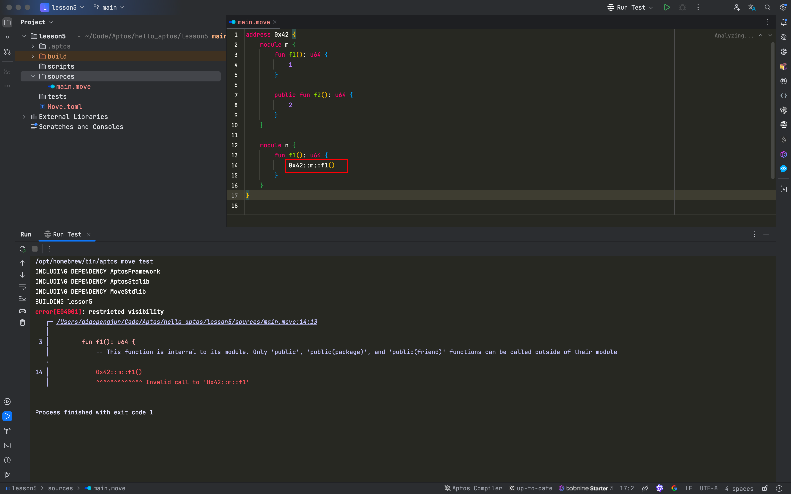
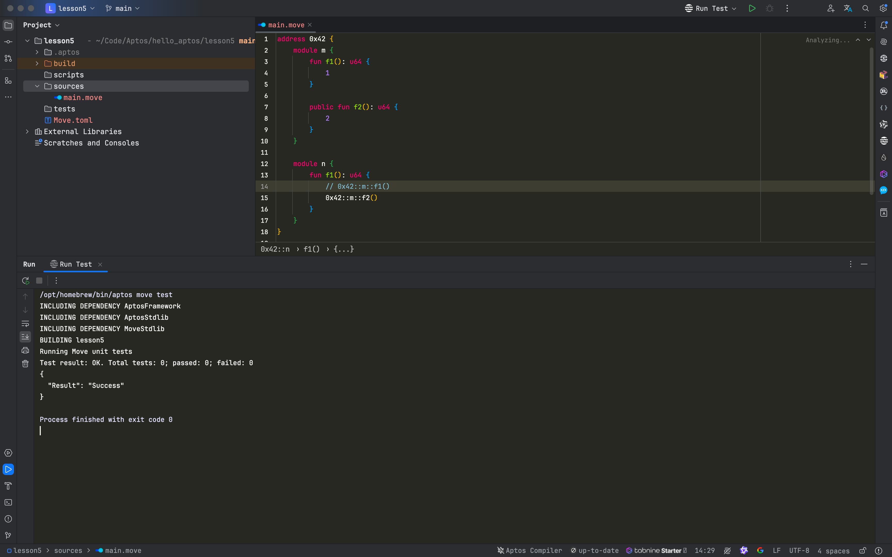
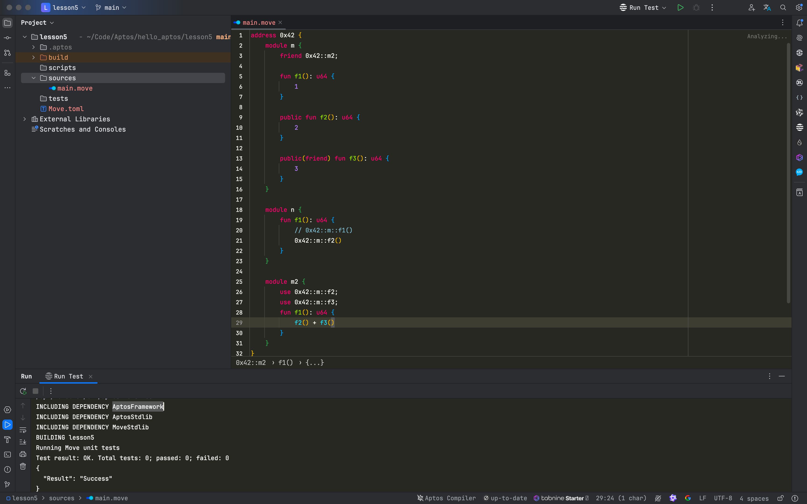
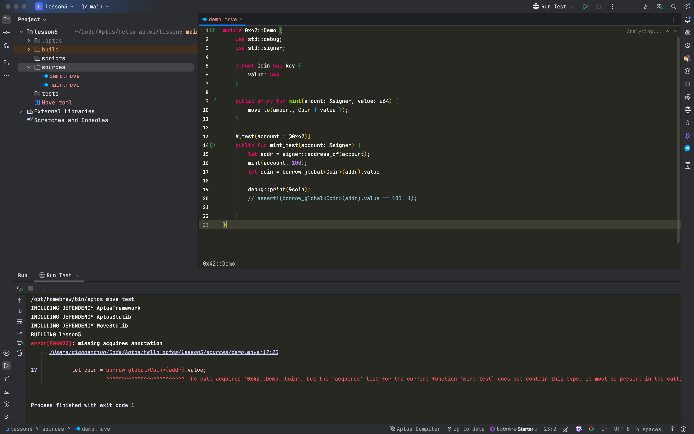
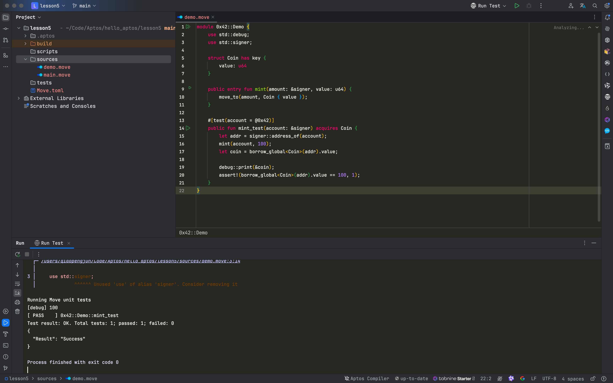

# **深入理解APTOS-MOVE中的函数修饰符：核心概念与应用**

在区块链智能合约开发中，Aptos-MOVE编程语言提供了一套独特的函数修饰符，这些修饰符为开发者提供了更强的控制力，使其可以定义函数的可见性、资源访问权限以及与链下交互的能力。本文旨在详细解析APTOS-MOVE中的函数修饰符，帮助开发者更好地理解这些关键概念，并通过示例展示它们的实际应用。

APTOS-MOVE中的函数修饰符为开发者提供了管理函数访问权限和资源引用的能力。本文首先介绍了函数修饰符的三种主要类型：可见性、全局存储引用和链下调用。通过具体代码示例，文章展示了如何使用不同的修饰符来定义函数的作用域、控制资源访问、以及与链下脚本交互。此外，文章还讲解了使用acquires修饰符时的注意事项，并总结了APTOS-MOVE语言在智能合约开发中的应用场景。

## 函数修饰符

核心概念
函数修饰符是用来赋予函数特殊能力的一组关键字。主要有以下几类

- 可见性
  - 无Public，私有函数，仅限 module 内部调用
  - friend public，模块内部函数，同包模块之间可以调用
  - Public，模块公开函数，所有模块都可以调用
- 全局存储引用
  - acquires，当需要使用 move_from，borrow_global，borrow_global_mut 访问地址下的资源的时候，需要使用 acquires 修饰符
- 链下
  - entry，修饰后，该方法可由链下脚本调用

## 实操

```rust
address 0x42 {
    module m {
        fun f1(): u64 {
            1
        }

        public fun f2(): u64 {
            2
        }
    }

    module n {
        fun f1(): u64 {
            0x42::m::f1()
        }
    }
}

```

### 运行测试

```shell
/opt/homebrew/bin/aptos move test
INCLUDING DEPENDENCY AptosFramework
INCLUDING DEPENDENCY AptosStdlib
INCLUDING DEPENDENCY MoveStdlib
BUILDING lesson5
error[E04001]: restricted visibility
   ┌─ /Users/qiaopengjun/Code/Aptos/hello_aptos/lesson5/sources/main.move:14:13
   │
 3 │         fun f1(): u64 {
   │             -- This function is internal to its module. Only 'public', 'public(package)', and 'public(friend)' functions can be called outside of their module
   ·
14 │             0x42::m::f1()
   │             ^^^^^^^^^^^^^ Invalid call to '0x42::m::f1'


Process finished with exit code 1

```




这段代码是用APTOS-MOVE语言编写的智能合约，定义了两个模块 `m` 和 `n`，它们都在地址 `0x42` 下。每个模块包含不同的函数，展示了函数的可见性和模块间调用的规则。

#### 详细解释：
#### 1. `address 0x42`：
这是APTOS-MOVE中的一种语法，用于声明一个在区块链上特定的地址空间。在这个地址下，定义了两个模块 `m` 和 `n`，表示它们都属于地址 `0x42` 所管理的代码空间。

#### 2. `module m`：
这是一个模块 `m`，它包含了两个函数：
- `fun f1(): u64`: 这是一个私有函数，返回值是 `1`。由于它没有任何可见性修饰符，因此它只能在 `m` 模块内部被调用，不能从其他模块直接访问。
- `public fun f2(): u64`: 这是一个公开函数，返回值是 `2`。因为它带有 `public` 修饰符，所以它不仅可以在 `m` 模块内部调用，还可以被其他模块访问。

#### 3. `module n`：
这是另一个模块 `n`，它包含了一个函数：
- `fun f1(): u64`: 这个函数尝试调用 `0x42::m::f1()`，也就是地址 `0x42` 下的模块 `m` 中的 `f1` 函数。

#### 错误说明：
代码中，`module n` 试图调用 `0x42::m::f1()`，但 `f1` 函数是 `m` 模块中的私有函数（因为它没有被标记为 `public` 或 `friend`），因此在 `m` 模块之外的任何地方都无法直接调用它。这会导致编译时的可见性错误。

#### 修复方法：
- 如果需要从 `module n` 调用 `m` 中的 `f1` 函数，可以将 `f1` 函数的可见性修改为 `public` 或者使用 `friend` 修饰符，允许 `n` 模块访问它。

例如：
```rust
friend 0x42::n; // 声明 n 模块为 m 模块的友元模块
```

这样 `module n` 就可以调用 `module m` 中的 `f1` 函数了。

#### 总结：
- `m` 模块中的 `f1` 是一个私有函数，无法被 `n` 模块直接调用。
- `f2` 是一个公开函数，可以被其他模块调用。
- 如果需要 `n` 模块调用 `m` 中的私有函数，需要调整 `f1` 函数的可见性修饰符。


### 调用 ` 0x42::m::f2()`



### Public friend 实操

https://aptos.dev/en/build/smart-contracts/book/functions#publicfriend-visibility

```rust
address 0x42 {
    module m {
        friend 0x42::m2;

        fun f1(): u64 {
            1
        }

        public fun f2(): u64 {
            2
        }

        public(friend) fun f3(): u64 {
            3
        }
    }

    module n {
        fun f1(): u64 {
            // 0x42::m::f1()
            0x42::m::f2()
        }
    }

    module m2 {
        use 0x42::m::f2;
        use 0x42::m::f3;
        fun f1(): u64 {
            f2() + f3()
        }
    }
}

```

这段代码使用了APTOS-MOVE的模块系统，定义了三个模块 `m`、`n` 和 `m2`，并演示了如何使用函数修饰符来控制不同模块之间的访问权限。以下是对每个部分的详细解释：

### 1. `module m`：
这是主模块 `m`，包含了三个函数和一个 `friend` 声明。
- `friend 0x42::m2;`：这行代码声明 `m2` 模块为 `m` 模块的`friend`，允许 `m2` 模块访问 `m` 模块中的 `public(friend)` 修饰的函数（即 `f3` 函数），即使这些函数对其他模块不可见。
- `fun f1(): u64`: 这是 `m` 模块中的私有函数，返回值为 `1`。因为它没有 `public` 修饰符，其他模块不能调用这个函数，只有 `m` 模块内部的代码可以调用。
- `public fun f2(): u64`: 这是 `m` 模块的公开函数，返回值为 `2`。由于它使用了 `public` 修饰符，所以任何模块都可以调用它。
- `public(friend) fun f3(): u64`: 这是 `m` 模块的`friend`函数，返回值为 `3`。带有 `public(friend)` 修饰符的函数只能由当前模块和声明为 `friend` 的模块（即 `m2`）调用，其他模块不能访问它。

### 2. `module n`：
这是一个普通模块 `n`，它试图调用 `m` 模块中的函数：
- `fun f1(): u64`: 该函数尝试调用 `0x42::m::f1()`，但注释掉了。这是因为 `f1` 是 `m` 模块的私有函数，`n` 模块无法访问它。
- 然而，`n` 模块可以调用 `0x42::m::f2()`，因为 `f2` 是 `public` 函数，对所有模块都公开。因此该行代码正常运行，返回 `f2()` 的结果，也就是 `2`。

### 3. `module m2`：
这是 `m` 模块的友元模块（通过 `friend` 声明），它能调用 `m` 中的 `f2` 和 `f3`：
- `use 0x42::m::f2;` 和 `use 0x42::m::f3;`：这两行代码导入了 `m` 模块中的 `f2` 和 `f3` 函数，使它们在 `m2` 模块中可以被直接调用。
- `fun f1(): u64`: 这个函数调用了 `f2()` 和 `f3()`，并将它们的返回值相加。由于 `f2` 是 `public` 函数，任何模块都可以调用，而 `f3` 是 `public(friend)` 函数，只能被 `m` 模块和友元模块 `m2` 调用。

因此，`m2::f1()` 的结果是 `f2()` 和 `f3()` 返回值的和，即 `2 + 3 = 5`。

### 主要概念总结：
1. **私有函数** (`f1`) 只能在定义它的模块内部使用。
2. **公开函数** (`f2`) 对所有模块都公开，可以被任意模块调用。
3. **友元函数** (`f3`) 仅允许声明为友元的模块（如 `m2`）调用，其他模块不能访问。

通过这些修饰符，APTOS-MOVE允许开发者在不同模块间灵活地控制函数访问权限，从而提高了代码的安全性和模块化设计。



### Acquires 实操

```rust
module 0x42::Demo {
    use std::debug;
    use std::signer;

    struct Coin has key {
        value: u64
    }

    public entry fun mint(amount: &signer, value: u64) {
        move_to(amount, Coin { value });
    }

    #[test(account = @0x42)]
    public fun mint_test(account: &signer) {
        let addr = signer::address_of(account);
        mint(account, 100);
        let coin = borrow_global<Coin>(addr).value;

        debug::print(&coin);
        // assert!(borrow_global<Coin>(addr).value == 100, 1);

    }
}
```

这段代码定义了一个 `0x42::Demo` 模块，展示了如何在 Aptos 上使用 Move 语言编写和测试合约。以下是对代码各部分的详细解释：

### 1. `struct Coin has key`:
```rust
struct Coin has key {
    value: u64
}
```
- 这个结构体 `Coin` 包含一个名为 `value` 的 `u64` 类型的字段，表示代币的数量。
- `has key` 表示该结构体类型具有全局存储的特性，可以通过其所有者地址在区块链的全局存储中存储和访问。这是 Move 语言中定义资源类型的关键字。

### 2. `public entry fun mint(amount: &signer, value: u64)`:
```rust
public entry fun mint(amount: &signer, value: u64) {
    move_to(amount, Coin { value });
}
```
- 这是一个公开的 `entry` 函数，表示它可以通过链下交易（例如用户的脚本）直接调用。
- 函数参数：
  - `amount: &signer`：代表发起该交易的签名者（用户）。签名者的地址可以通过 `signer::address_of` 获取。
  - `value: u64`：表示要铸造的代币数量。
- `move_to(amount, Coin { value });`：该行代码将 `value` 数量的 `Coin` 资源存储到 `signer` 的账户地址中。

### 3. `#[test(account = @0x42)]`:
```rust
#[test(account = @0x42)]
public fun mint_test(account: &signer) {
```
- 这是一个测试函数，它的目的是测试 `mint` 函数的行为。使用 `#[test(account = @0x42)]` 注解声明了一个测试环境，其中 `@0x42` 是用于执行该测试的地址。
- 测试函数的参数 `account: &signer` 是测试账户的签名者。

### 4. `mint_test` 函数逻辑：
```rust
let addr = signer::address_of(account);
mint(account, 100);
let coin = borrow_global<Coin>(addr).value;

debug::print(&coin);
```
- `let addr = signer::address_of(account);`：获取当前测试账户的地址。
- `mint(account, 100);`：调用 `mint` 函数，给当前签名者的账户铸造 100 个代币（`Coin { value: 100 }`）。
- `let coin = borrow_global<Coin>(addr).value;`：通过账户地址 `addr` 从全局存储中借用 `Coin` 资源，获取其中的 `value`（即代币的数量）。
- `debug::print(&coin);`：通过 `debug::print` 函数将 `coin` 的值（也就是 `100`）打印出来，方便在测试过程中查看结果。

### 5. 注释掉的断言代码：
```rust
// assert!(borrow_global<Coin>(addr).value == 100, 1);
```
- 这里注释掉了一行断言代码，用来确保签名者账户中的 `Coin` 资源的 `value` 是否等于 100。断言失败时将抛出错误 `1`。如果启用这行代码，它将验证 `mint` 操作是否成功。

### 总结：
- 这个模块实现了一个简单的 `Coin` 代币铸造功能，并提供了一个用于测试该功能的函数 `mint_test`。
- `mint` 函数允许签名者向其账户铸造指定数量的 `Coin`，并通过测试函数检查铸造的结果是否符合预期。
- `#[test(account = @0x42)]` 注解创建了一个测试环境，可以直接在本地执行测试，验证代币铸造过程的正确性。

### 测试报错



当 Move 中的函数使用全局存储操作（如 move_from, borrow_global, borrow_global_mut）时，必须在函数定义中使用 acquires 关键字，指定该函数将访问哪些资源类型。这是 Move 的类型系统为了确保引用的安全性，不会出现悬空引用的情况。

在上面代码中，mint_test 函数通过 borrow_global<Coin>(addr) 操作访问了全局存储中的 Coin 资源，但没有在函数定义中声明 acquires Coin，这就是导致测试报错的原因。

要修复这个错误，你需要在 mint_test 函数定义中添加 acquires Coin，以便告诉 Move 这个函数会访问 Coin 类型的资源。

### Acquires

When a function accesses a resource using `move_from`, `borrow_global`, or `borrow_global_mut`, the function must indicate that it `acquires` that resource. This is then used by Move’s type system to ensure the references into global storage are safe, specifically that there are no dangling references into global storage.

```rust
module 0x42::Demo {
    use std::debug;
    use std::signer;

    struct Coin has key {
        value: u64
    }

    public entry fun mint(amount: &signer, value: u64) {
        move_to(amount, Coin { value });
    }

    #[test(account = @0x42)]
    public fun mint_test(account: &signer) acquires Coin {
        let addr = signer::address_of(account);
        mint(account, 100);
        let coin = borrow_global<Coin>(addr).value;

        debug::print(&coin);
        assert!(borrow_global<Coin>(addr).value == 100, 1);
    }
}
```

### 运行测试，测试成功



这段代码实现了一个简单的 Minting 机制，并通过测试函数来验证 `Coin` 资源的正确性。让我们逐步分析代码的逻辑：

#### 代码解释：

1. **`Coin` 结构体**:
   - 定义了一个名为 `Coin` 的结构体，带有一个 `value` 字段，表示代币的数量。
   - 该结构体带有 `key` 属性，这意味着它可以作为 Move 的全局存储中的资源被使用（类似于具有全局唯一标识的资源）。

2. **`mint` 函数**:
   - `mint` 是一个 `entry` 函数（可从链下调用），它接收两个参数：`amount`（类型为 `&signer`）和 `value`（类型为 `u64`）。
   - 该函数通过 `move_to` 将一个新的 `Coin` 资源移动到 `signer` 地址的全局存储中，`Coin` 的 `value` 被设置为传入的 `value`。

3. **`mint_test` 函数**:
   - 这是一个测试函数，带有 `#[test(account = @0x42)]` 的属性修饰，它将以 `@0x42` 地址的账户上下文运行。
   - 函数接收 `account` 参数，并通过 `signer::address_of` 方法获取此账户的地址。
   - 调用 `mint` 函数向该地址铸造 100 个 `Coin`。
   - 使用 `borrow_global<Coin>(addr)` 从全局存储中获取该地址下的 `Coin` 资源，并通过 `debug::print` 打印 `Coin` 的值。
   - 通过 `assert!` 验证该地址下的 `Coin` 的 `value` 是否为 100，如果不是，则会触发错误并返回值 `1`。

4. **`acquires Coin`**:
   - 由于 `mint_test` 函数通过 `borrow_global` 访问了全局存储中的 `Coin` 资源，因此需要在函数定义中显式声明 `acquires Coin`，以表明它对 `Coin` 资源的依赖。

#### 测试流程：
1. `mint_test` 函数会模拟 `@0x42` 地址的账户，并调用 `mint` 函数铸造 100 个 `Coin`。
2. 测试函数通过 `borrow_global` 从全局存储中提取 `Coin` 资源，并验证 `value` 是否正确存储为 100。

#### 代码完整性：
这段代码已经处理了 `acquires Coin` 的声明，并通过断言验证全局存储中的 `Coin` 值，确保铸币功能按预期工作。

### 总结

APTOS-MOVE中的函数修饰符为智能合约开发提供了强大的功能扩展，尤其是在管理函数可见性和全局存储访问时。这些修饰符帮助开发者在保护数据安全的前提下灵活地设计合约逻辑，确保合约在不同的调用场景下都能正确运行。掌握这些修饰符不仅有助于提升代码的可维护性，还能帮助开发者在实际应用中设计出更加安全、可靠的智能合约。

## 参考

- https://aptos.dev/en/build/smart-contracts/book/signer
- https://aptos.dev/en/build/smart-contracts/book/functions#acquires
- https://aptos.dev/en/build/guides/build-e2e-dapp/1-create-smart-contract

