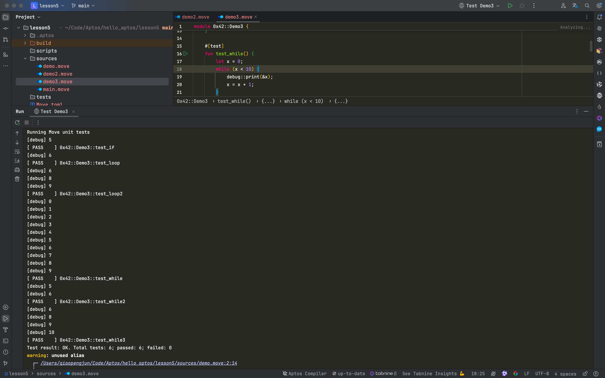

# Aptos Move 控制流解析：IF、WHILE与LOOP的深入解读

控制流语句是编程语言中至关重要的工具，用于决定程序在不同条件下的执行路径。Aptos Move语言支持使用`if`语句、`while`循环以及`loop`无限循环，帮助开发者更灵活地管理代码逻辑。在Move智能合约开发中，这些控制流结构为合约中的复杂操作提供了核心支持。本文将结合具体代码示例，深入解析Move语言中的控制流语法，并讲解如何使用`break`和`continue`语句进一步优化循环控制。

### 摘要

在Aptos Move编程中，控制流结构提供了强大的逻辑处理能力，允许开发者根据条件动态执行代码。本文主要探讨`if`语句、`while`和`loop`循环的用法，并通过代码示例展示如何在Move智能合约中灵活使用这些结构。我们还深入讲解了控制循环的`break`和`continue`语句的应用场景，为开发者提供了优化代码执行的策略。

---

## 控制流介绍

在任何编程语言中，控制流语句都扮演着引导程序如何执行的重要角色。在Aptos Move中，开发者可以使用`if`条件语句来选择性地执行代码块，或使用不同的循环结构来重复执行某些操作。Move语言中的控制流语句包括`if`、`while`和`loop`，它们分别适用于不同的场景。通过灵活应用这些语句，开发者能够有效控制合约的行为，从而优化操作的效率和可读性。

### 1. `if` 条件语句

`if`语句是最基础的控制流工具，根据条件判断来执行不同的代码块。在以下代码中，`if`语句判断变量`x`的值，并根据条件打印不同的结果：

```move
module 0x42::Demo3 {
    use std::debug;

    #[test]
    fun test_if() {
        let x = 5;
        let x2 = 10;
        if (x == 5) {
            debug::print(&x);
        } else {
            debug::print(&x2);
        }
    }
}
```

在这个例子中，如果变量`x`等于5，则输出`x`的值；否则输出变量`x2`。这一条件判断在实际智能合约中，常用于处理根据不同条件触发的操作，如检查账户余额是否足够、验证用户权限等。

### 2. `while` 循环

`while`循环允许在满足某个条件的情况下，反复执行代码块。当条件不再满足时，循环结束。在Move中，`while`循环的应用十分灵活，可以处理诸如批量操作、事件轮询等场景。下面的示例展示了一个基本的`while`循环：

```move
#[test]
fun test_while() {
    let x = 0;
    while (x < 10) {
        debug::print(&x);
        x = x + 1;
    }
}
```

在这个例子中，变量`x`从0开始，每次循环增加1，直到`x`不小于10时停止。在智能合约中，类似的`while`循环可用于处理批量转账、批量验证交易等场景。

#### 使用 `break` 提前终止循环

`while`循环可以通过`break`语句在满足特定条件时提前终止。以下示例展示了如何使用`break`语句：

```move
#[test]
fun test_while2() {
    let x = 5;
    while (x < 10) {
        debug::print(&x);
        x = x + 1;

        if (x == 7) {
            break;
        }
    }
}
```

在此代码中，当变量`x`等于7时，`break`语句会终止循环，避免不必要的后续执行。`break`语句常用于优化合约执行，减少不必要的计算或操作。

#### 使用 `continue` 跳过循环

有时我们需要跳过某些循环中的操作，而不完全终止循环。这时可以使用`continue`语句：

```move
#[test]
fun test_while3() {
    let x = 5;
    while (x < 10) {
        x = x + 1;
        if (x == 7) {
            continue;
        };
        debug::print(&x);
    }
}
```

在这个例子中，当`x`等于7时，`continue`语句会跳过本次循环的剩余部分，并继续下一次迭代。这种用法可以用于过滤不需要的操作，提高代码的效率。

### 3. `loop` 无限循环

`loop`是一个无限循环，它将不断重复执行，直到显式使用`break`语句退出。它常用于需要持续运行的操作，如等待某些外部条件的变化。以下是一个基本的`loop`循环：

```move
#[test]
fun test_loop() {
    let x = 5;
    loop {
        x = x + 1;
        if (x == 7) {
            break;
        };
        debug::print(&x);
    }
}
```

在这个例子中，循环会不断执行，直到变量`x`等于7时使用`break`语句退出。`loop`循环的使用场景包括持续监听事件、轮询外部资源等。

#### `loop` 循环中的`continue`和`break`语句

我们同样可以在`loop`循环中结合使用`continue`和`break`语句，如下所示：

```move
#[test]
fun test_loop2() {
    let x = 5;
    loop {
        x = x + 1;
        if (x == 7) {
            continue;
        };
        if (x == 10) {
            break;
        };
        debug::print(&x);
    }
}
```

此代码展示了一个更复杂的`loop`循环，使用`continue`跳过特定条件，并在另一个条件下终止循环。结合`break`和`continue`语句，开发者可以更灵活地控制循环流程。

## While, For, and Loop 实操

Move offers three constructs for looping: `while`, `for`, and `loop`.

```rust
module 0x42::Demo3 {
    use std::debug;

    #[test]
    fun test_if() {
        let x = 5;
        let x2 = 10;
        if (x == 5) {
            debug::print(&x);
        } else {
            debug::print(&x2);
        }
    }

    #[test]
    fun test_while() {
        let x = 0;
        while (x < 10) {
            debug::print(&x);
            x = x + 1;
        }
    }

    #[test]
    fun test_while2() {
        let x = 5;
        while (x < 10) {
            debug::print(&x);
            x = x + 1;

            if (x == 7) {
                break;
            }
        }
    }

    #[test]
    fun test_while3() {
        let x = 5;
        while (x < 10) {
            x = x + 1;
            if (x == 7) {
                continue;
            };
            debug::print(&x);
        }
    }

    #[test]
    fun test_loop() {
        let x = 5;
        loop {
            x = x + 1;
            if (x == 7) {
                break;
            };
            debug::print(&x);
        }
    }

    #[test]
    fun test_loop2() {
        let x = 5;
        loop {
            x = x + 1;
            if (x == 7) {
                continue;
            };
            if (x == 10) {
                break;
            };
            debug::print(&x);
        }
    }
}

```


### 运行测试

代码中包含的所有测试可以在Move中直接运行。通过`#[test]`注解，可以方便地执行每个函数，并查看执行结果。以下是运行测试的示例输出：



通过这些测试，开发者可以轻松验证控制流语句的正确性，并根据具体需求调整代码。

---

### 结论

控制流结构在Move编程中是至关重要的工具，`if`语句、`while`循环和`loop`循环为开发者提供了处理条件判断和重复操作的基础能力。通过合理使用这些语法结构，以及`break`和`continue`等控制语句，开发者可以极大地提升合约逻辑的灵活性与效率。在实际应用中，开发者可以根据具体需求选择合适的控制流结构，以确保合约的性能与安全性。在智能合约开发中，复杂的逻辑控制不仅会影响合约的执行效率，还关系到合约的安全性和用户体验。希望本篇文章的解析能够帮助开发者更好地掌握Aptos Move中的控制流语法，并为后续智能合约的开发提供有力支持。

## 参考

- https://aptos.dev/en/build/smart-contracts/book/loops
- https://aptos.dev/en/build/guides/build-e2e-dapp/1-create-smart-contract