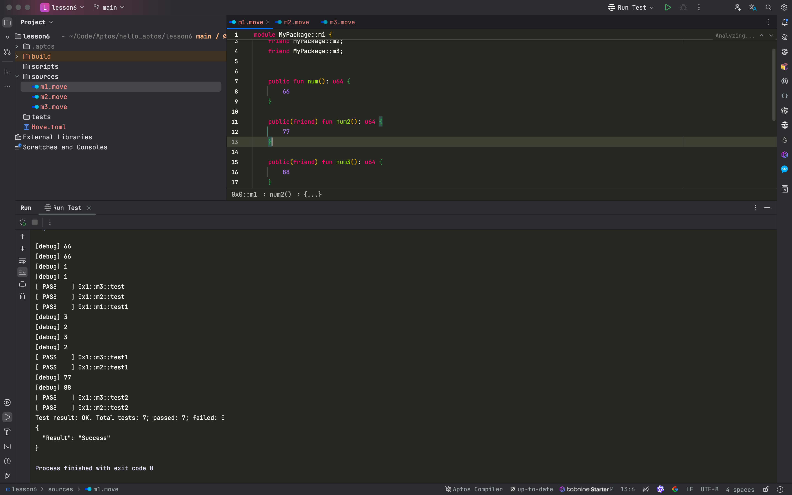

# Aptos Move 模块的特性与实操指南：模块引用与作用域管理

Aptos Move 是一门为区块链和智能合约设计的编程语言。它以其模块化、可升级性和灵活的安全性机制在 Web3 领域中越来越受欢迎。在开发过程中，如何正确导入模块、管理作用域以及理解不同的访问权限至关重要。本文旨在通过代码示例，详细讲解 Aptos Move 中模块的特性，帮助开发者更好地掌握这些核心概念。


本文将介绍 Aptos Move 中模块的引用方式、作用域管理以及模块的访问权限控制，包括 `public`、`public(friend)` 和 `entry` 等关键字的使用。通过实际项目的创建与初始化，读者将能够了解如何配置 Aptos Move 项目，并通过具体的代码示例演示模块之间的交互与函数调用方式。文章最后通过测试运行结果来验证实现效果，帮助开发者快速上手 Aptos Move 智能合约开发。

___

模块的特性

#### 模块引用

在 Aptos Move 中，可以通过三种不同的方式导入模块，分别是直接导入、导入模块中的特定函数以及为导入的函数起别名。这些方式让开发者可以更灵活地管理模块和函数引用，从而避免命名冲突。以下是一个使用 `std::debug` 模块的示例：

```rust
use std::debut;

use std::debug::print;

use std::debug::{print as P, native_print, print};

fun main() {
  debug::print(&v);
  print(&v);
  P(&v);
}
```

#### 作用域

在 Aptos Move 中，变量和模块的作用域可以是在全局，也可以是在函数内部。作用域内定义的模块和变量只能在该作用域内有效。这一机制确保了代码的封装性和模块化管理。以下代码示例展示了如何在函数内部定义模块的作用域：

```rust
fun main() {
  use std::debug::print;
  print(&v);
}
```

#### 模块的访问权限

- **`public(friend)`**：声明当前模块受信任的模块，受信任模块可以调用该模块中具有 `public(friend)` 关键字的函数。这种访问权限可以用于限制函数的可见性，只允许部分模块进行调用。
- **`public`**：声明模块中对外开放的方法，其他模块可以通过 `public` 关键字声明的方法来访问该模块的功能。
- **`entry`**：声明可以被链下调用的模块方法，一般用于链上与链下交互。

引用

可以通过以下三种方式导入模块，用来更好的进行管理。注意命名不能重复。

```rust
use std::debut;

use std::debug::print;

use std::debug::{print as P, native_print, print};

fun main() {

  debug::print(&v);

  print(&v);

  P(&v);

}
```


作用域

可以在全局定义，也可以定义在函数内部，只在所在的作用域内有效。

```rust
fun main() {

  use std::debug::print;

  print(&v);

}
```


public(friend) 

声明当前模块信任用模块，受信任模块可以调用当前模块中具有 public(friend) 的可见性函数

public

声明当前模块对外供其他接口调用的方法。

entry

声明可被链下调用的模块方法。

## 实操

### 创建并初始化项目

创建项目的第一步是初始化 Aptos Move 项目，以下命令展示了如何进行项目的创建与初始化：

```shell
aptos move init --name lesson6
aptos init
```

#### 创建并初始化项目实操

```shell
hello_aptos on  main [?] via 🅒 base
➜
mcd lesson6

hello_aptos/lesson6 on  main [?] via 🅒 base
➜
aptos move init --name lesson6
{
  "Result": "Success"
}

hello_aptos/lesson6 on  main [?] via 🅒 base took 2.1s
➜
aptos init
Configuring for profile default
Choose network from [devnet, testnet, mainnet, local, custom | defaults to devnet]

No network given, using devnet...
Enter your private key as a hex literal (0x...) [Current: None | No input: Generate new key (or keep one if present)]

No key given, generating key...
Account 0x6d81697146b7b42ec28a48963225633660d60446c7f7d0204fa1a15f89e03fda doesn't exist, creating it and funding it with 100000000 Octas
Account 0x6d81697146b7b42ec28a48963225633660d60446c7f7d0204fa1a15f89e03fda funded successfully

---
Aptos CLI is now set up for account 0x6d81697146b7b42ec28a48963225633660d60446c7f7d0204fa1a15f89e03fda as profile default!
 See the account here: https://explorer.aptoslabs.com/account/0x6d81697146b7b42ec28a48963225633660d60446c7f7d0204fa1a15f89e03fda?network=devnet
 Run `aptos --help` for more information about commands
{
  "Result": "Success"
}


```

### 项目结构

创建完项目后，项目的结构如下所示：

```shell
.
├── Move.toml
├── scripts
├── sources
│   ├── m1.move
│   ├── m2.move
│   └── m3.move
└── tests
```

#### 项目结构实操

```shell
hello_aptos/lesson6 on  main [?] via 🅒 base 
➜ tree . -L 6 -I 'build'

.
├── Move.toml
├── scripts
├── sources
│   ├── m1.move
│   ├── m2.move
│   └── m3.move
└── tests

4 directories, 4 files

hello_aptos/lesson6 on  main [?] via 🅒 base 
➜ 

```

### `Move.toml`

```toml
[package]
name = "lesson6"
version = "1.0.0"
authors = []

[addresses]
MyPackage="0x1"
[dev-addresses]

[dependencies.AptosFramework]
git = "https://github.com/aptos-labs/aptos-core.git"
rev = "mainnet"
subdir = "aptos-move/framework/aptos-framework"

[dev-dependencies]
```

### `m1.move`

```rust
module MyPackage::m1 {
    use std::debug::{print as P, print};
    friend MyPackage::m2;
    friend MyPackage::m3;


    public fun num(): u64 {
        66
    }

    public(friend) fun num2(): u64 {
        77
    }

    public(friend) fun num3(): u64 {
        88
    }

    #[test]
    fun test1() {
        let n = 1;
        print(&n);
        P(&n);
    }
}

```

### `m2.move`

```rust
module MyPackage::m2 {
    use std::debug::{print as P, print};

    #[test]
    fun test() {
        use MyPackage::m1::num;

        let n = num();
        print(&n);
    }

    #[test]
    fun test1() {
        let n = 2;
        print(&n);
        P(&n);
    }

    #[test]
    fun test2() {
        use MyPackage::m1::num2;
        let n = num2();
        print(&n);
    }
}

```

### `m3.move`

```rust
module MyPackage::m3 {
    use std::debug::{print as P, print};

    #[test]
    fun test() {
        use MyPackage::m1::num;

        let n = num();
        print(&n);
    }

    #[test]
    fun test1() {
        let n = 3;
        print(&n);
        P(&n);
    }

    #[test]
    fun test2() {
        use MyPackage::m1::num3;
        let n = num3();
        print(&n);
    }
}

```

### 运行测试



## 代码分析

##### `Move.toml` 配置文件

`Move.toml` 文件中定义了包的基本信息以及依赖关系：

```toml
[package]
name = "lesson6"
version = "1.0.0"

[addresses]
MyPackage="0x1"

[dependencies.AptosFramework]
git = "https://github.com/aptos-labs/aptos-core.git"
rev = "mainnet"
subdir = "aptos-move/framework/aptos-framework"
```

#### 模块示例代码

以下展示了三个模块的示例代码，分别是 `m1.move`、`m2.move` 和 `m3.move`，它们通过 `friend` 关键字相互之间有权限调用部分函数。

```rust
module MyPackage::m1 {
    use std::debug::{print as P, print};
    friend MyPackage::m2;
    friend MyPackage::m3;

    public fun num(): u64 {
        66
    }

    public(friend) fun num2(): u64 {
        77
    }

    public(friend) fun num3(): u64 {
        88
    }
}
```

`m2.move` 和 `m3.move` 这两个模块则可以调用 `m1.move` 中的部分函数：

```rust
module MyPackage::m2 {
    use std::debug::{print as P, print};

    #[test]
    fun test() {
        use MyPackage::m1::num;
        let n = num();
        print(&n);
    }
}
```

#### 运行测试

最后，通过运行测试来验证各模块的功能是否正常。测试的结果如下图所示：


---

### 结论

通过本文的讲解和代码实操，开发者可以更好地理解 Aptos Move 模块的引用、作用域管理及访问控制特性。掌握这些特性不仅可以提升代码的模块化和可读性，还可以提高开发效率与安全性。在智能合约的开发过程中，理解这些基础概念将为后续更加复杂的合约编写打下坚实的基础。

## 参考

- [Aptos Move 官方文档](https://aptos.dev/en/build/smart-contracts/book/functions)
- https://aptos.dev/en/build/smart-contracts/book/functions

