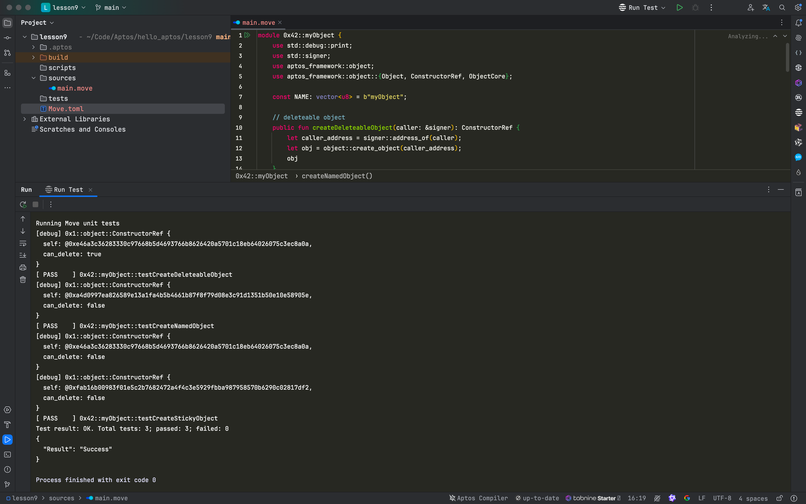
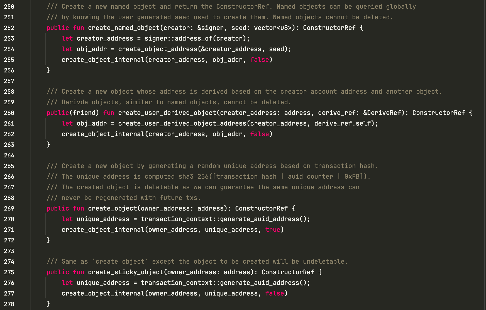

# **深入理解 Aptos Move 中的 Object 创建与管理**

Aptos Move 是一种新兴的智能合约编程语言，它基于 Move 的架构，专注于安全性和资源管理。在 Aptos 中，Object 是一种关键的数据结构，提供了一种更高效的资源管理和所有权控制方式。本文将介绍 Aptos Object 的概念、类型、创建和转移方法，并通过实际代码示例，帮助开发者更好地理解其在智能合约中的应用。

___


本文深入探讨了 Aptos Move 中的 Object 概念，介绍了对象的两种主要类型：可删除和不可删除对象。通过实际的代码示例，展示了如何创建、设置和转移对象实例，并解释了对象的管理机制。同时，还列出了如何在 Aptos Move 环境中初始化项目并运行测试。最后，通过对核心源代码的解读，进一步说明了对象的底层实现原理，帮助开发者掌握如何在实际开发中灵活运用 Aptos Object。

## **认识 OBJECT**

### **什么是 Aptos object？**

Aptos Object 是一个资源容器，专门用于存储资源并管理所有权。它具有以下几个特点：

1. 对象是单个地址的资源容器，用于储存资源
2. 对象提供了一种集中式资源控制与所有权管理的方法

### **创建并转移对象实例**

我们可以通过 aptos_framework 库中的 object 模块实现对象的创建与转移。以下是一个简化的示例，展示如何创建对象并将其转移到另一个地址：

```rust
module my_addr::object_playground {
  use std::signer;
  use aptos_framework::object::{self, ObjectCore};

  entry fun create_and_transfer(caller: &signer, destination: address) {
    // Create object
    let caller_address = signer::address_of(caller);
    let constructor_ref = object::create_object(caller_address);

    // Set up the object

    // Transfer to destination
    let object = object::object_from_constructor_ref<ObjectCore>(&constructor_ref);
    object::transfer(caller, object, destination);
  }
}
```

### 两类对象

- 可删除普通对象
- 不可删除对象
  - 命名对象，通过固定的 signer 和特定的 seed 生成唯一地址的对象，1个地址只能生成1个
  - 粘性对象，通过 signer 生成的对象，1个地址可以生成多个


## 代码实操

### 创建项目并初始化

​	1.	使用 aptos init 命令初始化一个新的项目。

​	2.	创建一个新的 Move 模块并编写对象的创建和转移逻辑。

```shell
hello_aptos on  main [?] via 🅒 base
➜
mcd lesson9
hello_aptos/lesson9 via 🅒 base …
➜


hello_aptos/lesson9 on  main [?] via 🅒 base
➜
aptos init
Configuring for profile default
Choose network from [devnet, testnet, mainnet, local, custom | defaults to devnet]

No network given, using devnet...
Enter your private key as a hex literal (0x...) [Current: None | No input: Generate new key (or keep one if present)]

No key given, generating key...
Account 0x4ff0520288d97315b68d0bc740a5eadf835f4ac61b2c815d8855d77d8f26f808 doesn't exist, creating it and funding it with 100000000 Octas
Account 0x4ff0520288d97315b68d0bc740a5eadf835f4ac61b2c815d8855d77d8f26f808 funded successfully

---
Aptos CLI is now set up for account 0x4ff0520288d97315b68d0bc740a5eadf835f4ac61b2c815d8855d77d8f26f808 as profile default!
 See the account here: https://explorer.aptoslabs.com/account/0x4ff0520288d97315b68d0bc740a5eadf835f4ac61b2c815d8855d77d8f26f808?network=devnet
 Run `aptos --help` for more information about commands
{
  "Result": "Success"
}

hello_aptos/lesson9 on  main [?] via 🅒 base took 5.9s
➜
aptos move init --name lesson9
{
  "Result": "Success"
}

hello_aptos/lesson9 on  main [?] via 🅒 base
➜
open -a RustRover .
```

### 项目目录结构

```shell
tree . -L 6 -I 'build'


.
├── Move.toml
├── scripts
├── sources
│   └── main.move
└── tests

4 directories, 2 files
```

### 代码示例

#### `main.move`

在 main.move 文件中，分别展示了创建可删除对象、命名对象和粘性对象的代码：

```rust
module 0x42::myObject {
    use std::debug::print;
    use std::signer;
    use aptos_framework::object;
    use aptos_framework::object::{Object, ConstructorRef, ObjectCore};

    const NAME: vector<u8> = b"myObject";

    // deleteable object
    public fun createDeleteableObject(caller: &signer): ConstructorRef {
        let caller_address = signer::address_of(caller);
        let obj = object::create_object(caller_address);
        obj
    }

    // undeleteable object
    public fun createNamedObject(caller: &signer): ConstructorRef {
        let obj = object::create_named_object(caller, NAME);
        obj
    }

    // sticky object
    public fun createStickyObject(caller: &signer): ConstructorRef {
        let caller_address = signer::address_of(caller);
        let obj = object::create_sticky_object(caller_address);
        obj
    }

    #[test(caller = @0x42)]
    fun testCreateDeleteableObject(caller: &signer) {
        let obj = createDeleteableObject(caller);
        print(&obj);
    }

    #[test(caller = @0x42)]
    fun testCreateNamedObject(caller: &signer) {
        let obj = createNamedObject(caller);
        // let obj2 = createNamedObject(caller);
        print(&obj);
        // print(&obj2);
    }

    #[test(caller = @0x42)]
    fun testCreateStickyObject(caller: &signer) {
        let obj = createStickyObject(caller);
        let obj2 = createStickyObject(caller);
        print(&obj);
        print(&obj2);
    }
}

```

### 运行测试

可以通过测试函数验证对象的创建功能，如下图所示：




## 查看源码

通过查看 Aptos 框架中的 object.move 源码，可以更深入了解对象的底层实现逻辑。以下是 create_named_object 和 create_sticky_object 、`create_object`的代码片段：

```rust
    /// Create a new named object and return the ConstructorRef. Named objects can be queried globally
    /// by knowing the user generated seed used to create them. Named objects cannot be deleted.
    public fun create_named_object(creator: &signer, seed: vector<u8>): ConstructorRef {
        let creator_address = signer::address_of(creator);
        let obj_addr = create_object_address(&creator_address, seed);
        create_object_internal(creator_address, obj_addr, false)
    }

    /// Create a new object whose address is derived based on the creator account address and another object.
    /// Derivde objects, similar to named objects, cannot be deleted.
    public(friend) fun create_user_derived_object(creator_address: address, derive_ref: &DeriveRef): ConstructorRef {
        let obj_addr = create_user_derived_object_address(creator_address, derive_ref.self);
        create_object_internal(creator_address, obj_addr, false)
    }

    /// Create a new object by generating a random unique address based on transaction hash.
    /// The unique address is computed sha3_256([transaction hash | auid counter | 0xFB]).
    /// The created object is deletable as we can guarantee the same unique address can
    /// never be regenerated with future txs.
    public fun create_object(owner_address: address): ConstructorRef {
        let unique_address = transaction_context::generate_auid_address();
        create_object_internal(owner_address, unique_address, true)
    }

    /// Same as `create_object` except the object to be created will be undeletable.
    public fun create_sticky_object(owner_address: address): ConstructorRef {
        let unique_address = transaction_context::generate_auid_address();
        create_object_internal(owner_address, unique_address, false)
    }
```




更多请参考：https://github.com/aptos-labs/aptos-core/blob/main/aptos-move/framework/aptos-framework/sources/object.move

---


本文通过详细的代码示例和概念介绍，展示了 Aptos Move 中 Object 的创建与管理方式。我们探讨了两种主要对象类型：可删除对象与不可删除对象，以及它们的实际应用场景。通过深入分析 Aptos 框架中的源码，可以更好地理解对象的生命周期和所有权转移机制，为开发者在智能合约中使用 Object 提供了更全面的参考。

## 参考

- https://aptos.dev/en/build/smart-contracts/objects
- https://aptos.dev/en/build/smart-contracts/objects/using-objects
- https://aptos.dev/en/build/smart-contracts/objects/creating-objects
- https://github.com/aptos-labs/aptos-core/blob/main/aptos-move/framework/aptos-framework/sources/object.move