# 深入探索 Aptos Move：Object 配置与实操指南

Aptos Move 是一门专为区块链设计的编程语言，以其模块化与高效性著称。在 Move 生态系统中，Object 是一个核心概念，它为开发者提供了灵活的资源管理工具。本文章将详细介绍如何配置和使用 Move 中的 Object，以及实操步骤帮助开发者更好地理解与应用这一关键功能。

___


本文重点介绍 Aptos Move 中的 Object 配置与使用方法，详细解释了如何创建和自定义 Object、控制其行为、转移管理、受控转移及删除权限等内容。文章还通过实操演示了如何创建、发布并调用 Object 相关方法，帮助开发者快速上手并掌握 Object 的配置技巧和编程流程。

## OBJECT 配置与使用

object 有哪些配置？

1. 扩展对象：将对象变成可动态配置的，可以往里面添置新的 Struct 资源
2. 转移管理：可以开启或者禁用 object transfer 功能
3. 受控转移：仅可使用一次转移功能
4. 允许删除：允许删除对象

Creating an Object involves two steps:

1. Creating the `ObjectCore` resource group (which has an address you can use to refer to the Object later).
2. Customizing how the Object will behave using permissions called `Ref`s.

## 实操

### 第一步：创建项目并初始化

```shell
hello_aptos on  main via 🅒 base
➜
mcd lesson10

hello_aptos/lesson10 on  main via 🅒 base
➜
aptos move init --name lesson10
{
  "Result": "Success"
}

hello_aptos/lesson10 on  main [?] via 🅒 base
➜
aptos init
Configuring for profile default
Choose network from [devnet, testnet, mainnet, local, custom | defaults to devnet]

No network given, using devnet...
Enter your private key as a hex literal (0x...) [Current: None | No input: Generate new key (or keep one if present)]

No key given, generating key...
Account 0x06b234f711414a80cf8c61e1121433c17d19e46e7d9c646cb66cb6c47f296d0d doesn't exist, creating it and funding it with 100000000 Octas
Account 0x06b234f711414a80cf8c61e1121433c17d19e46e7d9c646cb66cb6c47f296d0d funded successfully

---
Aptos CLI is now set up for account 0x06b234f711414a80cf8c61e1121433c17d19e46e7d9c646cb66cb6c47f296d0d as profile default!
 See the account here: https://explorer.aptoslabs.com/account/0x06b234f711414a80cf8c61e1121433c17d19e46e7d9c646cb66cb6c47f296d0d?network=devnet
 Run `aptos --help` for more information about commands
{
  "Result": "Success"
}

hello_aptos/lesson10 on  main [?] via 🅒 base took 4.6s
➜
open -a RustRover .

```

### 第二步：实现代码

### `main.move`

```rust
module lesson10::MyObject {
    use std::signer;
    use aptos_framework::object;
    use aptos_framework::object::{Object, ObjectGroup};

    #[resource_group_member(group = ObjectGroup)]
    struct MyStruct has key {
        num: u8
    }

    entry fun create(caller: &signer) {
        let caller_address = signer::address_of(caller);
        let obj_ref = object::create_object(caller_address);
        let obj_signer = object::generate_signer(&obj_ref);

        move_to(&obj_signer, MyStruct { num: 42 })
    }
}

```


### 第三步：compile 发布

```shell
/opt/homebrew/bin/aptos move publish --named-addresses lesson10=default
Compiling, may take a little while to download git dependencies...
UPDATING GIT DEPENDENCY https://github.com/aptos-labs/aptos-core.git
INCLUDING DEPENDENCY AptosFramework
INCLUDING DEPENDENCY AptosStdlib
INCLUDING DEPENDENCY MoveStdlib
BUILDING lesson10
warning[W09001]: unused alias
  ┌─ /Users/qiaopengjun/Code/Aptos/hello_aptos/lesson10/sources/main.move:4:35
  │
4 │     use aptos_framework::object::{Object, ObjectGroup};
  │                                   ^^^^^^ Unused 'use' of alias 'Object'. Consider removing it

warning: unused alias
  ┌─ /Users/qiaopengjun/Code/Aptos/hello_aptos/lesson10/sources/main.move:4:35
  │
4 │     use aptos_framework::object::{Object, ObjectGroup};
  │                                   ^^^^^^ Unused 'use' of alias 'Object'. Consider removing it

package size 1117 bytes
Do you want to submit a transaction for a range of [135200 - 202800] Octas at a gas unit price of 100 Octas? [yes/no] >
yes
Transaction submitted: https://explorer.aptoslabs.com/txn/0xc118c64be5356d7c2dd350a2f1493bf45200a7ac17d8888c2aed4361986874d0?network=devnet
{
  "Result": {
    "transaction_hash": "0xc118c64be5356d7c2dd350a2f1493bf45200a7ac17d8888c2aed4361986874d0",
    "gas_used": 1352,
    "gas_unit_price": 100,
    "sender": "06b234f711414a80cf8c61e1121433c17d19e46e7d9c646cb66cb6c47f296d0d",
    "sequence_number": 0,
    "success": true,
    "timestamp_us": 1726286241870315,
    "version": 65182258,
    "vm_status": "Executed successfully"
  }
}

Process finished with exit code 0

```


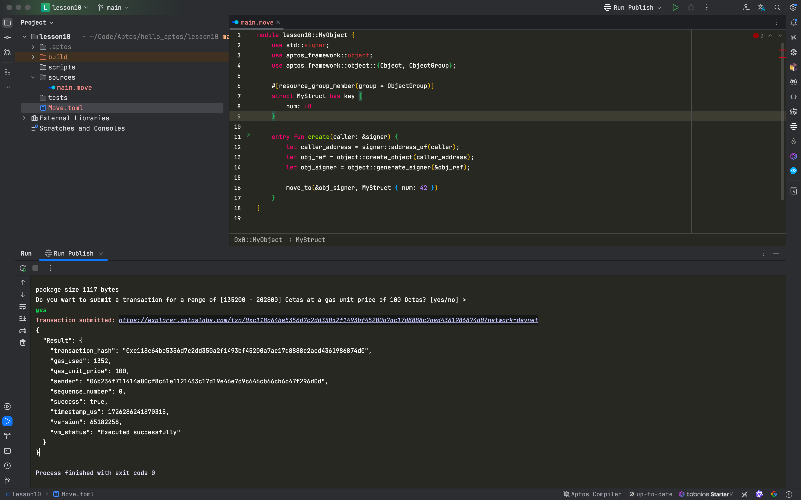

### 第四步：查看 Transaction

https://explorer.aptoslabs.com/txn/0xc118c64be5356d7c2dd350a2f1493bf45200a7ac17d8888c2aed4361986874d0?network=devnet


### 第五步：查看合约代码

https://explorer.aptoslabs.com/account/0x06b234f711414a80cf8c61e1121433c17d19e46e7d9c646cb66cb6c47f296d0d/modules/code/MyObject?network=devnet

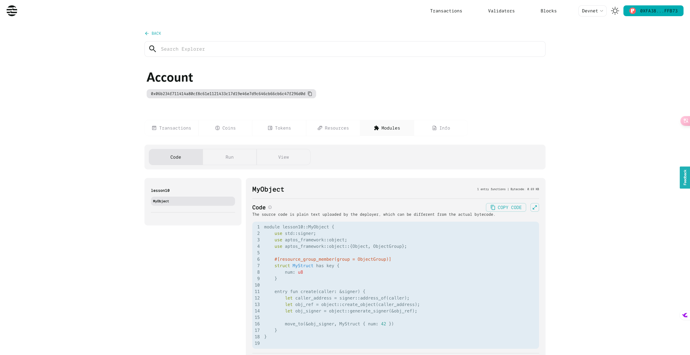


### 第六步：调用 `Create` 方法 Run create

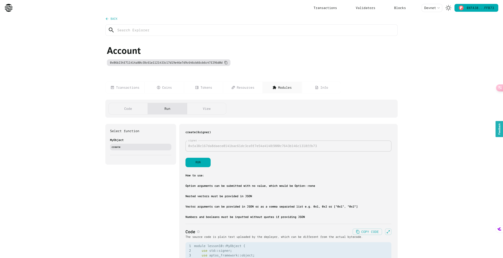

### 第七步：Approve

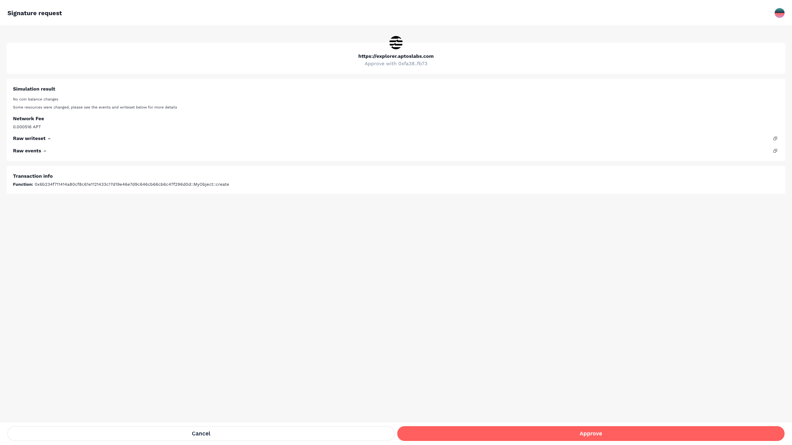

### 第八步：调用 `create` 方法 success

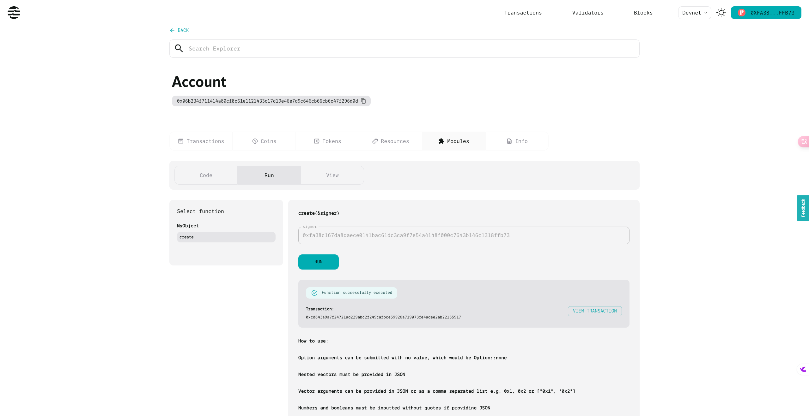


### 第九步：查看调用结果 Transaction

https://explorer.aptoslabs.com/txn/65349015/userTxnOverview?network=devnet

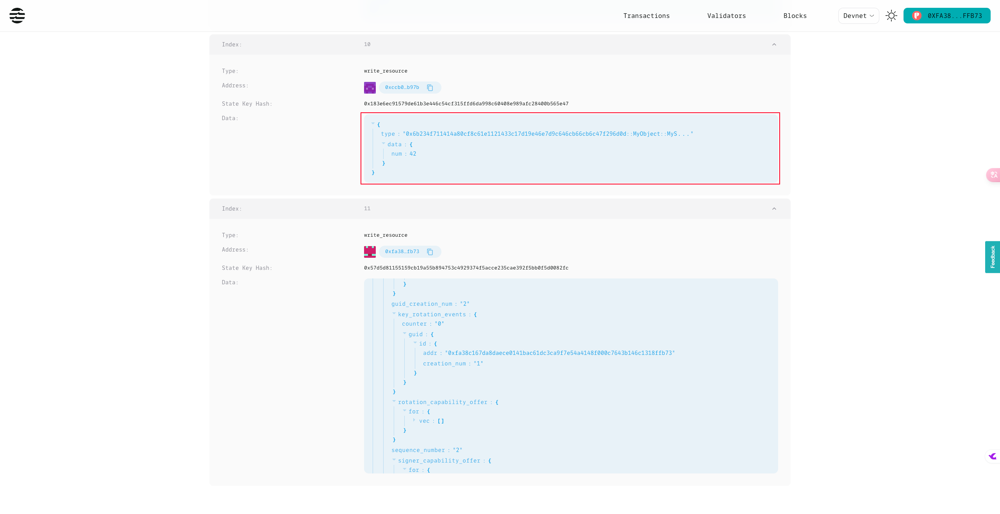

### 第十步：查看 Object

https://explorer.aptoslabs.com/object/0xccb0f97a6203148b21a80f9ddfb6ee9dcab037e79e1ca5b23c05eb7c52bfb97b/resources?network=devnet

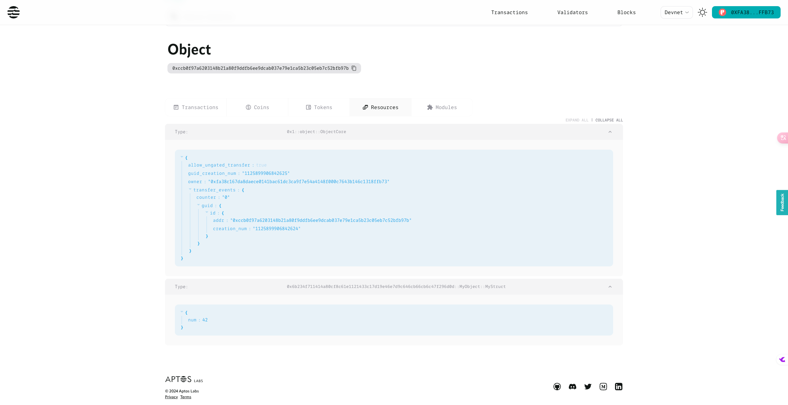


###  第十一步：增加 update 和 query 方法

```rust
module lesson10::MyObject {
    use std::signer;
    use aptos_framework::object;
    use aptos_framework::object::{Object, ObjectGroup};

    #[resource_group_member(group = ObjectGroup)]
    struct MyStruct has key {
        num: u8
    }

    entry fun create(caller: &signer) {
        let caller_address = signer::address_of(caller);
        let obj_ref = object::create_object(caller_address);
        let obj_signer = object::generate_signer(&obj_ref);

        move_to(&obj_signer, MyStruct { num: 42 })
    }

    entry fun update(caller: &signer, obj_addr: address, num: u8) acquires MyStruct {
        let obj_ref = borrow_global_mut<MyStruct>(obj_addr);
        obj_ref.num = num;
    }

    #[view]
    public fun query(obj_addr: address): u8 acquires MyStruct {
        let obj_ref = borrow_global<MyStruct>(obj_addr);
        obj_ref.num
    }
}

```

### 第十二步：再次发布

```shell
/opt/homebrew/bin/aptos move publish --named-addresses lesson10=default
Compiling, may take a little while to download git dependencies...
UPDATING GIT DEPENDENCY https://github.com/aptos-labs/aptos-core.git
INCLUDING DEPENDENCY AptosFramework
INCLUDING DEPENDENCY AptosStdlib
INCLUDING DEPENDENCY MoveStdlib
BUILDING lesson10
warning[W09001]: unused alias
  ┌─ /Users/qiaopengjun/Code/Aptos/hello_aptos/lesson10/sources/main.move:4:35
  │
4 │     use aptos_framework::object::{Object, ObjectGroup};
  │                                   ^^^^^^ Unused 'use' of alias 'Object'. Consider removing it

warning[W09002]: unused variable
   ┌─ /Users/qiaopengjun/Code/Aptos/hello_aptos/lesson10/sources/main.move:19:22
   │
19 │     entry fun update(caller: &signer, obj_addr: address, num: u8) acquires MyStruct {
   │                      ^^^^^^ Unused parameter 'caller'. Consider removing or prefixing with an underscore: '_caller'

warning: unused alias
  ┌─ /Users/qiaopengjun/Code/Aptos/hello_aptos/lesson10/sources/main.move:4:35
  │
4 │     use aptos_framework::object::{Object, ObjectGroup};
  │                                   ^^^^^^ Unused 'use' of alias 'Object'. Consider removing it

warning: unused variable
   ┌─ /Users/qiaopengjun/Code/Aptos/hello_aptos/lesson10/sources/main.move:19:22
   │
19 │     entry fun update(caller: &signer, obj_addr: address, num: u8) acquires MyStruct {
   │                      ^^^^^^ Unused parameter 'caller'. Consider removing or prefixing with an underscore: '_caller'

package size 1293 bytes
Do you want to submit a transaction for a range of [13900 - 20800] Octas at a gas unit price of 100 Octas? [yes/no] >
yes
Transaction submitted: https://explorer.aptoslabs.com/txn/0x809b54562d52b7efc92d7df0ba83dcb40e4f8cbdf74c667dcef9ac69aa2fde71?network=devnet
{
  "Result": {
    "transaction_hash": "0x809b54562d52b7efc92d7df0ba83dcb40e4f8cbdf74c667dcef9ac69aa2fde71",
    "gas_used": 139,
    "gas_unit_price": 100,
    "sender": "06b234f711414a80cf8c61e1121433c17d19e46e7d9c646cb66cb6c47f296d0d",
    "sequence_number": 1,
    "success": true,
    "timestamp_us": 1726301062080986,
    "version": 65413944,
    "vm_status": "Executed successfully"
  }
}

Process finished with exit code 0

```

### 第十三步：查看 Transaction

https://explorer.aptoslabs.com/txn/0x809b54562d52b7efc92d7df0ba83dcb40e4f8cbdf74c667dcef9ac69aa2fde71?network=devnet

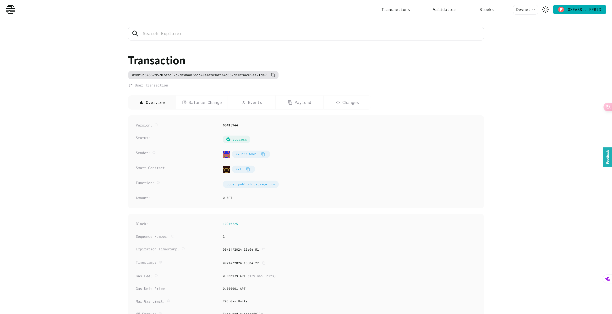


### 第十四步：查看合约

https://explorer.aptoslabs.com/account/0x06b234f711414a80cf8c61e1121433c17d19e46e7d9c646cb66cb6c47f296d0d/modules/code/MyObject?network=devnet

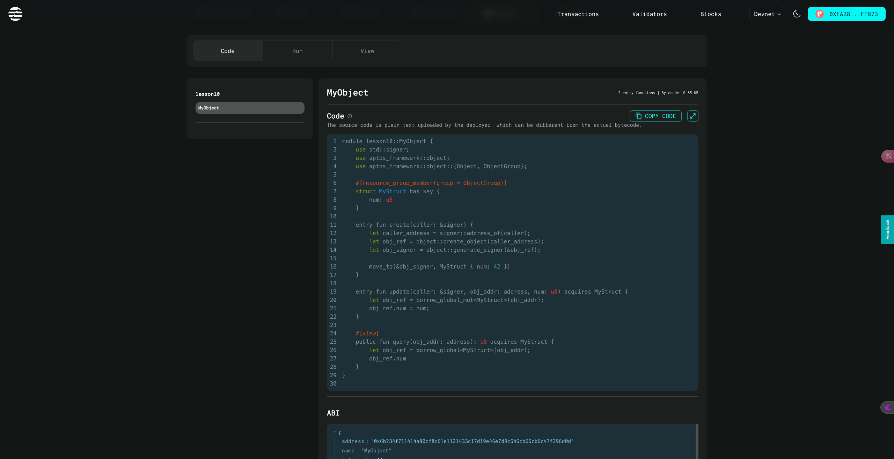

### 第十五步：调用create 方法

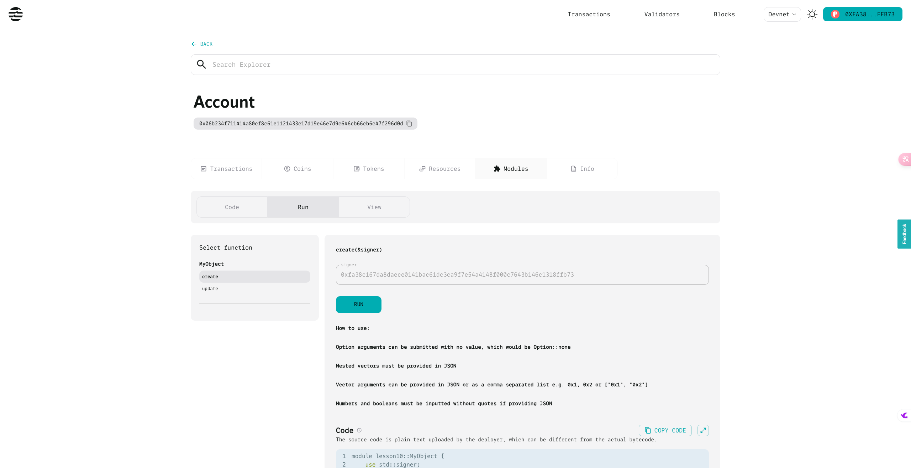

### 第十六步：调用 create 方法 success

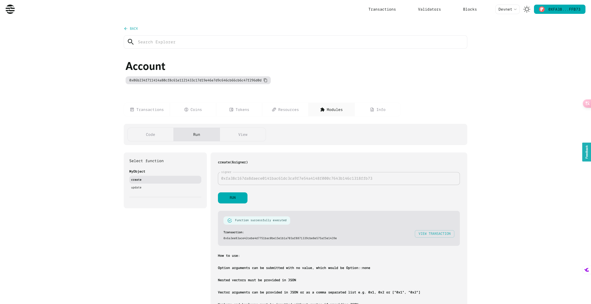

调用 create 方法成功

https://explorer.aptoslabs.com/account/0xa7bf08e4b2ef5eb2e8caf4755a78453a8a09f16e958d7e3f613aaf532c813e05/modules/run/MyObject/create?network=devnet

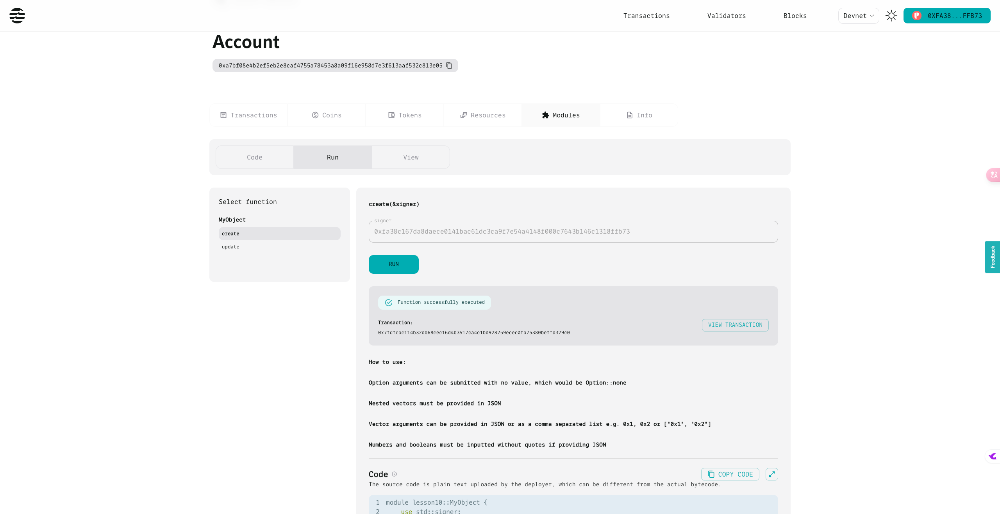

### 第十七步：查看 调用 create Transaction

https://explorer.aptoslabs.com/txn/0x7fdfcbc114b32db68cec16d4b3517ca4c1bd928259ecec0fb75380beffd329c0?network=devnet

https://explorer.aptoslabs.com/txn/0x7fdfcbc114b32db68cec16d4b3517ca4c1bd928259ecec0fb75380beffd329c0/changes?network=devnet

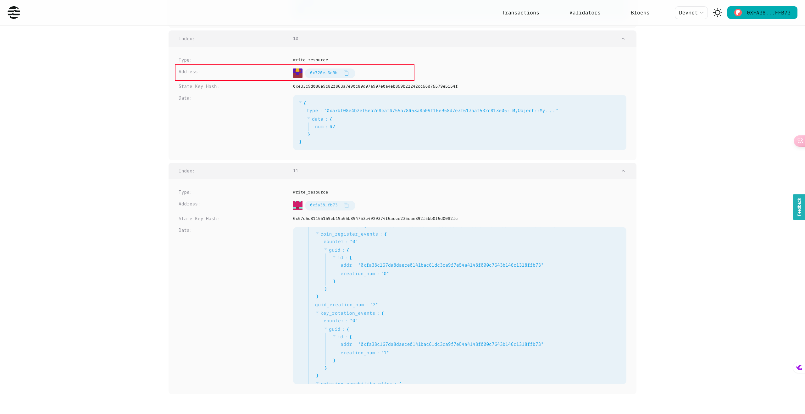

### 第十八步：查看创建的对象

https://explorer.aptoslabs.com/object/0x720e8f108840dbdd3e51e0197ef7222f344b3448a140b818b985bc633e606c9b/resources?network=devnet

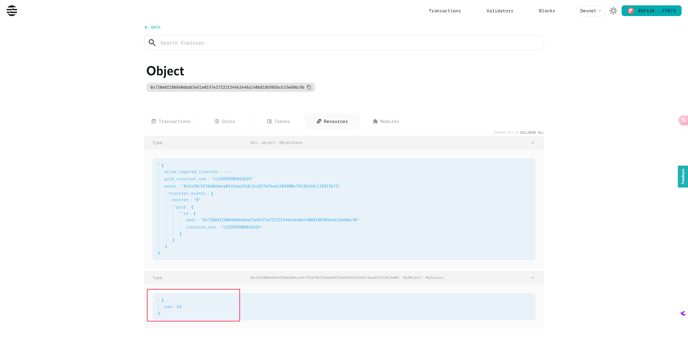

### 第十九步：调用 query 方法查看

注意：参数为 object 地址

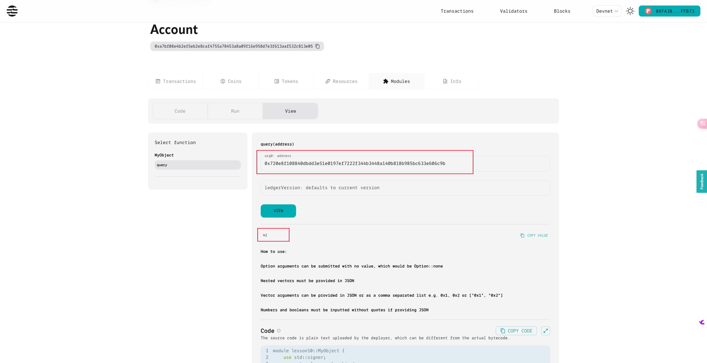

### 第二十步：调用 `Update` 方法更新为 88

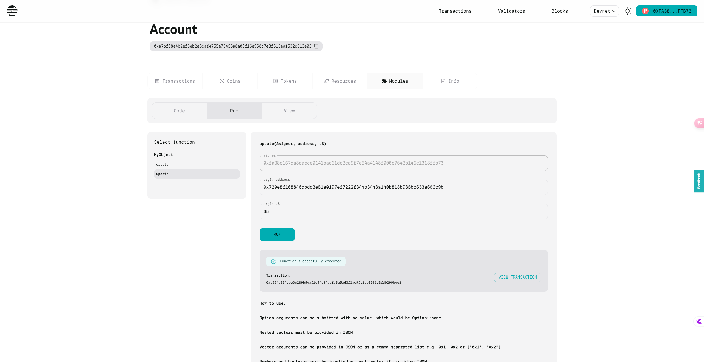

https://explorer.aptoslabs.com/txn/0xc654a954cbe0c289b54af1d94d84aafa5a5ad3f2ac9fbfea0081d3fdb299b4e2?network=devnet

### 第二十一步：再次调用 query 方法查看

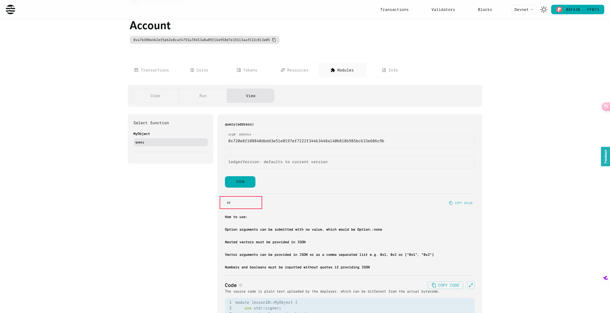

可以看到已经成功更新！

### 第二十二步：添加资源与配置实现代码

#### `main.move`代码

```rust
module lesson10::MyObject {
    use std::signer;
    use aptos_framework::object;
    use aptos_framework::object::{Object, ObjectGroup};

    // resource
    #[resource_group_member(group = ObjectGroup)]
    struct MyStruct has key {
        num: u8
    }

    #[resource_group_member(group = ObjectGroup)]
    struct YourStruct has key {
        bools: bool
    }

    // Extensibility
    #[resource_group_member(group = ObjectGroup)]
    struct ExtendRef has key {
        extend_ref: object::ExtendRef
    }

    #[resource_group_member(group = ObjectGroup)]
    struct TransferRef has key {
        transfer_ref: object::TransferRef
    }

    #[resource_group_member(group = ObjectGroup)]
    struct DeleteRef has key {
        delete_ref: object::DeleteRef
    }

    entry fun create(caller: &signer) {
        let caller_address = signer::address_of(caller);
        let obj_ref = object::create_object(caller_address);
        let obj_signer = object::generate_signer(&obj_ref);

        let obj_extend_ref = object::generate_extend_ref(&obj_ref);
        let obj_transfer_ref = object::generate_transfer_ref(&obj_ref);
        let obj_delete_ref = object::generate_delete_ref(&obj_ref);

        move_to(&obj_signer, MyStruct { num: 42 });
        move_to(&obj_signer, ExtendRef { extend_ref: obj_extend_ref });
        move_to(&obj_signer, TransferRef { transfer_ref: obj_transfer_ref });
        move_to(&obj_signer, DeleteRef { delete_ref: obj_delete_ref });
    }

    entry fun add_struct(obj: Object<MyStruct>) acquires ExtendRef {
        let obj_addr = object::object_address(&obj);
        let obj_extend_ref = &borrow_global<ExtendRef>(obj_addr).extend_ref;
        let obj_signer = object::generate_signer_for_extending(obj_extend_ref);

        move_to(&obj_signer, YourStruct { bools: true })
    }

    entry fun transfer(owner: &signer, obj: Object<MyStruct>, to: address) {
        object::transfer(owner, obj, to);
    }

    entry fun switch_transfer(obj: Object<MyStruct>) acquires TransferRef {
        let obj_addr = object::object_address(&obj);
        let obj_transfer_ref = &borrow_global<TransferRef>(obj_addr).transfer_ref;

        if (object::ungated_transfer_allowed(obj)) {
            object::disable_ungated_transfer(obj_transfer_ref);
        } else {
            object::enable_ungated_transfer(obj_transfer_ref);
        }
    }

    entry fun delete(owner: &signer, obj: Object<MyStruct>) acquires DeleteRef {
        let obj_addr = object::object_address(&obj);
        let DeleteRef { delete_ref }  = move_from<DeleteRef>(obj_addr);

        object::delete(delete_ref);
    }

    entry fun update(caller: &signer, obj_addr: address, num: u8) acquires MyStruct {
        let obj_ref = borrow_global_mut<MyStruct>(obj_addr);
        obj_ref.num = num;
    }

    #[view]
    public fun query(obj_addr: address): u8 acquires MyStruct {
        let obj_ref = borrow_global<MyStruct>(obj_addr);
        obj_ref.num
    }

    #[view]
    public fun owner(obj: Object<MyStruct>): address {
        object::owner(obj)
    }
}

```

### 第二十三步：发布

```shell
/opt/homebrew/bin/aptos move publish --named-addresses lesson10=default --skip-fetch-latest-git-deps
Compiling, may take a little while to download git dependencies...
INCLUDING DEPENDENCY AptosFramework
INCLUDING DEPENDENCY AptosStdlib
INCLUDING DEPENDENCY MoveStdlib
BUILDING lesson10
warning[W09002]: unused variable
   ┌─ /Users/qiaopengjun/Code/Aptos/hello_aptos/lesson10/sources/main.move:71:22
   │
71 │     entry fun delete(owner: &signer, obj: Object<MyStruct>) acquires DeleteRef {
   │                      ^^^^^ Unused parameter 'owner'. Consider removing or prefixing with an underscore: '_owner'

warning[W09002]: unused variable
   ┌─ /Users/qiaopengjun/Code/Aptos/hello_aptos/lesson10/sources/main.move:78:22
   │
78 │     entry fun update(caller: &signer, obj_addr: address, num: u8) acquires MyStruct {
   │                      ^^^^^^ Unused parameter 'caller'. Consider removing or prefixing with an underscore: '_caller'

warning: unused variable
   ┌─ /Users/qiaopengjun/Code/Aptos/hello_aptos/lesson10/sources/main.move:71:22
   │
71 │     entry fun delete(owner: &signer, obj: Object<MyStruct>) acquires DeleteRef {
   │                      ^^^^^ Unused parameter 'owner'. Consider removing or prefixing with an underscore: '_owner'

warning: unused variable
   ┌─ /Users/qiaopengjun/Code/Aptos/hello_aptos/lesson10/sources/main.move:78:22
   │
78 │     entry fun update(caller: &signer, obj_addr: address, num: u8) acquires MyStruct {
   │                      ^^^^^^ Unused parameter 'caller'. Consider removing or prefixing with an underscore: '_caller'

package size 2544 bytes
Do you want to submit a transaction for a range of [57100 - 85600] Octas at a gas unit price of 100 Octas? [yes/no] >
yes
Transaction submitted: https://explorer.aptoslabs.com/txn/0xd710922357ab939a6214bf71abc0dff63dbda628779df45b6dd457f9efa4c899?network=devnet
{
  "Result": {
    "transaction_hash": "0xd710922357ab939a6214bf71abc0dff63dbda628779df45b6dd457f9efa4c899",
    "gas_used": 571,
    "gas_unit_price": 100,
    "sender": "a7bf08e4b2ef5eb2e8caf4755a78453a8a09f16e958d7e3f613aaf532c813e05",
    "sequence_number": 1,
    "success": true,
    "timestamp_us": 1726318231800770,
    "version": 65681916,
    "vm_status": "Executed successfully"
  }
}

Process finished with exit code 0

```

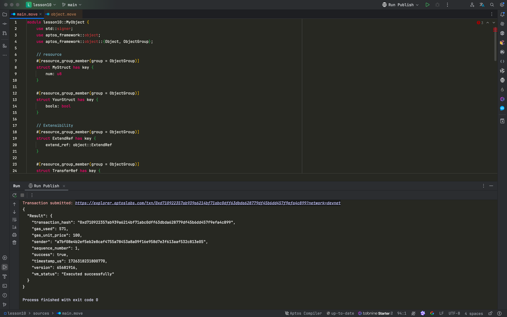

### 第二十四步：查看 发布 Transaction

https://explorer.aptoslabs.com/txn/0xd710922357ab939a6214bf71abc0dff63dbda628779df45b6dd457f9efa4c899?network=devnet

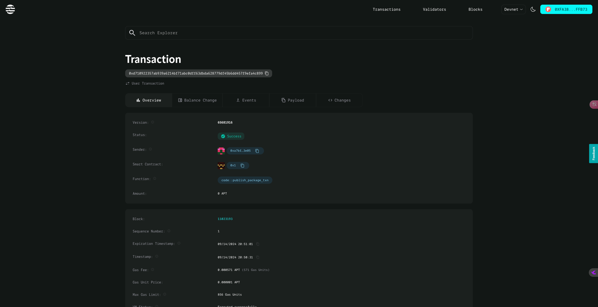

### 第二十五步：查看 合约 Code

https://explorer.aptoslabs.com/account/0xa7bf08e4b2ef5eb2e8caf4755a78453a8a09f16e958d7e3f613aaf532c813e05/modules/code/MyObject?network=devnet

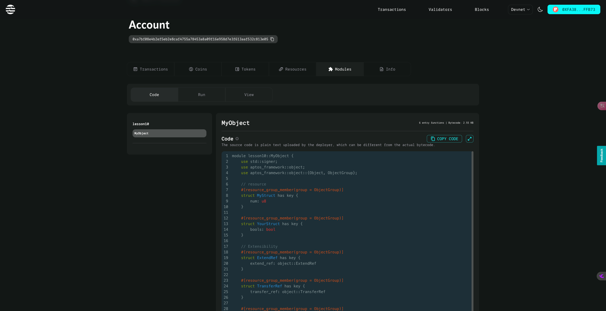

### 第二十六步：调用 `create` 方法

#### 点击 RUN 

https://explorer.aptoslabs.com/account/0xa7bf08e4b2ef5eb2e8caf4755a78453a8a09f16e958d7e3f613aaf532c813e05/modules/run/MyObject/create?network=devnet

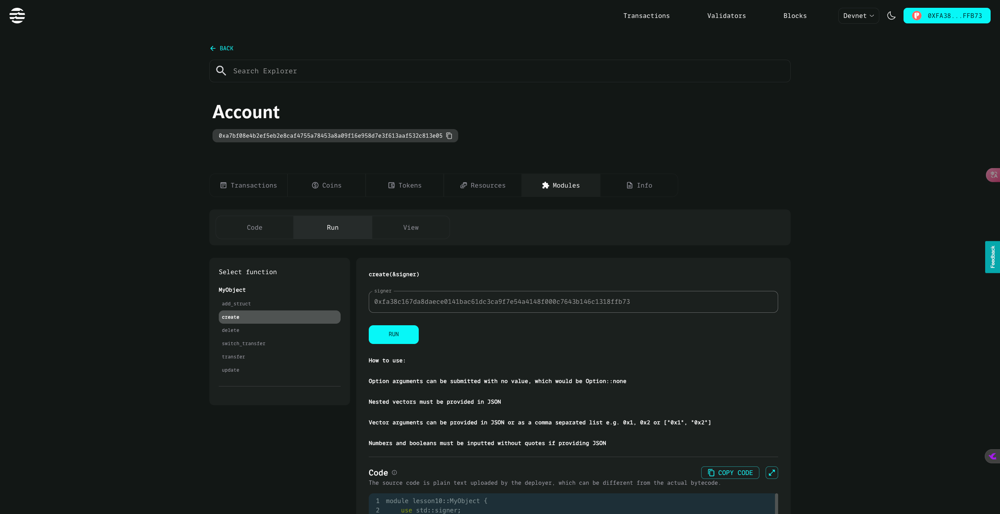

### 第二十七步：Approve

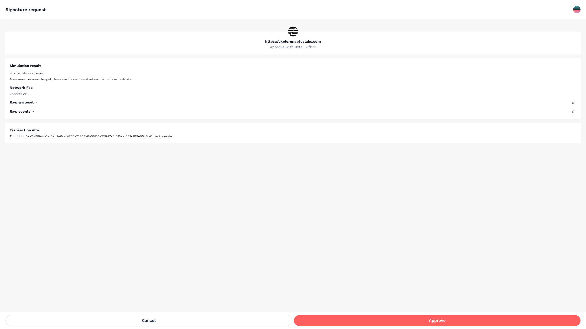

#### 第二十八步：create successful

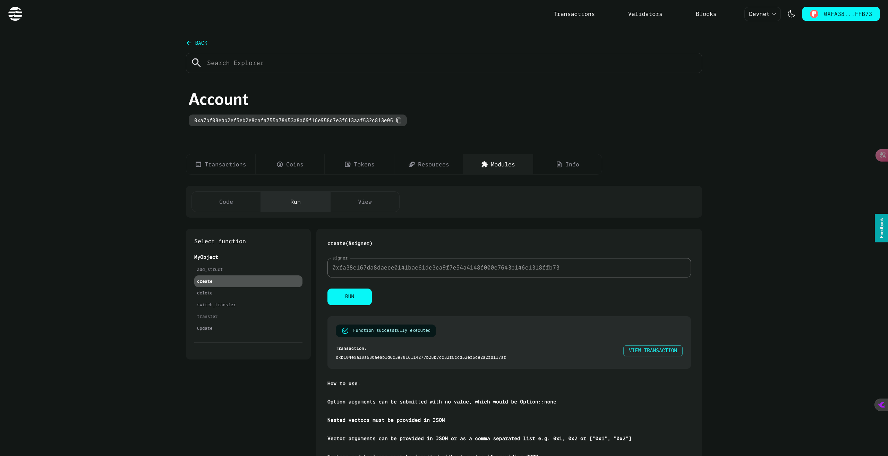

### 第二十九步：查看 调用 create Transaction

https://explorer.aptoslabs.com/txn/0xb104e9a19a680aeab1d6c3e7816114277b28b7cc32f5ccd52ef6ce2a2fd117af?network=devnet

https://explorer.aptoslabs.com/txn/0xb104e9a19a680aeab1d6c3e7816114277b28b7cc32f5ccd52ef6ce2a2fd117af/changes?network=devnet

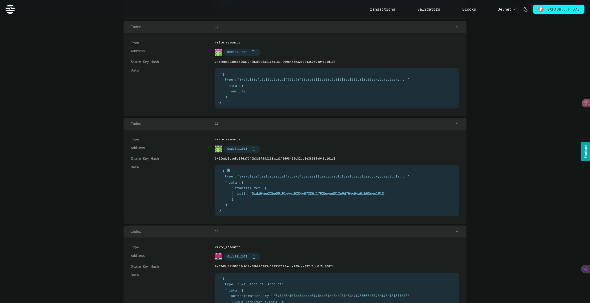

### 第三十步：查看 Object 

0xda54ee23be09f91444f5384467386f1792bc4ed013e9d754464a6fb58c4c1918

https://explorer.aptoslabs.com/object/0xda54ee23be09f91444f5384467386f1792bc4ed013e9d754464a6fb58c4c1918/resources?network=devnet

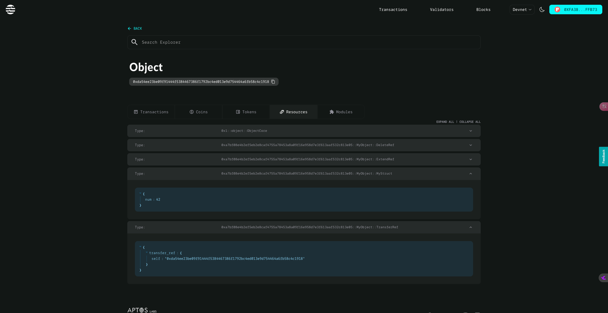

### 第三十一步：调用 `add_struct`

https://explorer.aptoslabs.com/account/0xa7bf08e4b2ef5eb2e8caf4755a78453a8a09f16e958d7e3f613aaf532c813e05/modules/run/MyObject/add_struct?network=devnet

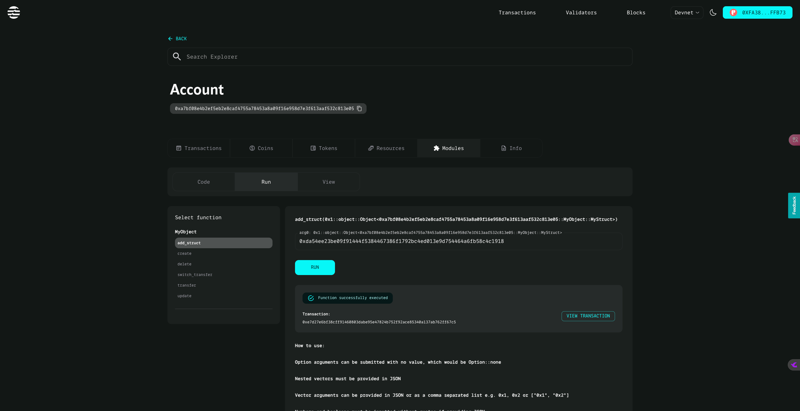

### 第三十二步：查看 调用 `add_struct` Transaction

https://explorer.aptoslabs.com/txn/0xe7d27e6bf38cff91460803dabe95e47824b752f92ace85340a137ab762ff67c5/changes?network=devnet

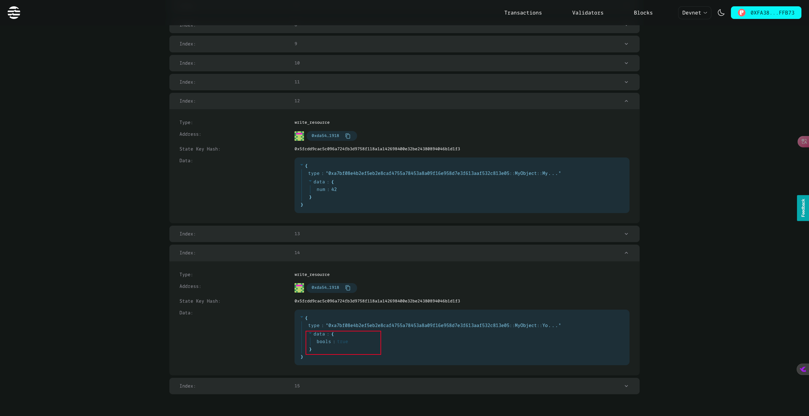

### 第三十三步：调用 `transfer` 方法

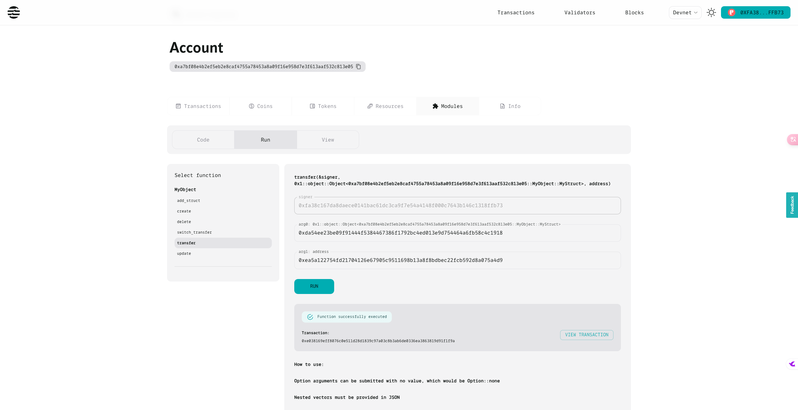


### 第三十四步：查看 `transfer Transaction`

**https://explorer.aptoslabs.com/txn/0xe038169eff8076c0e511d28d1839c97a03c8b3ab6de0336ea3863819d91f1f9a?network=devnet**

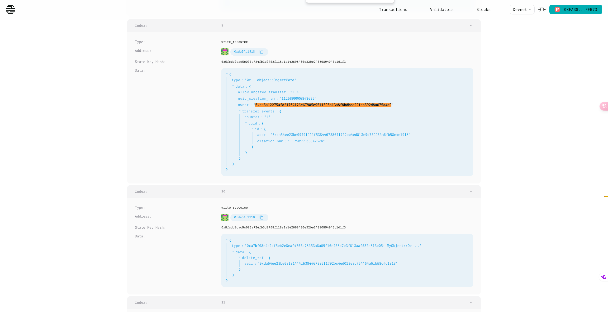


### 第三十五步：调用`owner` 方法查看 owner

https://explorer.aptoslabs.com/account/0xa7bf08e4b2ef5eb2e8caf4755a78453a8a09f16e958d7e3f613aaf532c813e05/modules/view/MyObject/owner?network=devnet

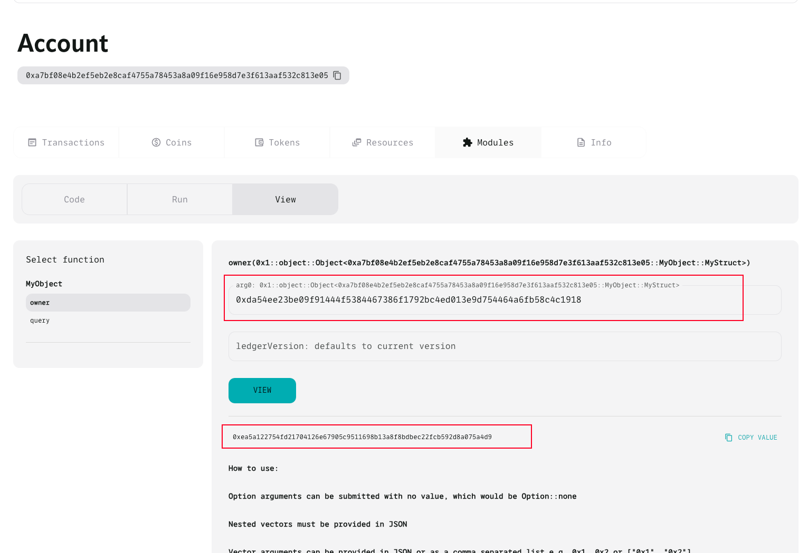

可以看到owner已经是新的地址了！

### 第三十六步：调用`query` 方法查看对应的值

https://explorer.aptoslabs.com/account/0xa7bf08e4b2ef5eb2e8caf4755a78453a8a09f16e958d7e3f613aaf532c813e05/modules/view/MyObject/query?network=devnet

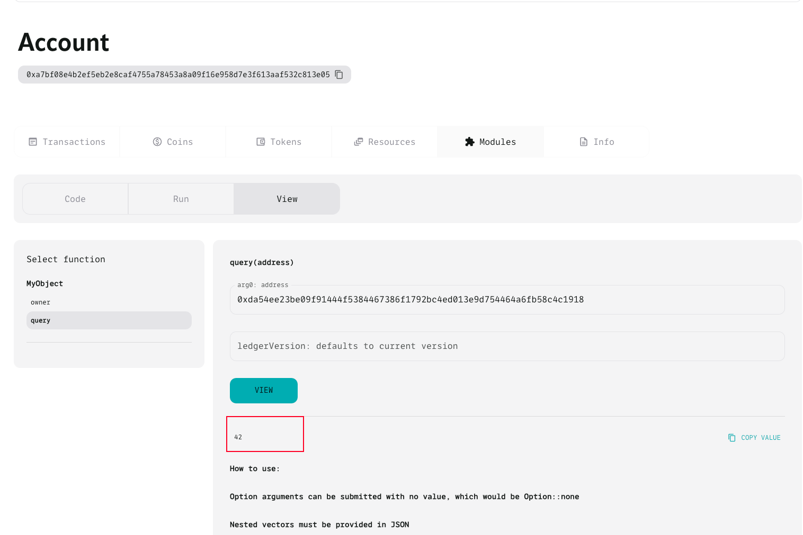

#### 可以看到查询到的值为 42！

### 第三十七步：调用`update` 方法更新值为 100

注意：这里owner 没有限制故可以修改！实际开发中应根据具体情况做出相应的限制。

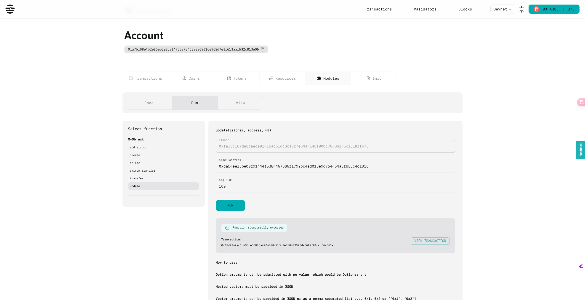

https://explorer.aptoslabs.com/txn/0x45d02a0ec1d495ce35048a420a748f213d7e740b99925da6607f81dcb66a361e?network=devnet

### 第三十八步：调用`query` 方法查询更新后的结果

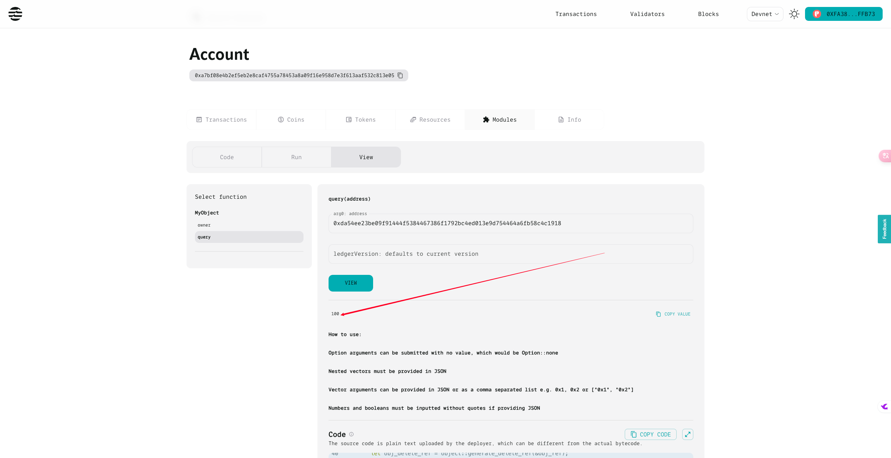

可以看到值已经成功更新为 100！

### 第三十九步：调用`create` 方法创建一个新的 Object

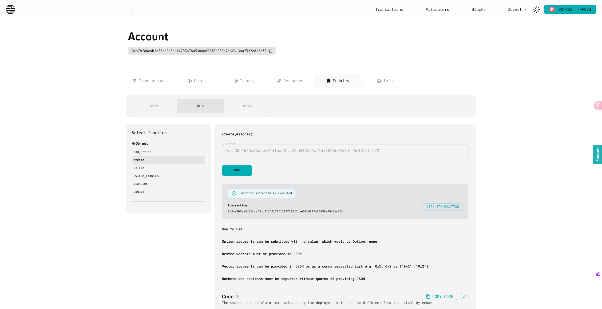

Transaction：

https://explorer.aptoslabs.com/txn/0x3ae2b5ea8d85cdaf3cb3124917fff2f97206f2dae09bd8f7a65690e55a84c66b/changes?network=devnet

object：0x6b61f12d681855d3ec4af3d4b34d9989757d9d4faa1226873b4a40d007c5d952

### 第四十步：调用`switch_transfer` 方法

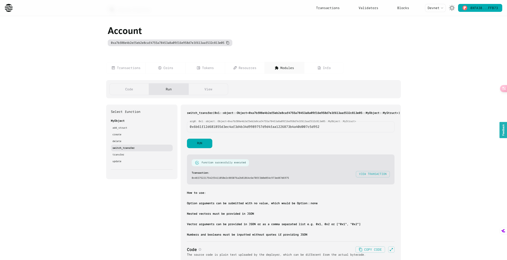

Transaction:

0x483752217542f5411050e2c885076a2b81864c6e70ff3b0e054c973ed87d6975

https://explorer.aptoslabs.com/txn/0x483752217542f5411050e2c885076a2b81864c6e70ff3b0e054c973ed87d6975?network=devnet

调用`switch_transfer` 后不能再 `transfer`了

### 第四十一步：调用`transfer` 方法验证

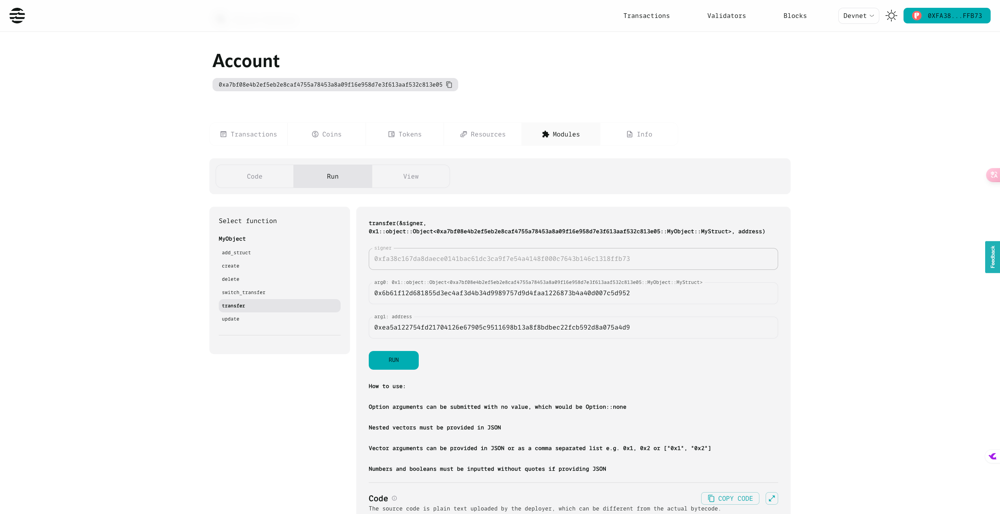

点击 `RUN`

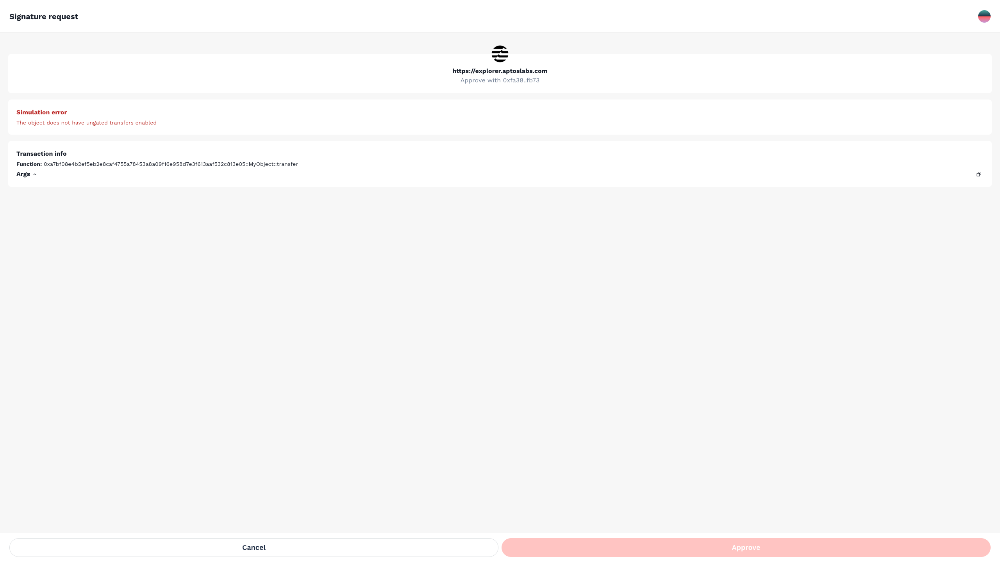

报错：The object does not have ungated transfers enabled

成功验证了`switch_transfer`后是不能`transfer` 的！

### 第四十二步：调用 `delete` 方法

https://explorer.aptoslabs.com/account/0xa7bf08e4b2ef5eb2e8caf4755a78453a8a09f16e958d7e3f613aaf532c813e05/modules/run/MyObject/delete?network=devnet

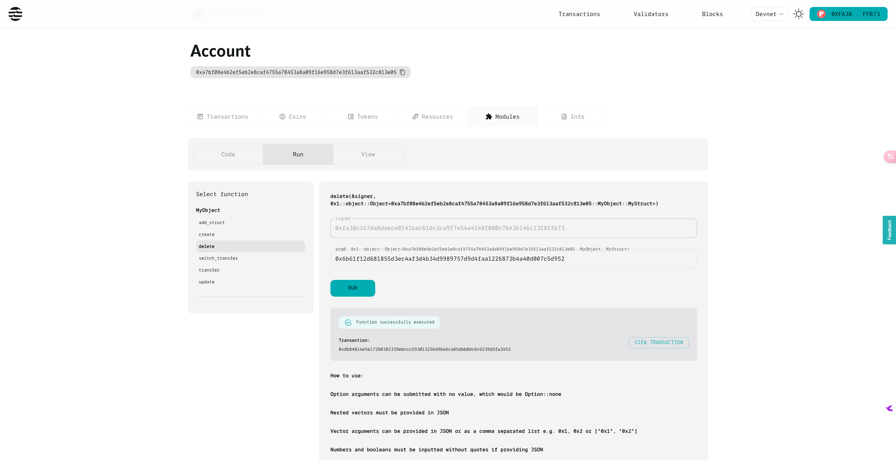

https://explorer.aptoslabs.com/txn/0xdb84814e5e17280382339ebccc593013256d9ba6ca85dbb0dc6c6239d5fa3453?network=devnet

调用之前：

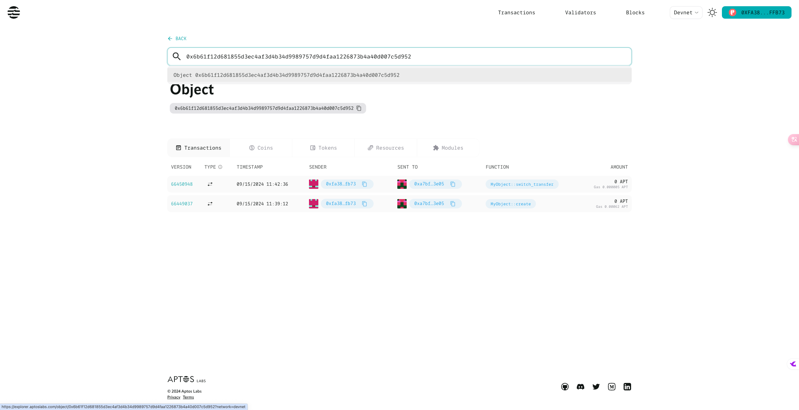


调用之后：

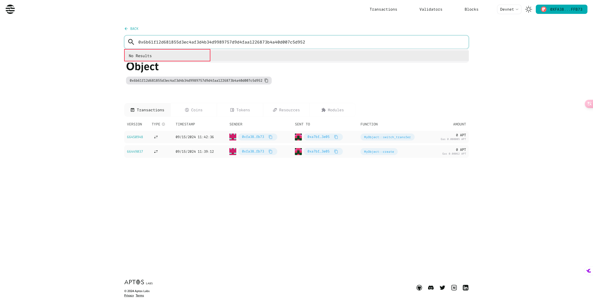


成功删除！

扩展：`update` `transfer` 可以增加限制功能！

### object 源码参考

```rust
    /// Create a new named object and return the ConstructorRef. Named objects can be queried globally
    /// by knowing the user generated seed used to create them. Named objects cannot be deleted.
    public fun create_named_object(creator: &signer, seed: vector<u8>): ConstructorRef {
        let creator_address = signer::address_of(creator);
        let obj_addr = create_object_address(&creator_address, seed);
        create_object_internal(creator_address, obj_addr, false)
    }

    /// Create a new object whose address is derived based on the creator account address and another object.
    /// Derivde objects, similar to named objects, cannot be deleted.
    public(friend) fun create_user_derived_object(creator_address: address, derive_ref: &DeriveRef): ConstructorRef {
        let obj_addr = create_user_derived_object_address(creator_address, derive_ref.self);
        create_object_internal(creator_address, obj_addr, false)
    }

    /// Create a new object by generating a random unique address based on transaction hash.
    /// The unique address is computed sha3_256([transaction hash | auid counter | 0xFB]).
    /// The created object is deletable as we can guarantee the same unique address can
    /// never be regenerated with future txs.
    public fun create_object(owner_address: address): ConstructorRef {
        let unique_address = transaction_context::generate_auid_address();
        create_object_internal(owner_address, unique_address, true)
    }

    /// Same as `create_object` except the object to be created will be undeletable.
    public fun create_sticky_object(owner_address: address): ConstructorRef {
        let unique_address = transaction_context::generate_auid_address();
        create_object_internal(owner_address, unique_address, false)
    }
```

## 总结

通过本文的讲解与实操，读者应已掌握 Aptos Move 中 Object 的核心概念与配置方法。Object 的动态扩展性和受控转移功能赋予了开发者更大的灵活性，使资源管理更加便捷与安全。借助这些工具，开发者能够更高效地构建复杂的区块链应用。

## 参考

- https://aptos.dev/en/build/smart-contracts/objects/creating-objects#adding-resources
- https://explorer.aptoslabs.com/txn/0xb104e9a19a680aeab1d6c3e7816114277b28b7cc32f5ccd52ef6ce2a2fd117af/changes?network=devnet
- https://explorer.aptoslabs.com/txn/0xe7d27e6bf38cff91460803dabe95e47824b752f92ace85340a137ab762ff67c5/changes?network=devnet
- https://explorer.aptoslabs.com/object/0x6b61f12d681855d3ec4af3d4b34d9989757d9d4faa1226873b4a40d007c5d952?network=devnet
- https://explorer.aptoslabs.com/txn/0x45d02a0ec1d495ce35048a420a748f213d7e740b99925da6607f81dcb66a361e?network=devnet
- https://explorer.aptoslabs.com/txn/0xe7d27e6bf38cff91460803dabe95e47824b752f92ace85340a137ab762ff67c5/changes?network=devnet
- https://explorer.aptoslabs.com/txn/0xc654a954cbe0c289b54af1d94d84aafa5a5ad3f2ac9fbfea0081d3fdb299b4e2?network=devnet
- https://explorer.aptoslabs.com/txn/0xdb84814e5e17280382339ebccc593013256d9ba6ca85dbb0dc6c6239d5fa3453?network=devnet
- https://aptos.dev/en/build/smart-contracts/objects/creating-objects#adding-resources