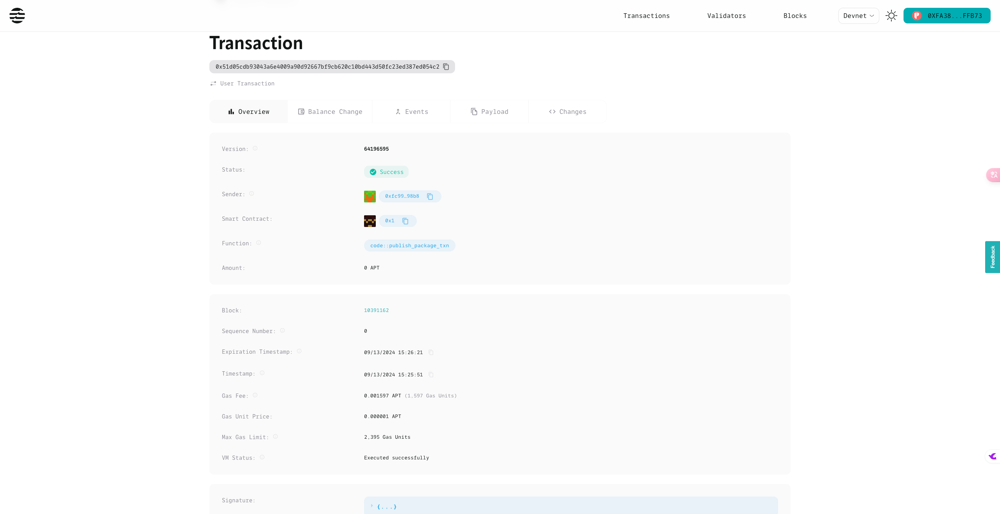
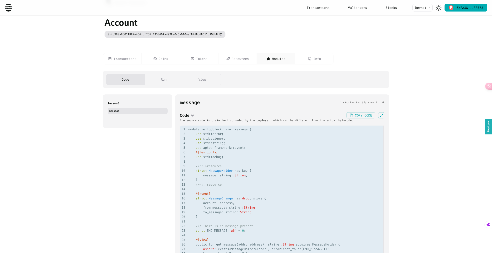
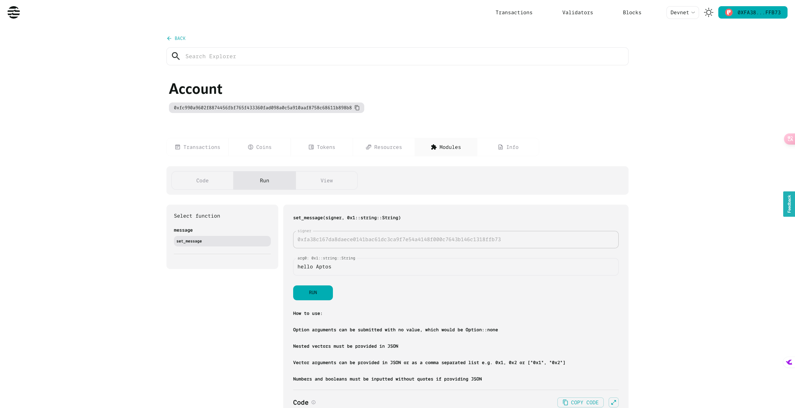
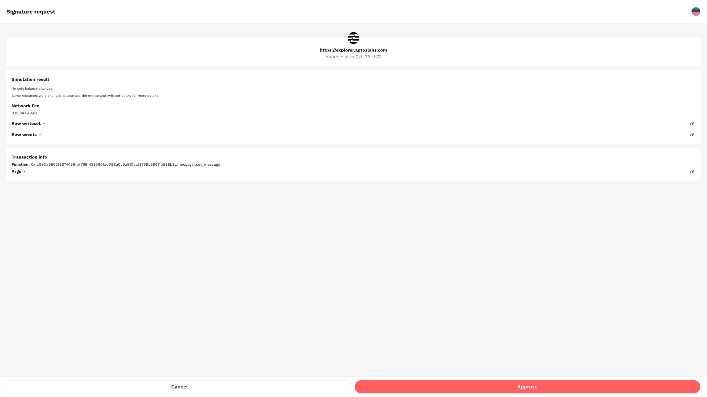
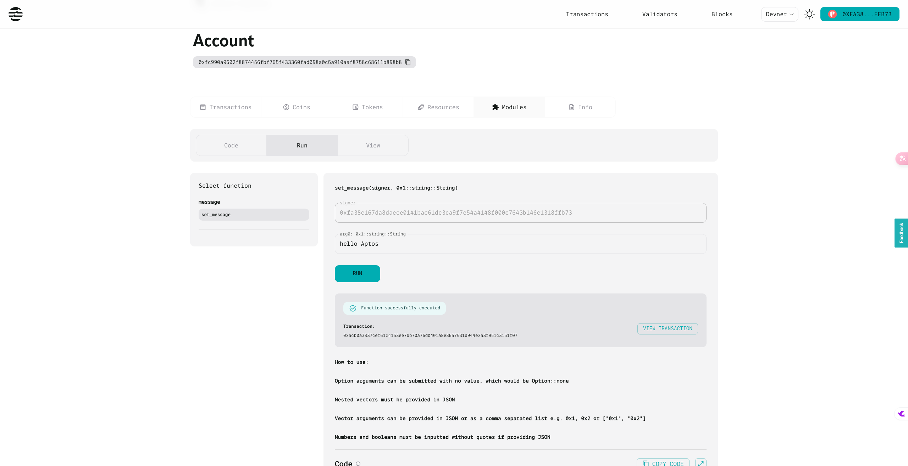
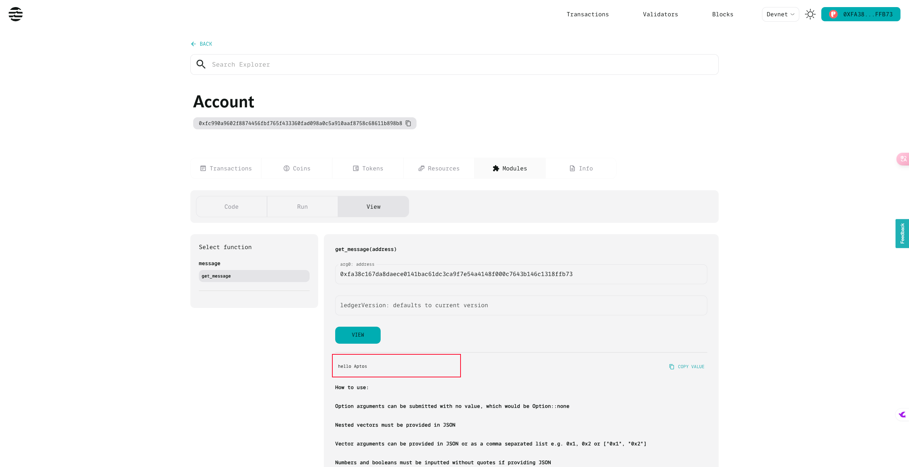
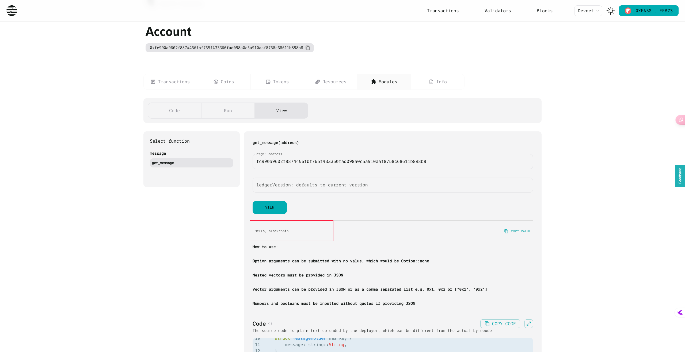

# **Aptos Move 模块的发布与交互：完整指南**

随着区块链技术的飞速发展，Aptos Move 作为一种创新的智能合约编程语言，受到了越来越多开发者的关注。Move 语言因其对安全性和资源管理的独特处理方式，逐渐成为区块链开发中的新宠。本指南将带你详细了解如何在 Aptos 上发布和交互 Move 模块，涵盖从初始化账户到调用智能合约的具体流程。

___

本文介绍了在 Aptos 区块链上如何使用 Move 语言编写、编译、发布和交互模块的全过程。首先，我们会指导你如何配置账户并为其注入 gas 费，随后展示如何编译和测试模块。接着，文章将说明如何通过 Aptos Explorer 浏览区块链状态，如何在终端中调用模块功能，以及如何通过 SDK 进行交互操作。最后，通过具体的代码示例，我们将带你深入体验完整的发布与交互流程。

___

## **模块的发布与交互流程**

### 发布流程

1. 配置账户，并为其发送 gas
     可以通过 aptos init 来初始化一个账户。

2. 编译并测试模块
     可以通过以下命令来编译

      ```shell
       aptos move compile --named-addresses hello_blockchain=default
      ```

     

3. 发布模块

     ```shell
     aptos move publish --named-addresses hello_blockchain=default
     ```

     

### 交互流程

1. 区块链浏览器
     https://explorer.aptoslabs.com/

2. 终端

     ```shell
     aptos move run --function-id 'default::message::set_message' --args 'string:hello, blockchain'
     ```

     

3. SDK

     详细参考 Aptos SDK 文档: [aptos.dev](https://aptos.dev/en/build/sdks)

     https://aptos.dev/en/build/sdks


## **实操示例**

### 1. 创建项目并初始化

使用以下命令创建新项目并初始化账户：

```shell
mkdir lesson8
cd lesson8
aptos move init --name lesson8
aptos init
```

**实操创建项目并初始化**

```shell
hello_aptos on  main [?] via 🅒 base
➜
mcd lesson8

hello_aptos/lesson8 on  main [?] via 🅒 base
➜
aptos move init --name lesson8
{
  "Result": "Success"
}

hello_aptos/lesson8 on  main [?] via 🅒 base
➜
aptos init
Configuring for profile default
Choose network from [devnet, testnet, mainnet, local, custom | defaults to devnet]

No network given, using devnet...
Enter your private key as a hex literal (0x...) [Current: None | No input: Generate new key (or keep one if present)]

No key given, generating key...
Account 0xfc990a9602f8874456fbf765f433360fad098a0c5a910aaf8758c68611b898b8 doesn't exist, creating it and funding it with 100000000 Octas
Account 0xfc990a9602f8874456fbf765f433360fad098a0c5a910aaf8758c68611b898b8 funded successfully

---
Aptos CLI is now set up for account 0xfc990a9602f8874456fbf765f433360fad098a0c5a910aaf8758c68611b898b8 as profile default!
 See the account here: https://explorer.aptoslabs.com/account/0xfc990a9602f8874456fbf765f433360fad098a0c5a910aaf8758c68611b898b8?network=devnet
 Run `aptos --help` for more information about commands
{
  "Result": "Success"
}

hello_aptos/lesson8 on  main [?] via 🅒 base took 7.7s
➜
open -a RustRover .

```

### 2. 查看项目结构

```shell
tree . -L 6 -I 'build'
```

输出结构大致如下：

```shell
.
├── Move.toml
├── scripts
├── sources
│   ├── hello_blockchain.move
│   └── hello_blockchain_test.move
└── tests
```

#### 实操

```shell
hello_aptos/lesson8 on  main [?] via 🅒 base took 5.7s 
➜ tree . -L 6 -I 'build'                                                                        


.
├── Move.toml
├── scripts
├── sources
│   ├── hello_blockchain.move
│   └── hello_blockchain_test.move
└── tests

4 directories, 3 files


```

###  **3. 模块编写：**`hello_blockchain.move`

该模块实现了一个简单的消息存储和获取功能。使用 MessageHolder 资源来保存消息，并通过 set_message 和 get_message 方法来设置和获取消息。

```rust
module hello_blockchain::message {
    use std::error;
    use std::signer;
    use std::string;
    use aptos_framework::event;
    #[test_only]
    use std::debug;

    //:!:>resource
    struct MessageHolder has key {
        message: string::String,
    }
    //<:!:resource

    #[event]
    struct MessageChange has drop, store {
        account: address,
        from_message: string::String,
        to_message: string::String,
    }

    /// There is no message present
    const ENO_MESSAGE: u64 = 0;

    #[view]
    public fun get_message(addr: address): string::String acquires MessageHolder {
        assert!(exists<MessageHolder>(addr), error::not_found(ENO_MESSAGE));
        borrow_global<MessageHolder>(addr).message
    }

    public entry fun set_message(account: signer, message: string::String)
    acquires MessageHolder {
        let account_addr = signer::address_of(&account);
        if (!exists<MessageHolder>(account_addr)) {
            move_to(&account, MessageHolder {
                message,
            })
        } else {
            let old_message_holder = borrow_global_mut<MessageHolder>(account_addr);
            let from_message = old_message_holder.message;
            event::emit(MessageChange {
                account: account_addr,
                from_message,
                to_message: copy message,
            });
            old_message_holder.message = message;
        }
    }

    #[test(account = @0x1)]
    public entry fun sender_can_set_message(account: signer) acquires MessageHolder {
        let msg: string::String = string::utf8(b"Running test for sender_can_set_message...");
        debug::print(&msg);

        let addr = signer::address_of(&account);
        aptos_framework::account::create_account_for_test(addr);
        set_message(account, string::utf8(b"Hello, Blockchain"));

        assert!(
            get_message(addr) == string::utf8(b"Hello, Blockchain"),
            ENO_MESSAGE
        );
    }
}
```

### `hello_blockchain_test.move`

```rust
#[test_only]
module hello_blockchain::message_tests {
    use std::signer;
    use std::unit_test;
    use std::vector;
    use std::string;

    use hello_blockchain::message;

    fun get_account(): signer {
        vector::pop_back(&mut unit_test::create_signers_for_testing(1))
    }

    #[test]
    public entry fun sender_can_set_message() {
        let account = get_account();
        let addr = signer::address_of(&account);
        aptos_framework::account::create_account_for_test(addr);
        message::set_message(account,  string::utf8(b"Hello, Blockchain"));

        assert!(
            message::get_message(addr) == string::utf8(b"Hello, Blockchain"),
            0
        );
    }
}
```

### `Move.toml`

```toml
[package]
name = "lesson8"
version = "1.0.0"
authors = []

[addresses]
hello_blockchain = "_"

[dev-addresses]

[dependencies.AptosFramework]
git = "https://github.com/aptos-labs/aptos-core.git"
rev = "mainnet"
subdir = "aptos-move/framework/aptos-framework"

[dev-dependencies]

```

https://github.com/aptos-labs/aptos-core/blob/main/aptos-move/move-examples/hello_blockchain/sources/hello_blockchain.move

### **4. 编译与测试**

```shell
aptos account fund-with-faucet --account default
aptos move compile --named-addresses hello_blockchain=default
aptos move test --named-addresses hello_blockchain=default
```

测试通过后，将看到类似如下的输出：

```shell
Test result: OK. Total tests: 2; passed: 2; failed: 0
```


#### 实操领水并 compile 和 Test

```shell
hello_aptos/lesson8 on  main [?] via 🅒 base 
➜ aptos account fund-with-faucet --account default                                                           
{
  "Result": "Added 100000000 Octas to account 0xfc990a9602f8874456fbf765f433360fad098a0c5a910aaf8758c68611b898b8"
}

hello_aptos/lesson8 on  main [?] via 🅒 base took 2.5s 
➜ aptos move compile --named-addresses hello_blockchain=default                                                 
Compiling, may take a little while to download git dependencies...
UPDATING GIT DEPENDENCY https://github.com/aptos-labs/aptos-core.git
INCLUDING DEPENDENCY AptosFramework
INCLUDING DEPENDENCY AptosStdlib
INCLUDING DEPENDENCY MoveStdlib
BUILDING lesson8
{
  "Result": [
    "fc990a9602f8874456fbf765f433360fad098a0c5a910aaf8758c68611b898b8::message"
  ]
}

hello_aptos/lesson8 on  main [?] via 🅒 base took 23.3s 
➜ aptos move test --named-addresses hello_blockchain=default
INCLUDING DEPENDENCY AptosFramework
INCLUDING DEPENDENCY AptosStdlib
INCLUDING DEPENDENCY MoveStdlib
BUILDING lesson8
Running Move unit tests
[debug] "Running test for sender_can_set_message..."
[ PASS    ] 0xfc990a9602f8874456fbf765f433360fad098a0c5a910aaf8758c68611b898b8::message_tests::sender_can_set_message
[ PASS    ] 0xfc990a9602f8874456fbf765f433360fad098a0c5a910aaf8758c68611b898b8::message::sender_can_set_message
Test result: OK. Total tests: 2; passed: 2; failed: 0
{
  "Result": "Success"
}

```

### **5. 发布模块**

通过以下命令发布模块：

```shell
aptos move publish --named-addresses hello_blockchain=default
```

实操发布

```shell
hello_aptos/lesson8 on  main [?] via 🅒 base took 8.0s 
➜ aptos move publish --named-addresses hello_blockchain=default
Compiling, may take a little while to download git dependencies...
UPDATING GIT DEPENDENCY https://github.com/aptos-labs/aptos-core.git
INCLUDING DEPENDENCY AptosFramework
INCLUDING DEPENDENCY AptosStdlib
INCLUDING DEPENDENCY MoveStdlib
BUILDING lesson8
package size 1729 bytes
Do you want to submit a transaction for a range of [159700 - 239500] Octas at a gas unit price of 100 Octas? [yes/no] >
yes
Transaction submitted: https://explorer.aptoslabs.com/txn/0x51d05cdb93043a6e4009a90d92667bf9cb620c10bd443d50fc23ed387ed054c2?network=devnet
{
  "Result": {
    "transaction_hash": "0x51d05cdb93043a6e4009a90d92667bf9cb620c10bd443d50fc23ed387ed054c2",
    "gas_used": 1597,
    "gas_unit_price": 100,
    "sender": "fc990a9602f8874456fbf765f433360fad098a0c5a910aaf8758c68611b898b8",
    "sequence_number": 0,
    "success": true,
    "timestamp_us": 1726212351694050,
    "version": 64196595,
    "vm_status": "Executed successfully"
  }
}

hello_aptos/lesson8 on  main [?] via 🅒 base took 28.9s 
➜ 

```

成功发布后，Aptos Explorer 上会显示发布的交易详情。

#### 查看 Transaction

https://explorer.aptoslabs.com/txn/0x51d05cdb93043a6e4009a90d92667bf9cb620c10bd443d50fc23ed387ed054c2?network=devnet




https://explorer.aptoslabs.com/account/0xfc990a9602f8874456fbf765f433360fad098a0c5a910aaf8758c68611b898b8/modules/code/message?network=devnet

### 6. 查看并调用合约




### 6. 调用 `set_message`方法




### 7.授权




### 8. Run set_message 成功





### 9. 调用 `Get message` 方法




### **10. 通过终端交互**命令行调用`set_message` 方法

调用 set_message 方法：

```shell
aptos move run --function-id 'default::message::set_message' --args string:"Hello, Aptos"
```

实操

```shell
hello_aptos/lesson8 on  main [?] via 🅒 base took 28.9s 
➜ aptos move run --function-id 'default::message::set_message' --args string:"Hello, Aptos"                                                           


Do you want to submit a transaction for a range of [44400 - 66600] Octas at a gas unit price of 100 Octas? [yes/no] >
yes
Transaction submitted: https://explorer.aptoslabs.com/txn/0x2614a9f87bc5d77625a46a2b26ee2820c97cd3a12ad3b0cb02a32bdc988786f2?network=devnet
{
  "Result": {
    "transaction_hash": "0x2614a9f87bc5d77625a46a2b26ee2820c97cd3a12ad3b0cb02a32bdc988786f2",
    "gas_used": 444,
    "gas_unit_price": 100,
    "sender": "fc990a9602f8874456fbf765f433360fad098a0c5a910aaf8758c68611b898b8",
    "sequence_number": 1,
    "success": true,
    "timestamp_us": 1726214267373462,
    "version": 64214885,
    "vm_status": "Executed successfully"
  }
}

hello_aptos/lesson8 on  main [?] via 🅒 base took 6.3s 
➜ aptos move run --function-id 'default::message::set_message' --args 'string:Hello, blockchain'


Do you want to submit a transaction for a range of [600 - 900] Octas at a gas unit price of 100 Octas? [yes/no] >
yes
Transaction submitted: https://explorer.aptoslabs.com/txn/0x7c05df2d2ff3f7891e42f06a7f3bd9d4052e5c7c28d3af0dd398257d128c2e7c?network=devnet
{
  "Result": {
    "transaction_hash": "0x7c05df2d2ff3f7891e42f06a7f3bd9d4052e5c7c28d3af0dd398257d128c2e7c",
    "gas_used": 6,
    "gas_unit_price": 100,
    "sender": "fc990a9602f8874456fbf765f433360fad098a0c5a910aaf8758c68611b898b8",
    "sequence_number": 2,
    "success": true,
    "timestamp_us": 1726214359541634,
    "version": 64215784,
    "vm_status": "Executed successfully"
  }
}

hello_aptos/lesson8 on  main [?] via 🅒 base took 5.7s 
➜                                                                                               


```

#### 在 Aptos Explorer 中查看交易详情并验证调用结果。

### 调用 `get_message` 查看




成功调用！

## **总结**

通过本文的讲解，你已经学会了如何在 Aptos 区块链上使用 Move 语言编写、发布模块并与之交互。Aptos 提供了便捷的工具集，使得模块开发和交互变得简单高效。无论是通过终端、区块链浏览器还是 SDK，Aptos 都为开发者提供了多样化的选择，助力你快速上手并实现功能开发。

## 参考

- https://github.com/aptos-labs/aptos-core/blob/main/aptos-move/move-examples/hello_blockchain/sources/hello_blockchain.move
- https://explorer.aptoslabs.com/account/0xfc990a9602f8874456fbf765f433360fad098a0c5a910aaf8758c68611b898b8/modules/view/message/get_message?network=devnet
- https://explorer.aptoslabs.com/txn/0x51d05cdb93043a6e4009a90d92667bf9cb620c10bd443d50fc23ed387ed054c2?network=devnet
- https://aptos.dev/en/build/cli/working-with-move-contracts/arguments-in-json-tutorial#deploying-the-package