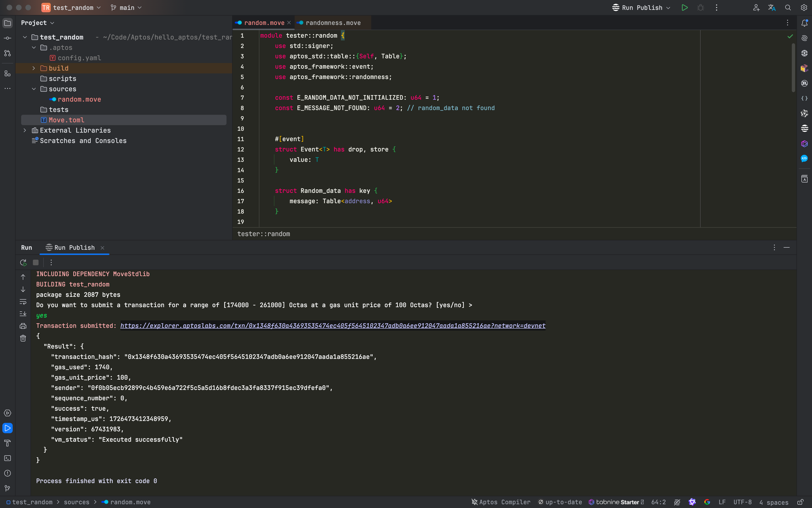
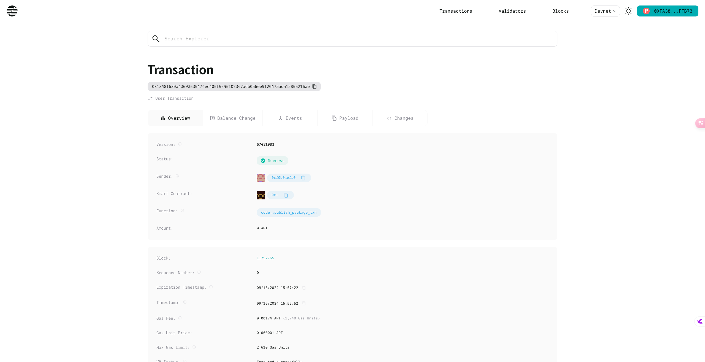
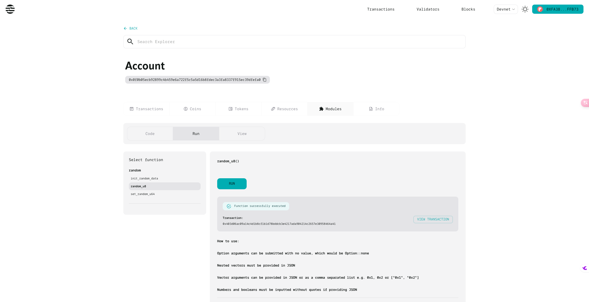
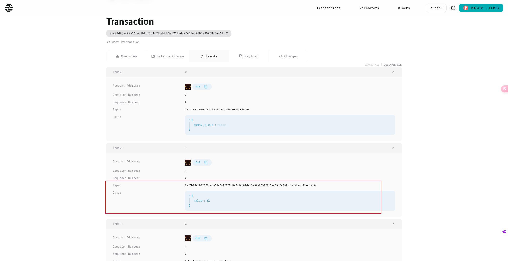
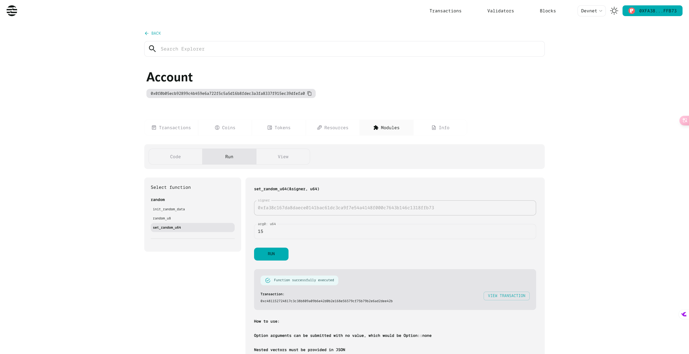
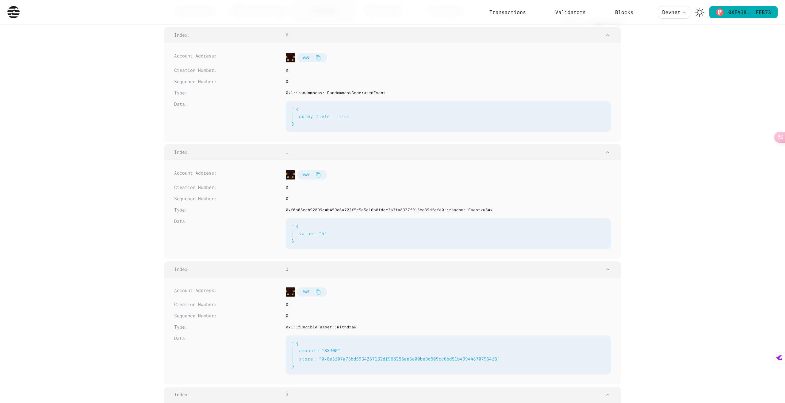
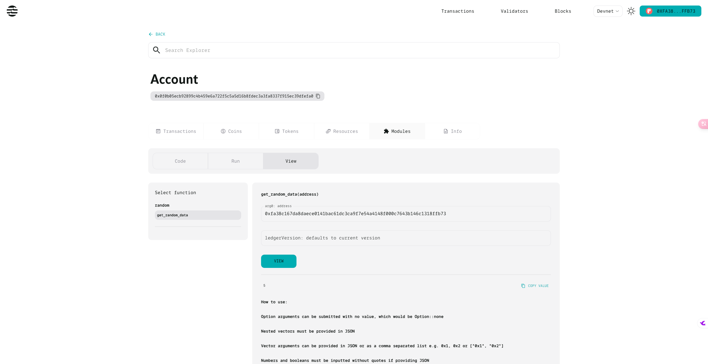
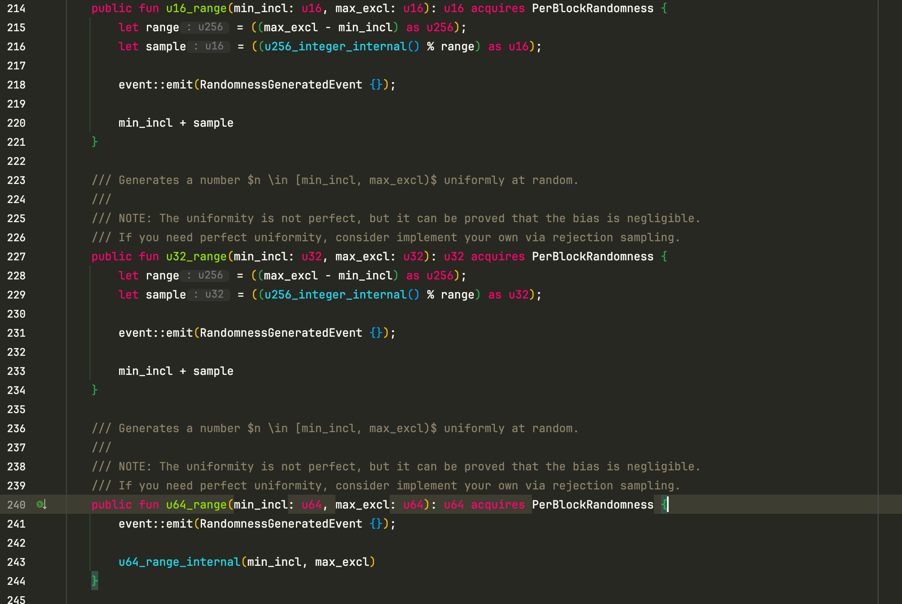

# **使用 Aptos Move 实现随机数生成：从 AIP-41 到实战操作**

随机数在区块链上的应用场景十分广泛，如在 NFT 铸造、游戏逻辑、智能合约安全等方面，都依赖于高质量的随机数生成。然而，传统的随机数生成方式在链上存在一定的安全隐患，尤其是对于恶意操控的风险。Aptos Move 提供了一种公开、可信的随机数生成机制。通过最新的 **AIP-41** 提案，开发者可以在 Aptos 网络上便捷地生成随机数，并将其应用于各种智能合约逻辑中。


本文将深入介绍如何使用 Aptos Move 的随机数生成 API，详细讲解 **AIP-41** 的背景和功能，并通过一个完整的实战项目演示如何创建和使用随机数生成逻辑。我们将展示如何从初始化项目到生成、存储并查询随机数的完整流程。

___


Aptos Move 引入了 **AIP-41** 提案，该提案提供了一套新的 API 来支持链上的随机数生成功能，特别适用于需要公正性和不可预测性的应用场景。本文通过实操项目展示如何在 Aptos Move 中使用这些随机数生成 API。项目从创建、发布到调用合约的每一步操作都有详细讲解，同时，我们也会介绍如何在区块链浏览器中查看生成的随机数及其事件。

通过本文，读者将学会：

​	•	Aptos Move 的随机数生成 API 功能。

​	•	使用 Aptos Move 构建一个包含随机数生成逻辑的智能合约。

​	•	通过实际操作掌握合约发布、调用和事件查看等步骤。

更多参考：

https://aptos.dev/en/build/smart-contracts/randomness

#### AIP-41 - Move APIs for public randomness generation

https://github.com/aptos-foundation/AIPs/blob/main/aips/aip-41.md

## 实操

### 创建项目并初始化

```shell
hello_aptos on  main via 🅒 base
➜
mcd test_random

hello_aptos/test_random on  main via 🅒 base
➜
aptos init
Configuring for profile default
Choose network from [devnet, testnet, mainnet, local, custom | defaults to devnet]

No network given, using devnet...
Enter your private key as a hex literal (0x...) [Current: None | No input: Generate new key (or keep one if present)]

No key given, generating key...
Account 0x208d246526904ace865e57314152211523ae2d111a120a5a4c7294310ba1792e doesn't exist, creating it and funding it with 100000000 Octas
Account 0x208d246526904ace865e57314152211523ae2d111a120a5a4c7294310ba1792e funded successfully

---
Aptos CLI is now set up for account 0x208d246526904ace865e57314152211523ae2d111a120a5a4c7294310ba1792e as profile default!
 See the account here: https://explorer.aptoslabs.com/account/0x208d246526904ace865e57314152211523ae2d111a120a5a4c7294310ba1792e?network=devnet
 Run `aptos --help` for more information about commands
{
  "Result": "Success"
}

hello_aptos/test_random on  main via 🅒 base took 8.5s
➜
aptos move init --name test_random
{
  "Result": "Success"
}

hello_aptos/test_random on  main [?] via 🅒 base took 2.0s
➜
open -a RustRover .
```

### 项目目录结构

```shell
hello_aptos/test_random on  main [?] via 🅒 base took 7.5s 
➜ tree . -L 6 -I 'build'


.
├── Move.toml
├── scripts
├── sources
│   └── random.move
└── tests

4 directories, 2 files


```


### 实现代码

#### `random.move`

```rust
module tester::random {
    use std::signer;
    use aptos_std::table::{Self, Table};
    use aptos_framework::event;
    use aptos_framework::randomness;

    const E_RANDOM_DATA_NOT_INITIALIZED: u64 = 1;
    const E_MESSAGE_NOT_FOUND: u64 = 2; // random_data not found


    #[event]
    struct Event<T> has drop, store {
        value: T
    }

    struct Random_data has key {
        message: Table<address, u64>
    }

    #[randomness]
    entry fun random_u8() {
        event::emit(Event {
            value: randomness::u8_integer()
        })
    }

    public entry fun init_random_data(account: &signer) {
        if (!exists<Random_data>(signer::address_of(account))) {
            move_to(account, Random_data {
                message: table::new()
            })
        }
    }

    #[randomness]
    entry fun set_random_u64(account: &signer, n: u64) acquires Random_data{
        let addr = signer::address_of(account);
        if (!exists<Random_data>(addr)) {
            init_random_data(account);
        };
        let r = randomness::u64_range(0, n);
        let random_info = borrow_global_mut<Random_data>(addr);

        if (table::contains(&random_info.message, addr)) {
            *table::borrow_mut(&mut random_info.message, addr) = r;
        } else {
            table::add(&mut random_info.message, addr, r);
        };

        event::emit(Event {
            value: r
        })
    }

    #[view]
    public fun get_random_data(addr: address): u64 acquires Random_data {
        assert!(exists<Random_data>(addr), E_RANDOM_DATA_NOT_INITIALIZED);
        let random_data_info = borrow_global<Random_data>(addr);

        assert!(table::contains(&random_data_info.message, addr), E_MESSAGE_NOT_FOUND);

        *table::borrow(&random_data_info.message, addr)
    }
}
```

### Publish 发布

```shell
/opt/homebrew/bin/aptos move publish
Compiling, may take a little while to download git dependencies...
UPDATING GIT DEPENDENCY https://github.com/aptos-labs/aptos-core.git
INCLUDING DEPENDENCY AptosFramework
INCLUDING DEPENDENCY AptosStdlib
INCLUDING DEPENDENCY MoveStdlib
BUILDING test_random
package size 2087 bytes
Do you want to submit a transaction for a range of [174000 - 261000] Octas at a gas unit price of 100 Octas? [yes/no] >
yes
Transaction submitted: https://explorer.aptoslabs.com/txn/0x1348f630a43693535474ec405f5645102347adb0a6ee912047aada1a855216ae?network=devnet
{
  "Result": {
    "transaction_hash": "0x1348f630a43693535474ec405f5645102347adb0a6ee912047aada1a855216ae",
    "gas_used": 1740,
    "gas_unit_price": 100,
    "sender": "0f0b05ecb92899c4b459e6a722f5c5a5d16b8fdec3a3fa8337f915ec39dfefa0",
    "sequence_number": 0,
    "success": true,
    "timestamp_us": 1726473412348959,
    "version": 67431983,
    "vm_status": "Executed successfully"
  }
}

Process finished with exit code 0

```




### 查看 Publish Transaction

https://explorer.aptoslabs.com/txn/0x1348f630a43693535474ec405f5645102347adb0a6ee912047aada1a855216ae?network=devnet



### 调用`random_u8` 方法生产随机数

https://explorer.aptoslabs.com/account/0x0f0b05ecb92899c4b459e6a722f5c5a5d16b8fdec3a3fa8337f915ec39dfefa0/modules/run/random/random_u8?network=devnet



### 查看 `random_u8` Transaction Events

https://explorer.aptoslabs.com/txn/0x403d06ac09a14c4d1b8cf1b1d78bddcb3e4217ada904214c2657e30958464a41/events?network=devnet




### 调用 `set_random_u64` 方法生成随机数并保存

https://explorer.aptoslabs.com/account/0x0f0b05ecb92899c4b459e6a722f5c5a5d16b8fdec3a3fa8337f915ec39dfefa0/modules/run/random/set_random_u64?network=devnet




### 查看 Transaction Events 中的随机数

https://explorer.aptoslabs.com/txn/0xc481152724817c3c38b809a09b6e42d0b2e168e56579cf75b79b2e6ad2dee42b?network=devnet




### 调用`get_random_data` 方法获取随机数

https://explorer.aptoslabs.com/account/0x0f0b05ecb92899c4b459e6a722f5c5a5d16b8fdec3a3fa8337f915ec39dfefa0/modules/view/random/get_random_data?network=devnet




## 源码参考

```rust
   /// Generates a number $n \in [min_incl, max_excl)$ uniformly at random.
    ///
    /// NOTE: The uniformity is not perfect, but it can be proved that the bias is negligible.
    /// If you need perfect uniformity, consider implement your own via rejection sampling.
    public fun u64_range(min_incl: u64, max_excl: u64): u64 acquires PerBlockRandomness {
        event::emit(RandomnessGeneratedEvent {});

        u64_range_internal(min_incl, max_excl)
    }

    public fun u64_range_internal(min_incl: u64, max_excl: u64): u64 acquires PerBlockRandomness {
        let range = ((max_excl - min_incl) as u256);
        let sample = ((u256_integer_internal() % range) as u64);

        min_incl + sample
    }
```




## **总结**

本文通过实战操作详细讲解了如何使用 Aptos Move 的随机数生成 API，展示了从项目初始化、合约编写到部署、调用随机数生成函数的全过程。同时，我们还探索了如何在 Aptos 区块链浏览器中查看合约发布后的事件。通过使用 Aptos Move 提供的随机数生成功能，开发者可以更轻松地构建基于随机性的智能合约逻辑，确保应用的公平性和安全性。

## 参考

- https://aptos.dev/en/build/smart-contracts/randomness
- https://github.com/aptos-foundation/AIPs/blob/main/aips/aip-41.md
- https://explorer.aptoslabs.com/account/0x0f0b05ecb92899c4b459e6a722f5c5a5d16b8fdec3a3fa8337f915ec39dfefa0/modules/run/random/random_u8?network=devnet
- https://github.com/aptos-labs/aptogotchi-random-mint/tree/main