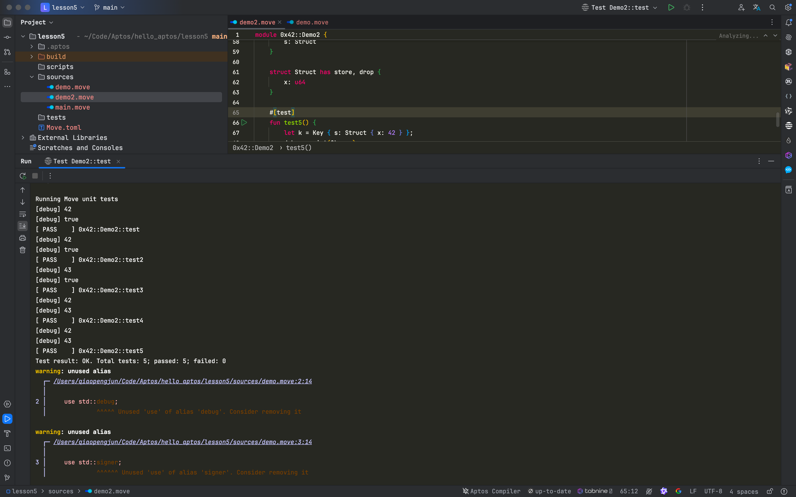

# **深入解读 Aptos Move 的 Struct 特性与四大能力**

在 Aptos Move 编程语言中，struct 是一种用于存储和组织数据的核心结构。它不仅可以嵌套使用，还能赋予特定的能力，从而增强其在不同场景中的使用效率。在本文中，我们将详细讲解 Aptos Move 中的 struct 特性，以及它们如何利用四种关键能力：copy、drop、store 和 key 来实现更强的功能。

本文对 Aptos Move 编程语言中的 struct 结构体及其特性进行了深入解读，重点介绍了 struct 的四大能力：copy（复制）、drop（销毁）、store（全局存储）和 key（全局存储键）。我们通过代码示例详细演示了这些能力如何影响 struct 的行为，特别是在全局存储、资源管理和复制操作中的应用。文章还提供了使用这些能力进行数据操作的实际用例，帮助开发者更好地理解并在项目中灵活运用 Aptos Move 的强大特性。

## APTOS-MOVE STRUCT 特性解读

### 核心概念

Aptos Move 的 Struct 结构体用于存储结构化数据。Struct 可以相互嵌套，并可以作为资源存储在特定地址下。”

1. 命名必须以大写字母开头
2. 可以通过 has 关键字赋予能力

```rust
struct Person {
  ape: u8,
  birthday: u32,
}

struct People {
  people: vector<Person>,
}
```

### **修饰符与四大能力**

Copy - 值能够被复制

Drop - 值可以在作用域结束时被自动清理

Key - 值可以用作于全局存储的键 Key

Store - 值可以存储在全局存储中

除 Struct 类型外，其他的类型默认具备 store、drop、copy 的能力，Struct 最终是存储在用户的地址上（或者被销毁），不存在 Aptos 合约里，Aptos 合约是一个全纯的函数。

### The Four Abilities

The four abilities are:

- `copy`
  - Allows values of types with this ability to be copied.
- `drop`
  - Allows values of types with this ability to be popped/dropped.
- `store`
  - Allows values of types with this ability to exist inside a struct in global storage.
- `key`
  - Allows the type to serve as a key for global storage operations.

### Drop

值能够在使用结束后被销毁

```rust
//drop

struct Coin {

  b: bool

}

#[test]
fun test6() {
  let c = Coin { b: true }; // 报错，没有 drop 修饰符
}

//drop
struct Coin has drop {

  b: bool,
}

#[test]
fun test6() {
  let c = Coin { b: true }; // 正常运行，拥有 drop 能力
}
```


### 2. copy

值能够在使用结束后被复制

```rust
//copy

struct CanCopy has drop {

  b: bool,

}

#[test]

fun test5() {

  let c = CanCopy { b: true };

  let c1 = c; // no copy

  let CanCopy { b } = &mut c1;

  *b = false;

  debug::print(&c1.b);

}
```

修改之后

```rust
// copy
struct CanCopy has copy, drop {
  b: bool,
}

#[test]
fun test5() {
  let c = CanCopy { b: true };
  let c1 = c; // copy
  let CanCopy { b } = &mut c1;
  *b = false;
  debug::print(&c1.b);
  debug::print(&c.b);
}
```

### 3. Key

值可以用作于全局存储的键 Key

```rust
//key
struct Coin has key {
  value: u64,
}

public entry fun mint(account: &signer, value: u64) {
  move_to(account, Coin { value });
}

#[test(account = @0x42)]
public fun test_mint(account: &signer) acquires Coin {
  let addr = signer::address_of(account);
  mint(account, 100);
  let coin = borrow_global<Coin>(addr).value;
  debug::print(&coin);
}
```

### 4. store

值可以被全局存储，通常配合Key使用

```rust
//store

struct Key has key, drop {

  a: Store,

}

struct Store has drop {

  b: bool,

}

#[test]
fun test6() {
  let k = Key {
​    a: Store { b: true },
  };

  debug::print(&k.a.b); // 会报错
}
```

父 的有 Key 子的必须有 stare

```rust
//store
struct Key has key, drop {
  a: Store,
}

struct Store has store, drop {
  b: bool,
}

#[test]
fun test6() {
  let k = Key {
    a: Store { b: true },
  };
  debug::print(&k.a.b);
}
```


## 实操

```rust
module 0x42::Demo2 {
    use std::debug;
    use std::signer;

    // drop
    struct Foo has drop {
        u: u64,
        b: bool
    }

    #[test]
    fun test() {
        let f = Foo { u: 42, b: true };
        // let Foo { u, b } = f;
        // debug::print(&u);
        // debug::print(&b);

        debug::print(&f.u);
        debug::print(&f.b);
    }

    #[test]
    fun test2() {
        let f = Foo { u: 42, b: true };
        let Foo { u, b } = f;
        debug::print(&u);
        debug::print(&b);
    }

    #[test]
    fun test3() {
        let f = Foo { u: 42, b: true };
        let Foo { u, b } = &mut f;
        *u = 43;
        debug::print(&f.u);
        debug::print(&f.b);
    }

    // copy
    struct CanCopy has copy, drop {
        u: u64,
        b: bool
    }

    #[test]
    fun test4() {
        let b1 = CanCopy { u: 42, b: true };
        let b2 = copy b1;
        let CanCopy { u, b } = &mut b2;
        *u = 43;
        debug::print(&b1.u);
        debug::print(&b2.u);

    }

    // store
    struct Key has key, drop {
        s: Struct
    }

    struct Struct has store, drop {
        x: u64
    }

    #[test]
    fun test5() {
        let k = Key { s: Struct { x: 42 } };
        debug::print(&k.s.x);
        let Struct { x } = &mut k.s;
        *x = 43;
        debug::print(&k.s.x);
    }
}

```

### 运行测试



Aptos Move 中的 struct 是一个强大的工具，结合四大能力，可以极大地增强数据管理的灵活性与安全性。理解并灵活运用这些能力，是编写高效、安全智能合约的基础。在未来的开发中，这些能力将为资源管理和全局存储提供更多可能性。

## 参考

- <https://aptos.dev/en/build/smart-contracts/book/structs-and-resources>
- <https://aptos.dev/en/build/smart-contracts/book/abilities>