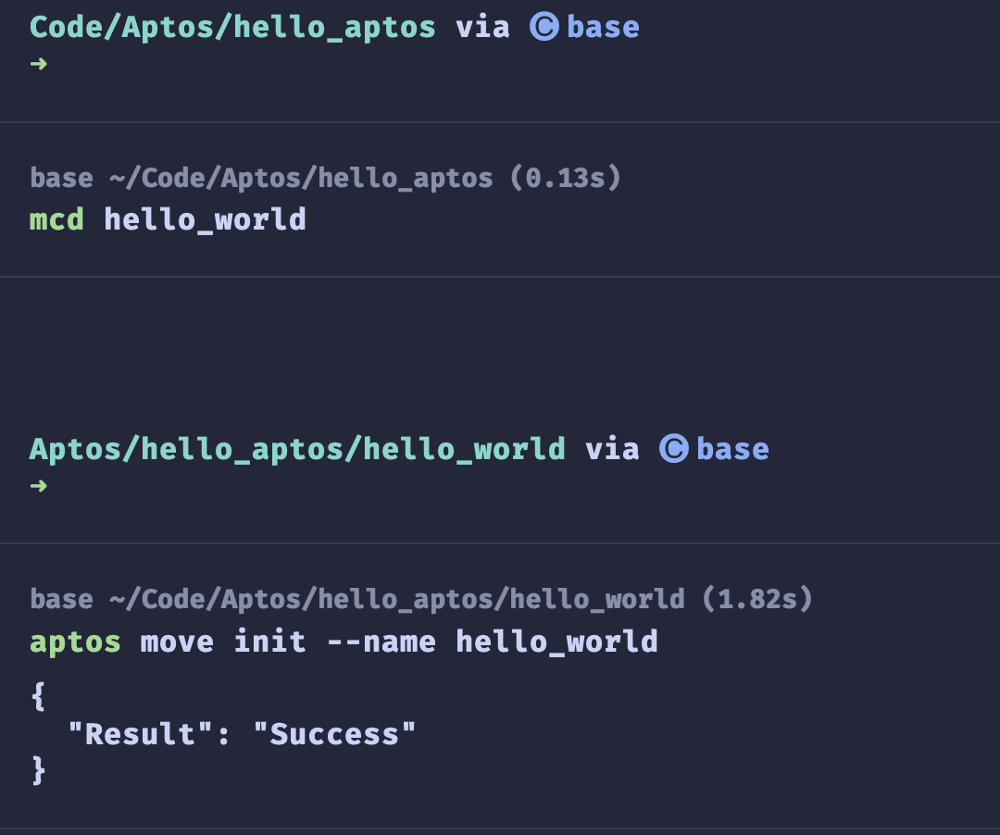
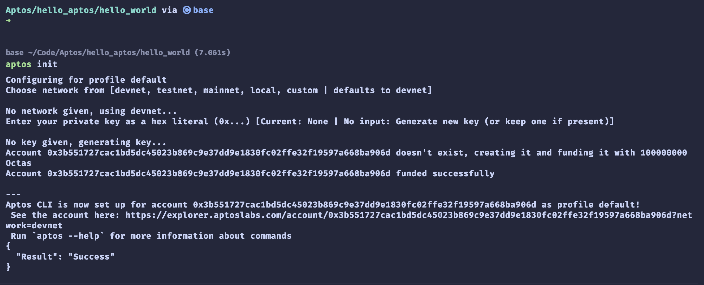

# **Aptos 区块链智能合约入门：使用 Move 实现消息存储与检索**

**引言：**

Aptos 是一个全新的第 1 层区块链网络，致力于为开发者提供一个更加快速、安全且具备高度扩展性的去中心化平台。该平台由前 Meta 工程师打造，推出了全新的编程语言——Move，用于编写安全、灵活且可验证的智能合约。Aptos 于 2022 年第三季度正式上线主网，迅速成为首个基于 Move 语言构建的去中心化生态系统，吸引了众多开发者的关注。

本文将带领开发者使用 Move 语言在 Aptos 区块链上构建一个简单的消息存储与检索智能合约。通过这个实战示例，您将掌握 Move 合约的基本结构和关键特性，并学会如何在 Aptos 平台上部署并交互智能合约，为开发 Web3 应用打下坚实的基础。

**摘要：**

本文展示了如何在 Aptos 区块链上使用 Move 语言开发一个智能合约，旨在实现简单的消息存储与检索系统。文章通过详细的代码示例，介绍了智能合约的核心结构、功能模块及其部署方法。该合约利用了 Aptos 的表（Table）和事件（Event）特性，为用户提供了高效、安全的数据存储和交互方式。本文适合对去中心化应用开发感兴趣的开发者，特别是希望探索 Aptos 和 Move 语言的学习者。

Aptos 作为一个去中心化网络，不仅为 Web3 开发人员提供了现代化的平台，还通过 Move 语言大幅提升了 DApp 的安全性、用户体验和升级能力。本文的示例合约展示了 Move 在处理资产管理和安全防护上的优势，帮助开发者更好地理解 Aptos 上的智能合约开发。

**Move 智能合约：消息存储与检索系统**

本文将介绍如何在 Aptos 区块链上使用 Move 语言编写智能合约，实现一个简单的消息存储和检索系统。该合约允许用户设置与其地址关联的消息，并使其他用户能够检索和查看这些消息。通过使用 Aptos 的表（Table）和事件（Event）功能，合约实现了高效的数据存储与访问逻辑。

**合约概述：**

​	1.	**消息存储功能**：每个用户可以为其地址设置一条唯一的消息，该消息存储在合约的表结构中。

​	2.	**消息检索功能**：其他用户可以通过地址查询并查看存储的消息，借此实现去中心化的消息记录和访问。

​	3.	**安全与灵活性**：得益于 Move 语言的安全机制，合约确保了资产的管理安全性，并防止常见的攻击类型。

通过这个简单的合约实例，开发者可以快速了解 Aptos 智能合约开发的核心步骤，并为构建更复杂的 DApp 奠定基础。

## 项目实操

### 创建项目

```shell
mcd hello_world  # mkdir hello_world && cd helo_world
```

### 初始化项目

```shell
aptos move init --name hello_world
```




### 初始化账户

```shell
aptos init
```




### 项目结构

```shell
Aptos/hello_aptos/hello_world via 🅒 base 
➜ tree . -L 6 -I 'build'

.
├── Move.toml
├── scripts
├── sources
│   └── hello_world.move
└── tests

4 directories, 2 files

Aptos/hello_aptos/hello_world via 🅒 base 
➜ 

```


### `Move.toml` 文件

```toml
[package]
name = "hello_world"
version = "1.0.0"
authors = []

[addresses]
my_addrx = "3b551727cac1bd5dc45023b869c9e37dd9e1830fc02ffe32f19597a668ba906d"
[dev-addresses]

[dependencies.AptosFramework]
git = "https://github.com/aptos-labs/aptos-core.git"
rev = "mainnet"
subdir = "aptos-move/framework/aptos-framework"

[dev-dependencies]

```

### `hello_world.move` 文件

```rust
// Define a module named hello_world under the my_addrx address
module my_addrx::hello_world {
    // Import necessary modules and types
    use std::string;
    use aptos_std::table::{Self, Table};
    use std::signer;
    use aptos_framework::account;
    use aptos_framework::event::{Self, EventHandle};

    /// Error codes
    const E_MESSAGE_HOLDER_NOT_INITIALIZED: u64 = 1; // MessageHolder not initialized
    const E_MESSAGE_NOT_FOUND: u64 = 2; // Message not found

    // Define MessageHolder struct to store messages and events
    struct MessageHolder has key {
        message: Table<address, string::String>, // Store mapping from address to message
        set_message_events: EventHandle<MessageSetEvent>, // Handle set message events
    }

    // Define MessageSetEvent struct to record message setting events
    struct MessageSetEvent has drop, store {
        address: address, // Address setting the message
        message: string::String, // Content of the set message
    }

    // Public entry function to initialize MessageHolder
    public entry fun init_message_holder(account: &signer) {
        // Check if MessageHolder exists, if not, create it
        if (!exists<MessageHolder>(signer::address_of(account))) {
            move_to(account, MessageHolder {
                message: table::new(),
                set_message_events: account::new_event_handle<MessageSetEvent>(account),
            })
        }
    }

    // Public entry function to set a message
    public entry fun set_message(account: &signer, message: string::String) acquires MessageHolder {
        let addr = signer::address_of(account);
        // If MessageHolder doesn't exist, initialize it first
        if (!exists<MessageHolder>(addr)) {
            init_message_holder(account);
        };
        let message_holder = borrow_global_mut<MessageHolder>(addr);
        
        // Update or add the message
        if (table::contains(&message_holder.message, addr)) {
            *table::borrow_mut(&mut message_holder.message, addr) = message;
        } else {
            table::add(&mut message_holder.message, addr, message);
        };

        // Emit message set event
        event::emit_event(&mut message_holder.set_message_events, MessageSetEvent {
            address: addr,
            message: message,
        });
    }

    // Public view function to get a message
    #[view]
    public fun get_message(addr: address): string::String acquires MessageHolder {
        // Ensure MessageHolder is initialized
        assert!(exists<MessageHolder>(addr), E_MESSAGE_HOLDER_NOT_INITIALIZED);
        let message_holder = borrow_global<MessageHolder>(addr);
        // Ensure the message exists
        assert!(table::contains(&message_holder.message, addr), E_MESSAGE_NOT_FOUND);
        // Return the message
        *table::borrow(&message_holder.message, addr)
    }
}
```

`acquires` 在 Move 语言中是一个重要的关键字，用于函数声明中。它的含义如下：

1. 功能：`acquires` 关键字表明该函数在执行过程中会访问（读取或修改）某个特定类型的全局存储资源。

2. 安全性：这是 Move 语言的一个安全特性，强制开发者明确声明函数将会访问哪些全局资源，从而帮助防止意外的资源访问和潜在的错误。

3. 使用方式：在函数声明中，`acquires` 后面跟着要访问的资源类型名称。在你的例子中，`acquires MessageHolder` 表示这个函数将会访问 `MessageHolder` 类型的全局资源。

4. 多个资源：如果函数需要访问多个不同类型的资源，可以用逗号分隔，例如：`acquires ResourceType1, ResourceType2`。

5. 编译时检查：编译器会检查函数体中是否确实使用了声明要获取的资源。如果声明了但没使用，或使用了未声明的资源，都会导致编译错误。

在 `set_message` 函数中，`acquires MessageHolder` 表明这个函数会访问和修改 `MessageHolder` 类型的全局资源。这与函数体中使用 `borrow_global_mut<MessageHolder>` 来获取和修改 `MessageHolder` 资源的操作相对应。

这种明确声明有助于提高代码的可读性和安全性，使其他开发者在阅读和使用这个函数时能够清楚地知道它会影响哪些全局状态。


这段 Move 代码实现了一个简单的消息存储系统，主要功能如下：

1. 数据存储：使用 `MessageHolder` 结构存储用户地址与消息的映射。

2. 初始化：`init_message_holder` 函数初始化消息存储结构。

3. 消息设置：`set_message` 函数允许用户设置或更新自己的消息。

4. 消息获取：`get_message` 函数用于查询指定地址的消息。

5. 事件记录：使用 `MessageSetEvent` 记录消息设置事件。

6. 错误处理：定义了错误代码，用于异常情况的处理。

代码利用了 Aptos 区块链的特性，如表（Table）和事件（Event），实现了基本的状态管理和交互功能。整体而言，这是一个简洁的智能合约，展示了 Move 语言在区块链应用开发中的基本用法。

### `Compile` 项目

```shell
Aptos/hello_aptos/hello_world via 🅒 base took 7.9s 
➜ aptos move compile --named-addresses my_addrx=3b551727cac1bd5dc45023b869c9e37dd9e1830fc02ffe32f19597a668ba906d
Compiling, may take a little while to download git dependencies...
UPDATING GIT DEPENDENCY https://github.com/aptos-labs/aptos-core.git
INCLUDING DEPENDENCY AptosFramework
INCLUDING DEPENDENCY AptosStdlib
INCLUDING DEPENDENCY MoveStdlib
BUILDING hello_world
{
  "Result": [
    "3b551727cac1bd5dc45023b869c9e37dd9e1830fc02ffe32f19597a668ba906d::hello_world"
  ]
}
```

### `Publish` 项目

```shell
Aptos/hello_aptos/hello_world via 🅒 base took 8.9s 
➜ aptos move publish --named-addresses my_addrx=3b551727cac1bd5dc45023b869c9e37dd9e1830fc02ffe32f19597a668ba906d
Compiling, may take a little while to download git dependencies...
UPDATING GIT DEPENDENCY https://github.com/aptos-labs/aptos-core.git
INCLUDING DEPENDENCY AptosFramework
INCLUDING DEPENDENCY AptosStdlib
INCLUDING DEPENDENCY MoveStdlib
BUILDING hello_world
package size 2387 bytes
Do you want to submit a transaction for a range of [186300 - 279400] Octas at a gas unit price of 100 Octas? [yes/no] >
yes
Transaction submitted: https://explorer.aptoslabs.com/txn/0x7c58e4faee24e6776a0f8cd03b9f5924d15880c851af2e378f44108247a940e7?network=devnet
{
  "Result": {
    "transaction_hash": "0x7c58e4faee24e6776a0f8cd03b9f5924d15880c851af2e378f44108247a940e7",
    "gas_used": 1863,
    "gas_unit_price": 100,
    "sender": "3b551727cac1bd5dc45023b869c9e37dd9e1830fc02ffe32f19597a668ba906d",
    "sequence_number": 0,
    "success": true,
    "timestamp_us": 1725805264405775,
    "version": 59330528,
    "vm_status": "Executed successfully"
  }
}

```

### 调用`init_message_holder` 方法

```shell
Aptos/hello_aptos/hello_world via 🅒 base took 2.9s 
➜ aptos move run --function-id 3b551727cac1bd5dc45023b869c9e37dd9e1830fc02ffe32f19597a668ba906d::hello_world::init_message_holder          
Do you want to submit a transaction for a range of [47400 - 71100] Octas at a gas unit price of 100 Octas? [yes/no] >
yes
Transaction submitted: https://explorer.aptoslabs.com/txn/0x08295fd4ae895c1c02c9d7a44ea4e33b05ff8dae3a7e3cc61b76f2adf24802ef?network=devnet
{
  "Result": {
    "transaction_hash": "0x08295fd4ae895c1c02c9d7a44ea4e33b05ff8dae3a7e3cc61b76f2adf24802ef",
    "gas_used": 474,
    "gas_unit_price": 100,
    "sender": "3b551727cac1bd5dc45023b869c9e37dd9e1830fc02ffe32f19597a668ba906d",
    "sequence_number": 1,
    "success": true,
    "timestamp_us": 1725805809879593,
    "version": 59338150,
    "vm_status": "Executed successfully"
  }
}

```

### 调用`set_message` 方法

```shell
Aptos/hello_aptos/hello_world via 🅒 base 
➜ aptos move run --function-id 3b551727cac1bd5dc45023b869c9e37dd9e1830fc02ffe32f19597a668ba906d::hello_world::set_message --args string:"Hello, Aptos"


Do you want to submit a transaction for a range of [43600 - 65400] Octas at a gas unit price of 100 Octas? [yes/no] >
yes
Transaction submitted: https://explorer.aptoslabs.com/txn/0x99b266c902112a78a9b0a611eb2079e5569939d86f95d62a463231ac518d9d4a?network=devnet
{
  "Result": {
    "transaction_hash": "0x99b266c902112a78a9b0a611eb2079e5569939d86f95d62a463231ac518d9d4a",
    "gas_used": 436,
    "gas_unit_price": 100,
    "sender": "3b551727cac1bd5dc45023b869c9e37dd9e1830fc02ffe32f19597a668ba906d",
    "sequence_number": 2,
    "success": true,
    "timestamp_us": 1725806036603475,
    "version": 59341272,
    "vm_status": "Executed successfully"
  }
}

```

### 调用`get_message` 方法

```shell
Aptos/hello_aptos/hello_world via 🅒 base took 13.3s 
➜ aptos move view --function-id 3b551727cac1bd5dc45023b869c9e37dd9e1830fc02ffe32f19597a668ba906d::hello_world::get_message --args address:3b551727cac1bd5dc45023b869c9e37dd9e1830fc02ffe32f19597a668ba906d


{
  "Result": [
    "Hello, Aptos"
  ]
}

```

这个简单的消息存储系统展示了 Move 语言在智能合约开发中的基本用法。它涵盖了数据存储、状态管理、事件处理和错误控制等关键概念，为理解和开发更复杂的 Move 智能合约奠定了基础。

## 参考

- https://aptos.dev/en
- https://aptoslabs.com/
- https://pontem.network/posts/guan-yu-aptos-ni-xu-yao-liao-jie-de-yi-qie
- https://www.binance.com/zh-CN/square/post/6933331153650


