# Aptos 学习笔记

### 最佳标题
**《Aptos 开发实战：从环境搭建到第一个 Hello World》**

### 引言
Aptos 区块链以其高性能和独特的设计为开发者提供了强大的工具。本篇学习笔记将带你一步步完成 Aptos 开发环境的搭建，并通过编写第一个 Hello World 项目，帮助你快速掌握 Aptos 开发的基础流程。从安装 Aptos CLI 到项目初始化与测试，本文为你提供了详细的实操指南，让你快速上手 Aptos 开发。

Aptos is a Layer-1 community-driven network, governed by the people who build on it from around the world. It’s decentralized. It’s fast. It’s blockchain at its best.

Aptos 区块链上的每个账户都由一个 32 字节的账户地址标识。
与其他区块链中账户和地址隐式不同，Aptos 上的账户是显式的，需要先创建才能执行交易。
可以通过将 Aptos 代币 (APT) 转移到 Aptos 来显式或隐式创建账户。

Aptos 上有三种类型的账户：

标准账户——这是一个典型的账户，对应一个地址和一对相应的公钥/私钥。
资源账户- 一个没有对应私钥的自主账户，供开发者存储资源或上链发布模块。
对象- 存储在代表单个实体的单个地址内的一组复杂资源。

帐户地址为 32 字节。它们通常显示为 64 个十六进制字符，每个十六进制字符为一个半字节。有时地址以 0x 为前缀。
Aptos区块链默认采用Ed25519签名交易。

Aptos 区块链存储三种类型的数据：

交易：交易表示区块链上的账户正在执行的预期操作（例如转移资产）。
状态：（区块链账本）状态代表交易执行输出的累积，即存储在所有资源内的价值。
事件：交易执行时发布的辅助数据。
只有交易才能改变账本状态。

## Aptos 开发环境配置

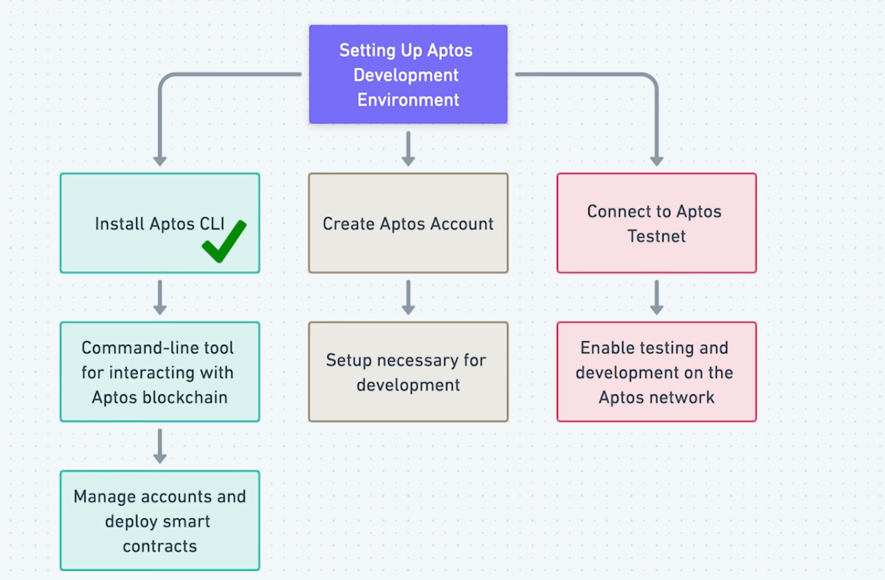

### Install Aptos CLI

Install the Aptos CLI on Mac

```shell
brew update
brew install aptos
```

查看版本检查安装是否成功

```shell
aptos help

intensive-colearning-aptos on  main via 🅒 base took 4.3s 
➜ aptos --version              
aptos 4.1.0

```

更新 Aptos

```shell
brew update
brew upgrade aptos
```

更多请参考：

- https://aptos.dev/en/build/get-started/developer-setup
- https://marketplace.visualstudio.com/items?itemName=MoveBit.aptos-move-analyzer

### 初始化账户

```shell

~/Code/Aptos via 🅒 base
➜
mcd hello_aptos
                                                                                                                                              

Code/Aptos/hello_aptos via 🅒 base
➜
aptos init
Configuring for profile default
Choose network from [devnet, testnet, mainnet, local, custom | defaults to devnet]
devnet
Enter your private key as a hex literal (0x...) [Current: None | No input: Generate new key (or keep one if present)]

No key given, generating key...
Account 0xee6c038b66df7ed8aa91eb700938003ce29647f402c090ededd89b87a3c70e35 doesn't exist, creating it and funding it with 100000000 Octas
Account 0xee6c038b66df7ed8aa91eb700938003ce29647f402c090ededd89b87a3c70e35 funded successfully

---
Aptos CLI is now set up for account 0xee6c038b66df7ed8aa91eb700938003ce29647f402c090ededd89b87a3c70e35 as profile default!
 See the account here: https://explorer.aptoslabs.com/account/0xee6c038b66df7ed8aa91eb700938003ce29647f402c090ededd89b87a3c70e35?network=devnet
 Run `aptos --help` for more information about commands
{
  "Result": "Success"
}
                                                                                                  
```

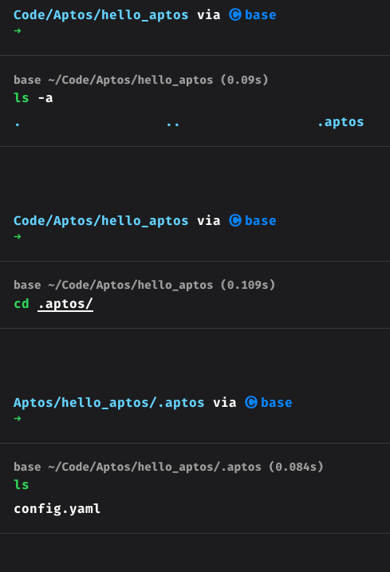

### 查看账户列表

```shell
                                            
Code/Aptos/hello_aptos via 🅒 base took 1m 32.7s
➜
aptos account list
{
  "Result": [
    {
      "0x1::account::Account": {
        "authentication_key": "0xee6c038b66df7ed8aa91eb700938003ce29647f402c090ededd89b87a3c70e35",
        "coin_register_events": {
          "counter": "0",
          "guid": {
            "id": {
              "addr": "0xee6c038b66df7ed8aa91eb700938003ce29647f402c090ededd89b87a3c70e35",
              "creation_num": "0"
            }
          }
        },
        "guid_creation_num": "2",
        "key_rotation_events": {
          "counter": "0",
          "guid": {
            "id": {
              "addr": "0xee6c038b66df7ed8aa91eb700938003ce29647f402c090ededd89b87a3c70e35",
              "creation_num": "1"
            }
          }
        },
        "rotation_capability_offer": {
          "for": {
            "vec": []
          }
        },
        "sequence_number": "0",
        "signer_capability_offer": {
          "for": {
            "vec": []
          }
        }
      }
    }
  ]
}
                                                                                                
```

### 获取水龙头因为测试网会定期重置

```shell

Code/Aptos/hello_aptos via 🅒 base took 2.5s
➜
aptos account fund-with-faucet --account 0xee6c038b66df7ed8aa91eb700938003ce29647f402c090ededd89b87a3c70e35
{
  "Result": "Added 100000000 Octas to account 0xee6c038b66df7ed8aa91eb700938003ce29647f402c090ededd89b87a3c70e35"
}
          
```


## 实操 Hello World

### 创建项目

```bash

Code/Aptos/hello_aptos via 🅒 base
➜
mcd lesson1
```


### 初始化move项目

```bash
Aptos/hello_aptos/lesson1 via 🅒 base
➜
aptos move init --name lesson1
{
  "Result": "Success"
}

Aptos/hello_aptos/lesson1 via 🅒 base took 2.1s
➜
ls
Move.toml scripts   sources   tests
```


### 初始化账户

```shell
aptos init
```

### 查看项目结构

```shell
Aptos/hello_aptos/lesson1 via 🅒 base 
➜ tree . -L 6 -I 'build'                  

.
├── Move.toml
├── scripts
├── sources
│   └── main.move
└── tests

4 directories, 2 files

```


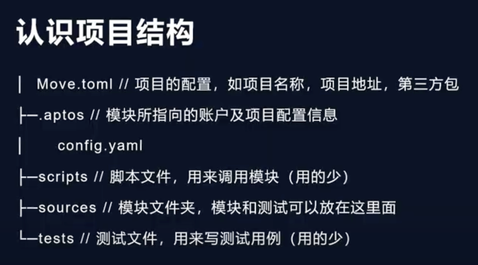

### `Move.toml` 代码

```toml
[package]
name = "lesson1"
version = "1.0.0"
authors = []

[addresses]
Lesson1 = "dfc044d199141627a77203495452bc5165c070edbcbf357f211096fbe974ddf7"
[dev-addresses]

[dependencies.AptosFramework]
git = "https://github.com/aptos-labs/aptos-core.git"
rev = "mainnet"
subdir = "aptos-move/framework/aptos-framework"

[dev-dependencies]

```

### `main.move` 代码

```move
module Lesson1::HelloWorld {
    #[test_only]
    use std::debug::print;
    #[test_only]
    use std::string::utf8;

    #[test]
    fun test_hello_world() {
        print(&utf8(b"hello world"));
    }
}

```

### 测试 Test

```shell
Aptos/hello_aptos/lesson1 via 🅒 base took 25.0s 
➜ aptos move test
INCLUDING DEPENDENCY AptosFramework
INCLUDING DEPENDENCY AptosStdlib
INCLUDING DEPENDENCY MoveStdlib
BUILDING lesson1
Running Move unit tests
[debug] "hello world"
[ PASS    ] 0xdfc044d199141627a77203495452bc5165c070edbcbf357f211096fbe974ddf7::HelloWorld::test_hello_world
Test result: OK. Total tests: 1; passed: 1; failed: 0
{
  "Result": "Success"
}

```


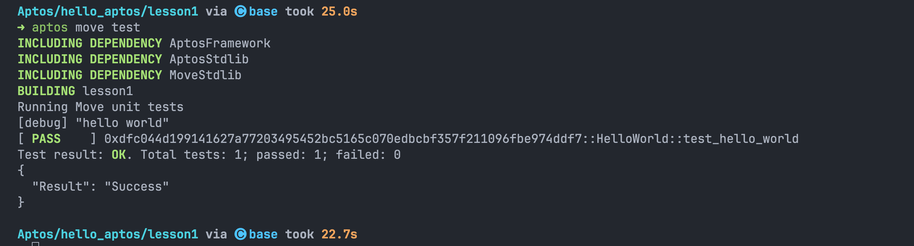

## 参考

- https://aptos.dev/en/build/cli/install-cli/install-cli-mac
- https://www.youtube.com/watch?v=_EFoVYcrbiY
- https://plugins.jetbrains.com/plugin/14721-move-on-aptos
- https://move-developers-dao.gitbook.io/aptos-move-by-example
- https://marketplace.visualstudio.com/items?itemName=movingco.move-analyzer-plus
- https://www.youtube.com/watch?v=87eeYsstBD4


**Aptos 开发指南：在 JetBrains 编辑器中配置运行、编译、测试与发布部署，实现更高效开发**


本文提供了在 JetBrains 系列编辑器中为 Aptos 开发项目配置运行、编译、测试和发布部署的详细步骤。通过图文并茂的方式，帮助开发者解决 Aptos 项目启动报错，顺利进行代码编译、测试和最终的部署，确保更高效的开发过程。


在 Aptos 开发过程中，合理配置编译、测试、运行和发布部署的环境对提高开发效率至关重要。特别是在使用 JetBrains 系列编辑器时，配置灵活的开发环境可以帮助开发者快速解决常见的报错问题并加速项目迭代。本文将详细介绍如何在 JetBrains 编辑器中设置运行、编译、测试与发布部署的完整流程，帮助开发者高效地进行 Aptos 项目开发。

### 打开项目报错 Aptos failed

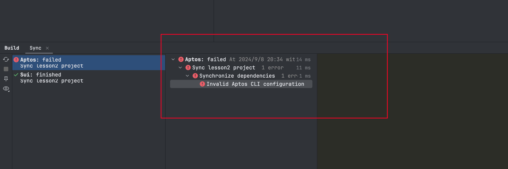

### 解决

#### 第一步：查看 Aptos 安装位置

```shell
Aptos/hello_aptos/lesson2 via 🅒 base 
➜ which aptos
/opt/homebrew/bin/aptos

```


#### 第二步：Aptos Compiler 配置

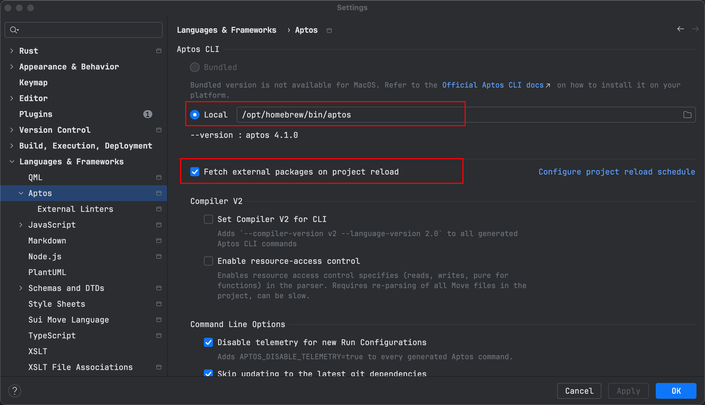


### IDEA配置Aptos 开发

第一步：` 点击 Add configurations`

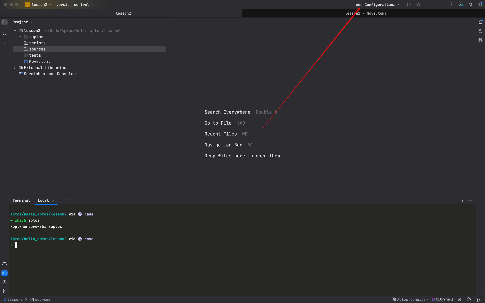

第二步： 点击 `Edit Configurations`

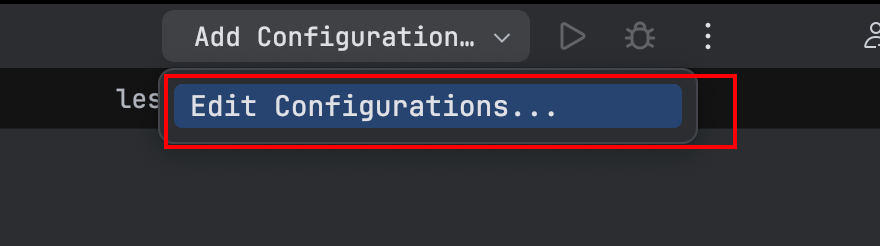

第三步：点击 `Aptos`

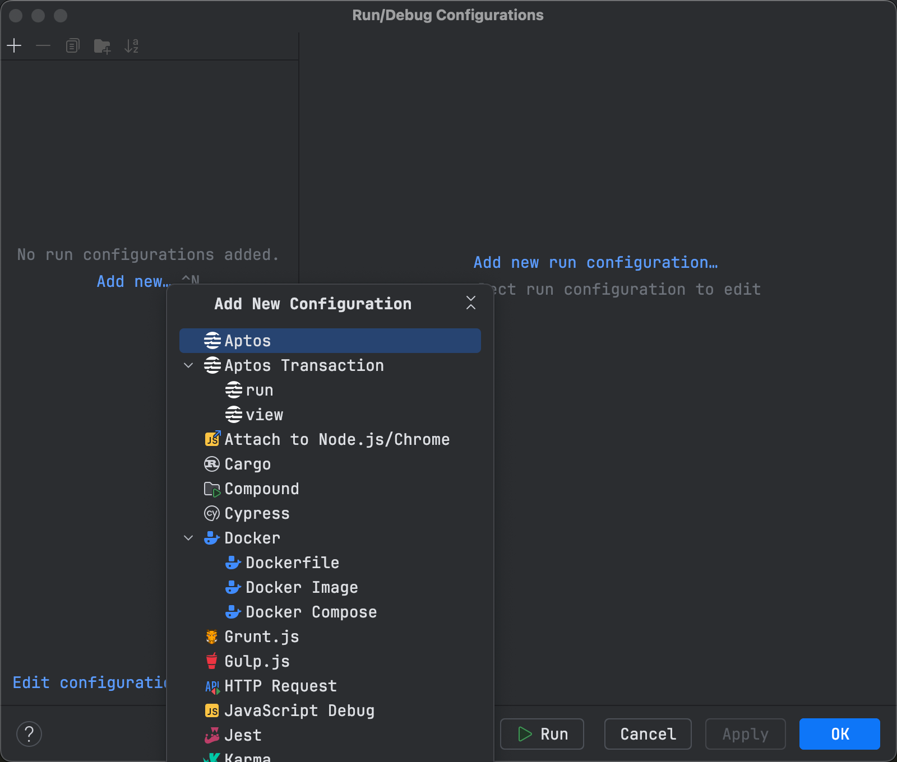

第四步：配置 `Compile` 命令

- 在 Name 中 填写`Run Move ` (可自定义)
- 在 Command 中填写`move compile`

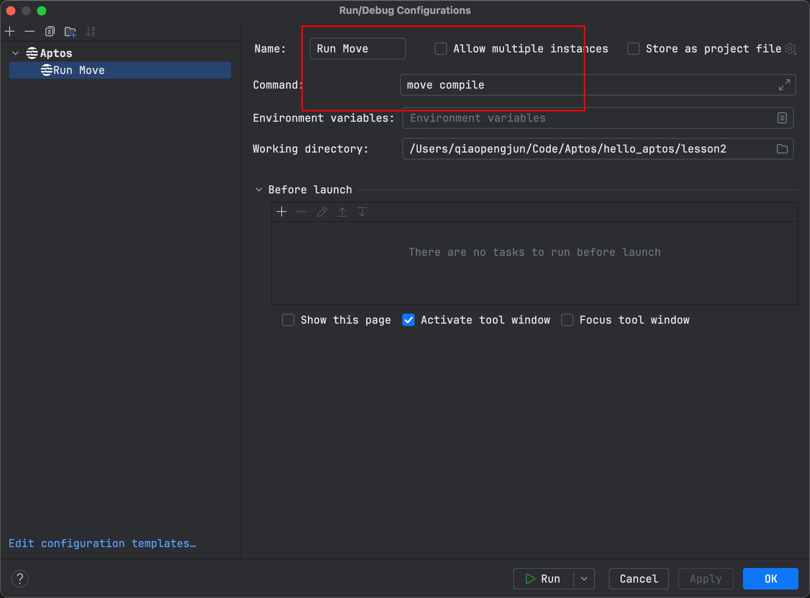

第四步：配置 `Test`命令

- 在 Name 中 填写`Run test`  (可自定义)
- 在 Command 中填写`move test`

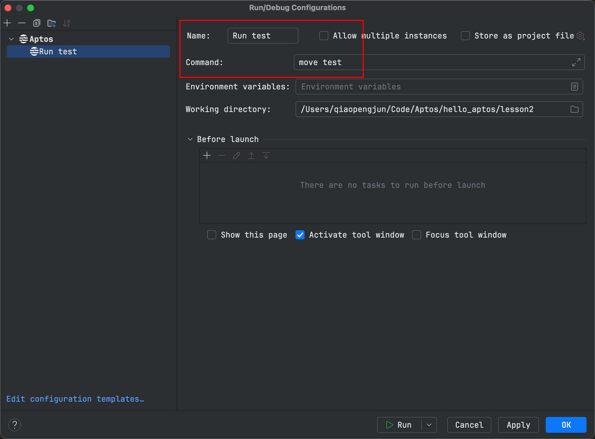

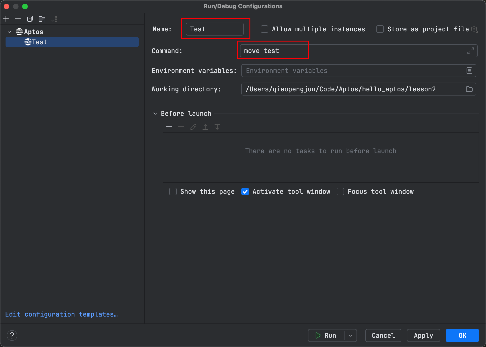

第四步：配置 `Publish`命令

- 在 Name 中 填写`Run Publish`  (可自定义)
- 在 Command 中填写`move publish`

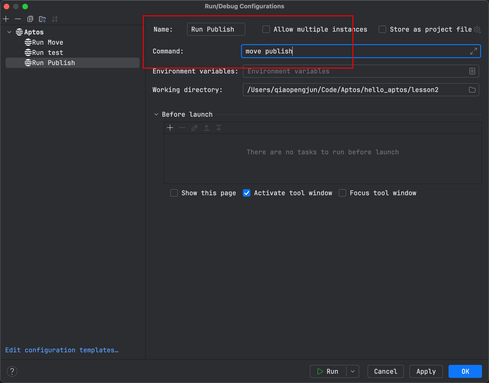

运行测试查看

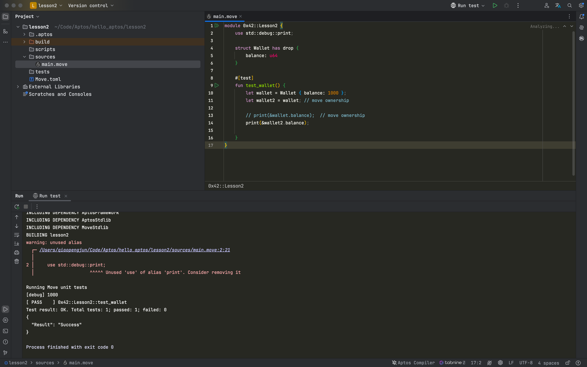

**总结**


通过本文的指导，开发者不仅可以解决 Aptos 项目在 JetBrains 编辑器中常见的启动问题，还能够全面掌握如何配置编译、测试与发布部署流程。这些配置将显著提高项目开发效率，确保开发者能够更快速地迭代和发布 Aptos 项目，从而提升整体开发体验。

## 参考

- https://aptos.dev/en
- https://docs.pontem.network/02.-move-language/intellij_ide_extension
- https://learn.aptoslabs.com/zh


