Aptos nft

# Aptos数字资产（DA）标准

数字资产 (DA) 标准是 Aptos 的现代非同质化代币 (NFT) 标准。NFT 代表链上的独特资产，并存储在集合中。

This standard is implemented with two Objects:

1. `Collection`s - A set of NFTs with a name and a bit of context for the group.
2. `Token`s - Digital assets which represent unique assets. These are often used to represent NFTs and usually use a `uri` link to point to more info about the asset (ex. a link to an image, video, etc.).


## 实操

### 第一步：创建项目并初始化

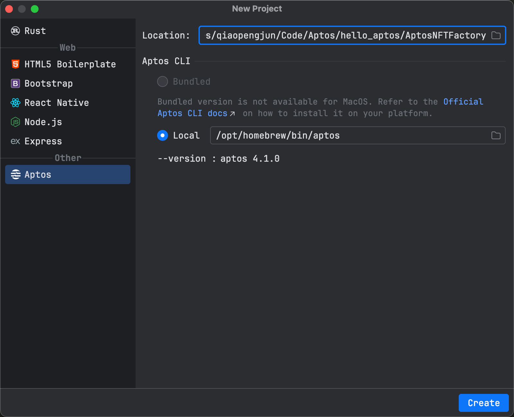

```bash

hello_aptos/AptosNFTFactory on  main [?] via 🅒 base 
➜ aptos init                            
Configuring for profile default
Choose network from [devnet, testnet, mainnet, local, custom | defaults to devnet]
testnet
Enter your private key as a hex literal (0x...) [Current: None | No input: Generate new key (or keep one if present)]

No key given, generating key...
Account 0xe6eba0c086998fbd5ad141e4b30942e38bc77e2d5696bf6b1786f7a7722415c8 doesn't exist, creating it and funding it with 100000000 Octas
Account 0xe6eba0c086998fbd5ad141e4b30942e38bc77e2d5696bf6b1786f7a7722415c8 funded successfully

---
Aptos CLI is now set up for account 0xe6eba0c086998fbd5ad141e4b30942e38bc77e2d5696bf6b1786f7a7722415c8 as profile default!
 See the account here: https://explorer.aptoslabs.com/account/0xe6eba0c086998fbd5ad141e4b30942e38bc77e2d5696bf6b1786f7a7722415c8?network=testnet
 Run `aptos --help` for more information about commands
{
  "Result": "Success"
}
```

### 第二步：项目目录结构

```bash
tree . -L 6 -I 'build'


.
├── Move.toml
├── scripts
├── sources
│   └── nft.move
└── tests

4 directories, 2 files
```

### 第三步：代码实现

#### `Move.toml` 文件

```toml
[package]
name = "AptosNFTFactory"
version = "1.0.0"
authors = []

[addresses]
contract = "_"
[dev-addresses]

[dependencies.AptosFramework]
git = "https://github.com/aptos-labs/aptos-core.git"
rev = "mainnet"
subdir = "aptos-move/framework/aptos-framework"

# https://github.com/aptos-labs/aptos-core/blob/main/aptos-move/framework/aptos-token-objects/Move.toml
[dependencies.AptosTokenObjects]
git = "https://github.com/aptos-labs/aptos-core.git"
rev = "mainnet"
subdir = "aptos-move/framework/aptos-token-objects"

[dev-dependencies]

```

#### `nft.move` 文件

```rust
module contract::nft {
    use aptos_token_objects::collection;
    use std::option::Self;
    use std::string;
    use aptos_token_objects::token;

    public entry fun create_collection(creator: &signer) {
        let max_supply = 1000;
        let royalty = option::none();

        // Maximum supply cannot be changed after collection creation
        collection::create_fixed_collection(
            creator,
            string::utf8(b"My Collection Description"),
            max_supply,
            string::utf8(b"Qiao Collection"),
            royalty,
            string::utf8(b"ipfs://Qma8NPQhCWjZZdi42e9ZmYjSPb76sgknCrztnCBXJHJczq/2.png")
        );
    }

    public entry fun mint_token(creator: &signer) {
        let royalty = option::none();
        token::create(
            creator,
            string::utf8(b"Qiao Collection"),
            string::utf8(b"My NFT Description"),
            string::utf8(b"QiaoToken"),
            royalty,
            string::utf8(b"ipfs://Qma8NPQhCWjZZdi42e9ZmYjSPb76sgknCrztnCBXJHJczq/3.png")
        );
    }
}

```

### 第四步：compile

```bash
hello_aptos/AptosNFTFactory on  main [?] via 🅒 base took 1m 2.3s 
➜ aptos move compile --named-addresses contract=default --skip-fetch-latest-git-deps 
Compiling, may take a little while to download git dependencies...
INCLUDING DEPENDENCY AptosFramework
INCLUDING DEPENDENCY AptosStdlib
INCLUDING DEPENDENCY AptosTokenObjects
INCLUDING DEPENDENCY MoveStdlib
BUILDING AptosNFTFactory
warning[W09001]: unused alias
  ┌─ /Users/qiaopengjun/Code/Aptos/hello_aptos/AptosNFTFactory/sources/nft.move:3:29
  │
3 │     use std::option::{Self, Option};
  │                             ^^^^^^ Unused 'use' of alias 'Option'. Consider removing it

warning: unused alias
  ┌─ /Users/qiaopengjun/Code/Aptos/hello_aptos/AptosNFTFactory/sources/nft.move:3:29
  │
3 │     use std::option::{Self, Option};
  │                             ^^^^^^ Unused 'use' of alias 'Option'. Consider removing it

{
  "Result": [
    "e6eba0c086998fbd5ad141e4b30942e38bc77e2d5696bf6b1786f7a7722415c8::nft"
  ]
}
```

### 第五步：部署合约

```bash
hello_aptos/AptosNFTFactory on  main [?] via 🅒 base took 4.3s 
➜ aptos move deploy-object --address-name contract                                   
Compiling, may take a little while to download git dependencies...
UPDATING GIT DEPENDENCY https://github.com/aptos-labs/aptos-core.git
UPDATING GIT DEPENDENCY https://github.com/aptos-labs/aptos-core.git
INCLUDING DEPENDENCY AptosFramework
INCLUDING DEPENDENCY AptosStdlib
INCLUDING DEPENDENCY AptosTokenObjects
INCLUDING DEPENDENCY MoveStdlib
BUILDING AptosNFTFactory
Do you want to deploy this package at object address 0x05b86a98c7976f97000b08c1df62ddd3948128d64acf50a7fa13d78dfc67181b [yes/no] >
yes
package size 1708 bytes
Do you want to submit a transaction for a range of [212400 - 318600] Octas at a gas unit price of 100 Octas? [yes/no] >
yes
Transaction submitted: https://explorer.aptoslabs.com/txn/0xb6f8785228763792dd36280eaaf619e84e3c81bbc80f1a40f3ddfcfe0ba05333?network=testnet
Code was successfully deployed to object address {}. 0x05b86a98c7976f97000b08c1df62ddd3948128d64acf50a7fa13d78dfc67181b
{
  "Result": "Success"
}

```

### 查看 Transaction

https://explorer.aptoslabs.com/txn/0xb6f8785228763792dd36280eaaf619e84e3c81bbc80f1a40f3ddfcfe0ba05333?network=testnet

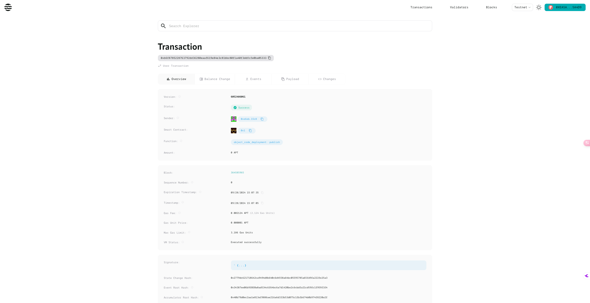

### 第六步：查看合约

https://explorer.aptoslabs.com/object/0x05b86a98c7976f97000b08c1df62ddd3948128d64acf50a7fa13d78dfc67181b/modules/code/nft?network=testnet

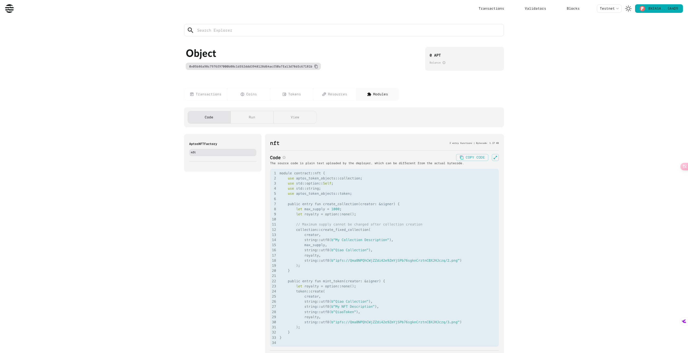

### 第七步：调用`create_collection` 方法

https://explorer.aptoslabs.com/object/0x05b86a98c7976f97000b08c1df62ddd3948128d64acf50a7fa13d78dfc67181b/modules/run/nft/create_collection?network=testnet

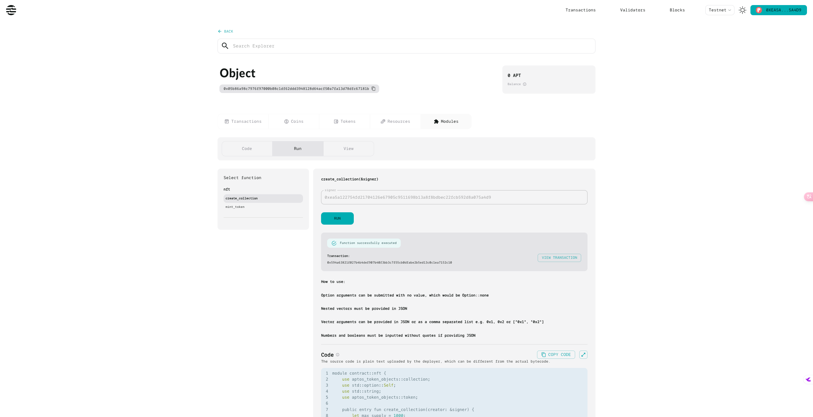

#### 查看 Transaction

https://explorer.aptoslabs.com/txn/0x594a63821f027b4b4def907b40f3bb3c7f55cb0dfabe2b5ed13c0c1ea7152c10?network=testnet

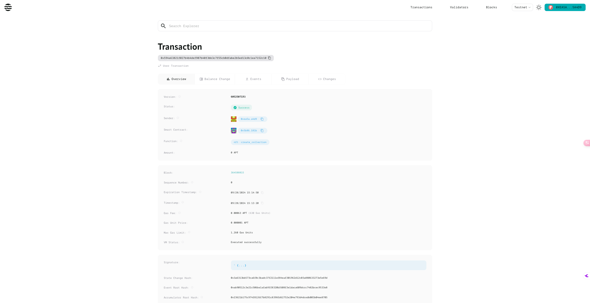

### 第八步：调用`mint_token` 方法

https://explorer.aptoslabs.com/object/0x05b86a98c7976f97000b08c1df62ddd3948128d64acf50a7fa13d78dfc67181b/modules/run/nft/mint_token?network=testnet


#### 查看 Transaction

https://explorer.aptoslabs.com/txn/0x1c899041d0f65a60739c2f841157dbc944eb495c874f186ab7af36c81543ba5d?network=testnet

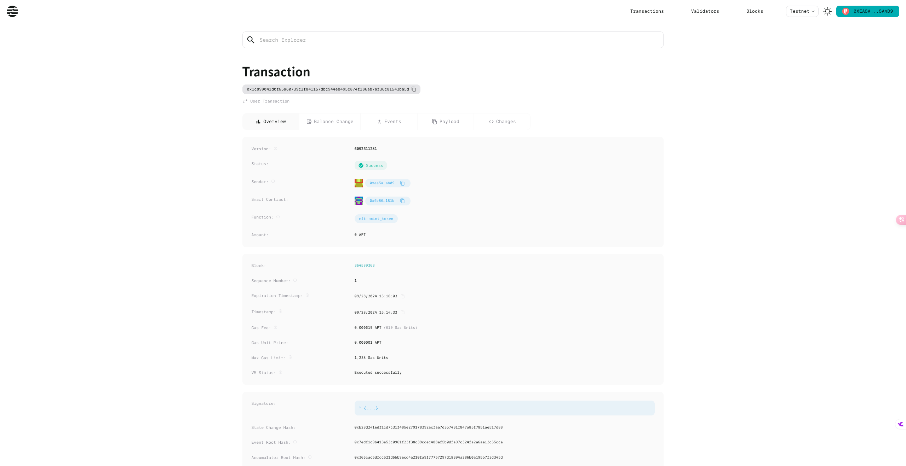

https://explorer.aptoslabs.com/txn/0x1c899041d0f65a60739c2f841157dbc944eb495c874f186ab7af36c81543ba5d/changes?network=testnet

### 第九步：代码优化修改(以上代码图片不显示故修改替换图片地址)

#### `nft.move` 文件

```rust
module contract::nft {
    use aptos_token_objects::collection;
    use std::option::Self;
    use std::string;
    use aptos_token_objects::token;
    use aptos_framework::object::{Self, Object};

    #[resource_group_member(group = aptos_framework::object::ObjectGroup)]
    /// The ambassador token
    struct NFTToken has key {
        /// Used to mutate the token uri
        mutator_ref: token::MutatorRef,
        /// Used to burn.
        burn_ref: token::BurnRef
    }

    public entry fun create_collection(creator: &signer) {
        let max_supply = 1000;
        let royalty = option::none();

        // Maximum supply cannot be changed after collection creation
        collection::create_fixed_collection(
            creator,
            string::utf8(b"My Collection Description"),
            max_supply,
            string::utf8(b"Qiao Collection"),
            royalty,
            string::utf8(
                b"https://learnblockchain.cn/image/avatar/18602_middle.jpg?GjIyGZqa"
            )
        );
    }

    public entry fun mint_token(creator: &signer) {
        let royalty = option::none();
        let token_constructor_ref =
            token::create(
                creator,
                string::utf8(b"Qiao Collection"),
                string::utf8(b"My NFT Description"),
                string::utf8(b"QiaoToken"),
                royalty,
                string::utf8(
                    b"https://img.learnblockchain.cn/space/banner/18602/h7ljMtGq668b998356db8.jpg"
                )
            );

        let object_signer = object::generate_signer(&token_constructor_ref);

        let burn_ref = token::generate_burn_ref(&token_constructor_ref);

        let mutator_ref = token::generate_mutator_ref(&token_constructor_ref);

        let nft_token = NFTToken { mutator_ref, burn_ref };
        move_to(&object_signer, nft_token);
    }

    public entry fun burn(token: Object<NFTToken>) acquires NFTToken {
        let ambassador_token = move_from<NFTToken>(object::object_address(&token));
        let NFTToken { mutator_ref: _, burn_ref } = ambassador_token;

        token::burn(burn_ref);
    }
}

```

### 第十步：Run Compile

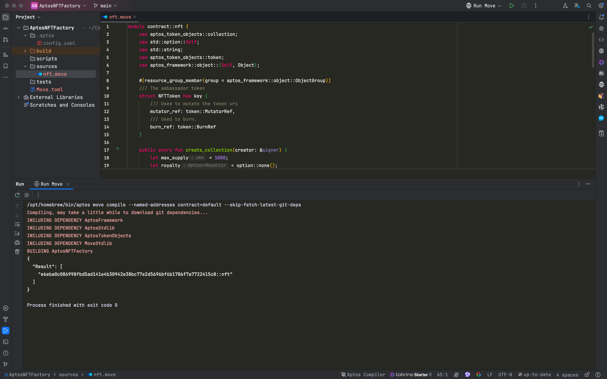

### 第十一步：Publish

```bash
/opt/homebrew/bin/aptos move publish --named-addresses contract=default
Compiling, may take a little while to download git dependencies...
UPDATING GIT DEPENDENCY https://github.com/aptos-labs/aptos-core.git
UPDATING GIT DEPENDENCY https://github.com/aptos-labs/aptos-core.git
INCLUDING DEPENDENCY AptosFramework
INCLUDING DEPENDENCY AptosStdlib
INCLUDING DEPENDENCY AptosTokenObjects
INCLUDING DEPENDENCY MoveStdlib
BUILDING AptosNFTFactory
package size 2436 bytes
Do you want to submit a transaction for a range of [188300 - 282400] Octas at a gas unit price of 100 Octas? [yes/no] >
yes
Transaction submitted: https://explorer.aptoslabs.com/txn/0x150f32b61ca082f3d659d57628cdfc489efed24157ffbd2dcee96cb78d358246?network=testnet
{
  "Result": {
    "transaction_hash": "0x150f32b61ca082f3d659d57628cdfc489efed24157ffbd2dcee96cb78d358246",
    "gas_used": 1883,
    "gas_unit_price": 100,
    "sender": "e6eba0c086998fbd5ad141e4b30942e38bc77e2d5696bf6b1786f7a7722415c8",
    "sequence_number": 1,
    "success": true,
    "timestamp_us": 1727510591901024,
    "version": 6052675871,
    "vm_status": "Executed successfully"
  }
}

Process finished with exit code 0

```

#### 查看 Transaction

https://explorer.aptoslabs.com/txn/0x150f32b61ca082f3d659d57628cdfc489efed24157ffbd2dcee96cb78d358246?network=testnet

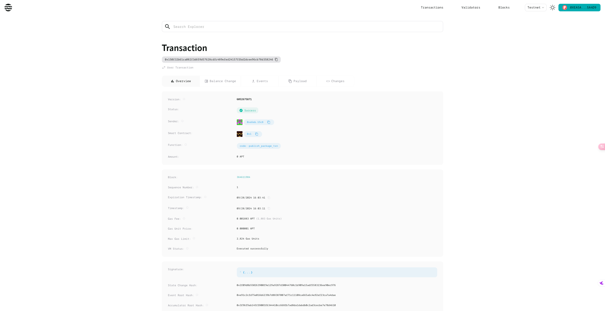

### 第十二步：查看合约

https://explorer.aptoslabs.com/account/0xe6eba0c086998fbd5ad141e4b30942e38bc77e2d5696bf6b1786f7a7722415c8/modules/code/nft?network=testnet

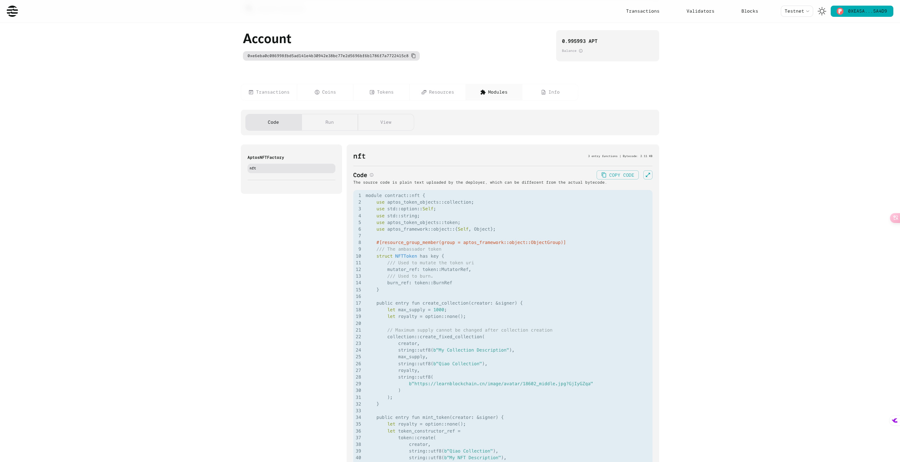

### 第十三步：调用`mint_token` 方法

这里因为上面已经调用了`create_collection`方法，该地址已经有collection，故无需调用。

如果调用则会报错：

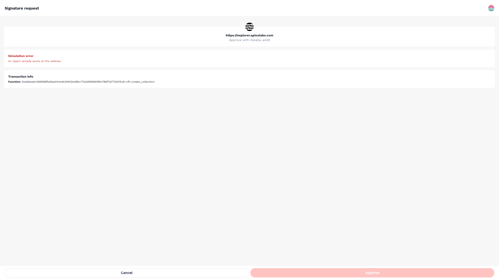

https://explorer.aptoslabs.com/account/0xe6eba0c086998fbd5ad141e4b30942e38bc77e2d5696bf6b1786f7a7722415c8/modules/run/nft/mint_token?network=testnet

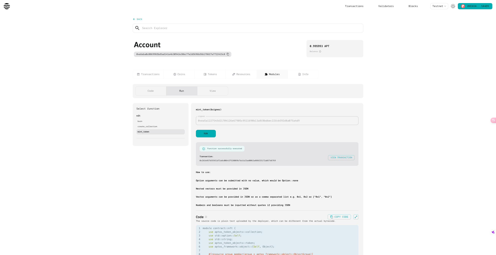

https://explorer.aptoslabs.com/txn/0x26fe857b559f1d72a8c006437528089b7dcfa23ad0062a888f25172a0f7d6769?network=testnet

### 第十四步：查看NFT

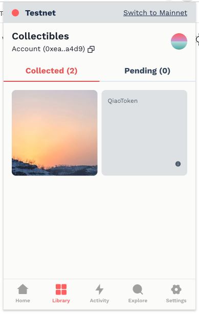

https://explorer.aptoslabs.com/object/0x72afba071d269473fcfca2dccad09ae055b5edea73a57ac708c6e1a58739ea07/resources?network=testnet

### 第十五步：切换账户调用`create_collection`方法

https://explorer.aptoslabs.com/account/0xe6eba0c086998fbd5ad141e4b30942e38bc77e2d5696bf6b1786f7a7722415c8/modules/run/nft/create_collection?network=testnet

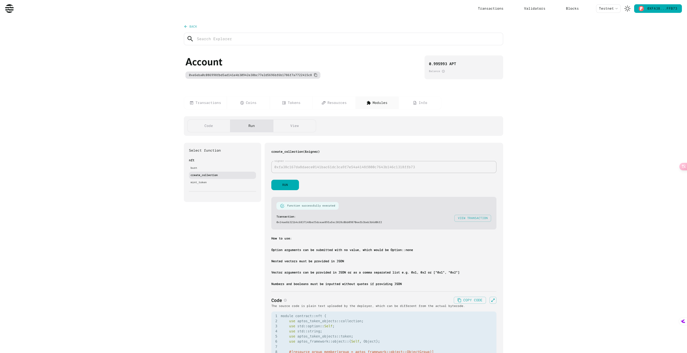

https://explorer.aptoslabs.com/txn/0x14ae6b321b4c6837148bef5dceae89fafec3828c0bb09870eefb3beb3b6d06f2?network=testnet

https://explorer.aptoslabs.com/object/0xae5e4781372c4030f929cb02c03647586062fe3e21b083f4646e5b85d5ab0099?network=testnet

https://explorer.aptoslabs.com/object/0xae5e4781372c4030f929cb02c03647586062fe3e21b083f4646e5b85d5ab0099/resources?network=testnet

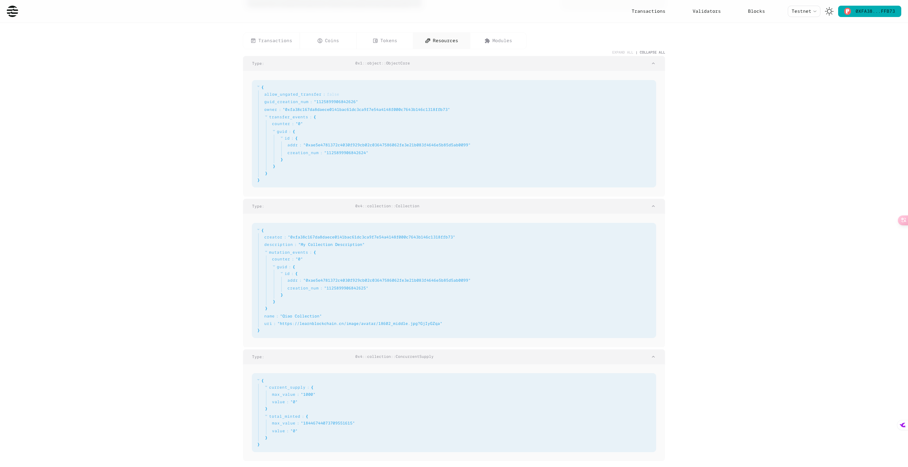

### 第十六步：调用`mint_token`方法

https://explorer.aptoslabs.com/account/0xe6eba0c086998fbd5ad141e4b30942e38bc77e2d5696bf6b1786f7a7722415c8/modules/run/nft/mint_token?network=testnet

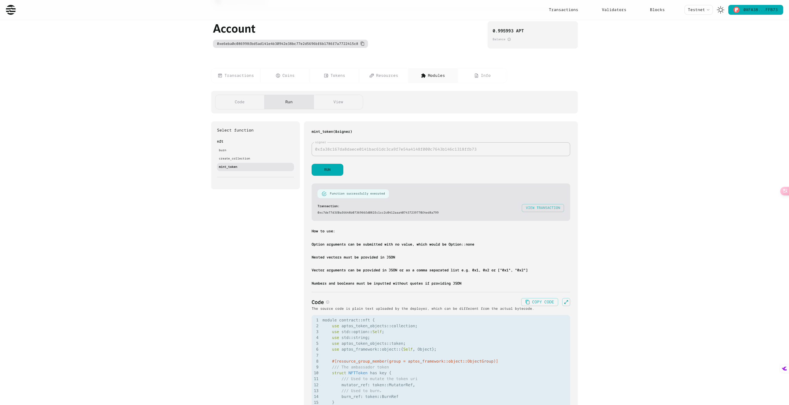

https://explorer.aptoslabs.com/txn/0xc7de77d3f0af6648b0736966fd082fc1cc2c0412aaa407437239770f4ed8a799?network=testnet

https://explorer.aptoslabs.com/object/0x720e8f108840dbdd3e51e0197ef7222f344b3448a140b818b985bc633e606c9b/resources?network=testnet

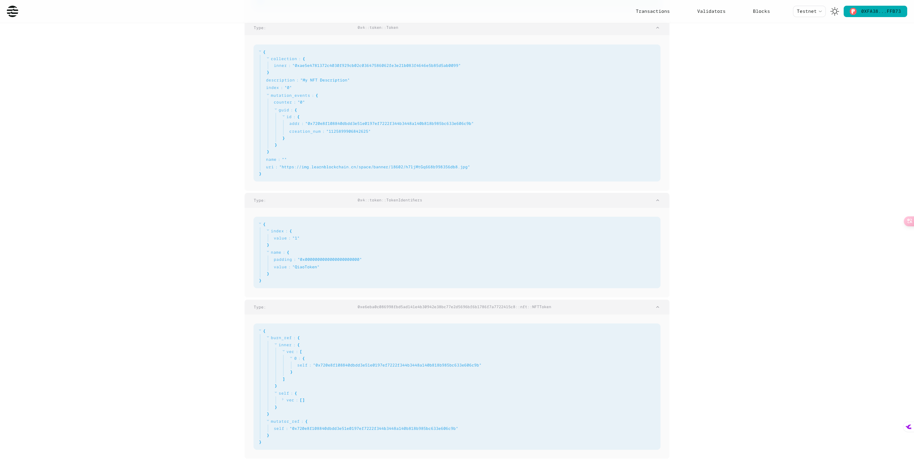

### 第十七步：查看NFT

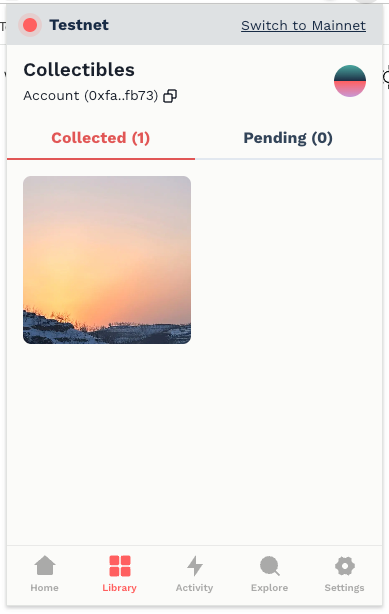

查看NFT 详情

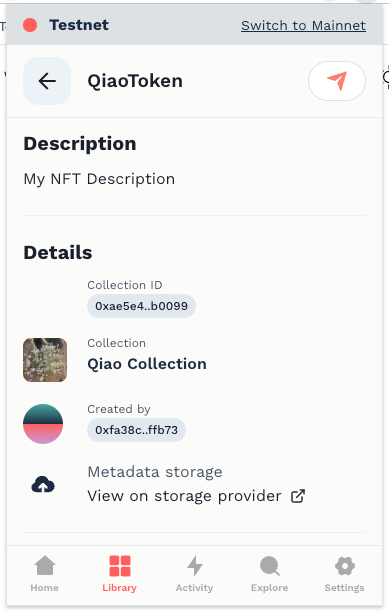

### 第十八步：调用`burn`方法

https://explorer.aptoslabs.com/account/0xe6eba0c086998fbd5ad141e4b30942e38bc77e2d5696bf6b1786f7a7722415c8/modules/run/nft/burn?network=testnet

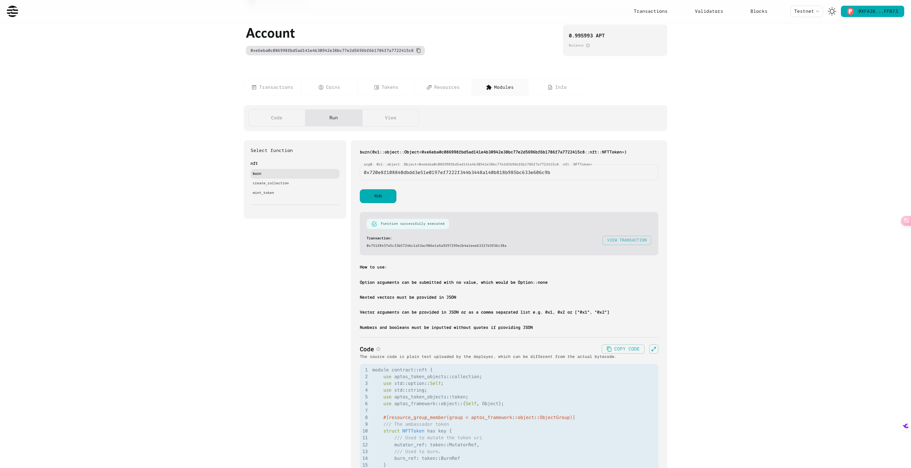

https://explorer.aptoslabs.com/txn/0x751f8437e5c33b5724bc1a53ac986e1a5a9297299e2b4a1eee63327d3936c38a?network=testnet

查看钱包

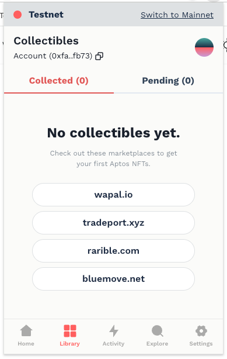


## 参考

- https://aptos.dev/en/build/smart-contracts/digital-asset
- https://explorer.aptoslabs.com/object/0xcd006487de8297c68a0879b8d69bfb37ea1b6c8a86f8dc872b9890dff7283c6a/modules/run/nft/mint_token?network=testnet
- https://github.com/aptos-labs/aptos-core/tree/main/aptos-move/framework/aptos-token-objects